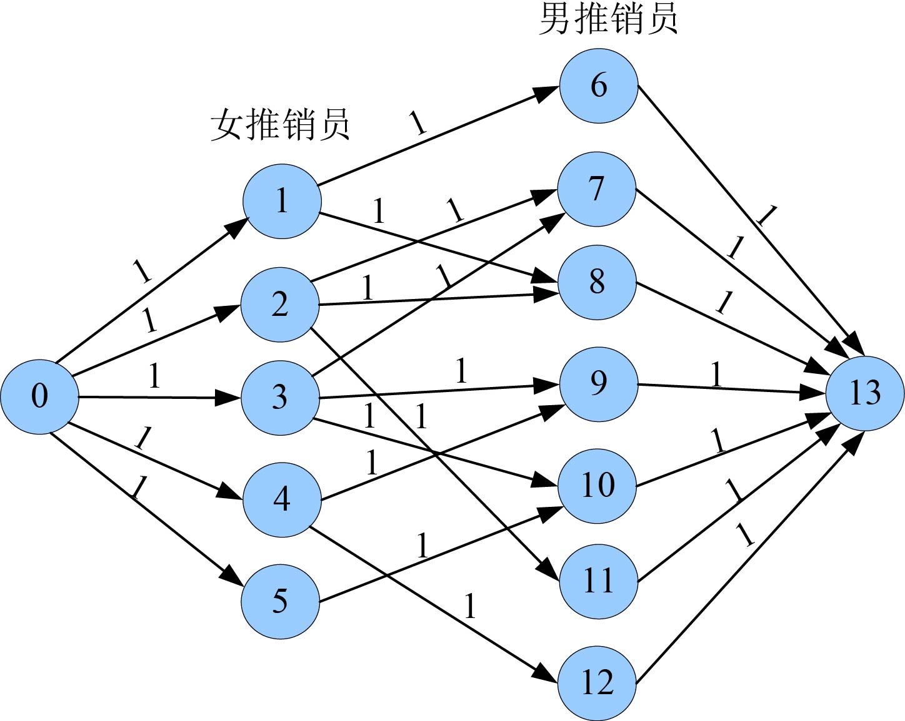
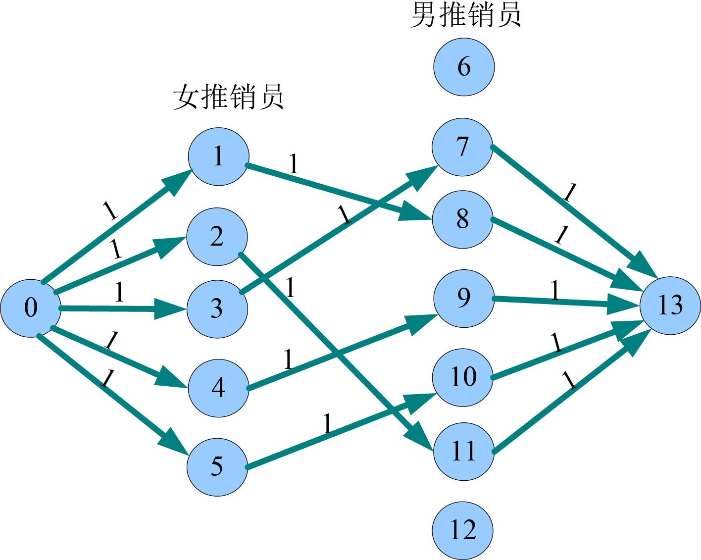

### 7.5.3　完美图解

例如，女推销员数为5，编号1～5；男推销员数为7，编号6～12。以下两个编号的推销员可以配合：1—6，1—8，2—7，2—8，2—11，3—7，3—9，3—10，4—12，4—9，5—10。

（1）构建网络

根据输入数据，添加源点和汇点，建立二分图。每条边的容量设为1，构建的网络如图7-133所示（注：程序中构建的是混合网络）。

<b class="my_markdown">图7-133　构建网络</b>

（2）求网络最大流

在图7-133的混合网络上，使用优化的ISAP算法求网络最大流，找到5条可增广路径。

+ 增广路径：13—10—5—0。增流：1。
+ 增广路径：13—9—4—0。增流：1。
+ 增广路径：13—7—3—0。增流：1。
+ 增广路径：13—11—2—0。增流：1。
+ 增广路径：13—8—1—0。增流：1。

增流后的实流网络如图7-134所示。

<b class="my_markdown">图7-134　实流网络</b>

（3）输出最大流值就是最多的配对数

读取女推销员结点的邻接表，流量为1的边对应的邻接点就是该女推销员的配对方案。

最大配对数：5。

配对方案：1—8，2—11，3—7，4—9，5—10。

