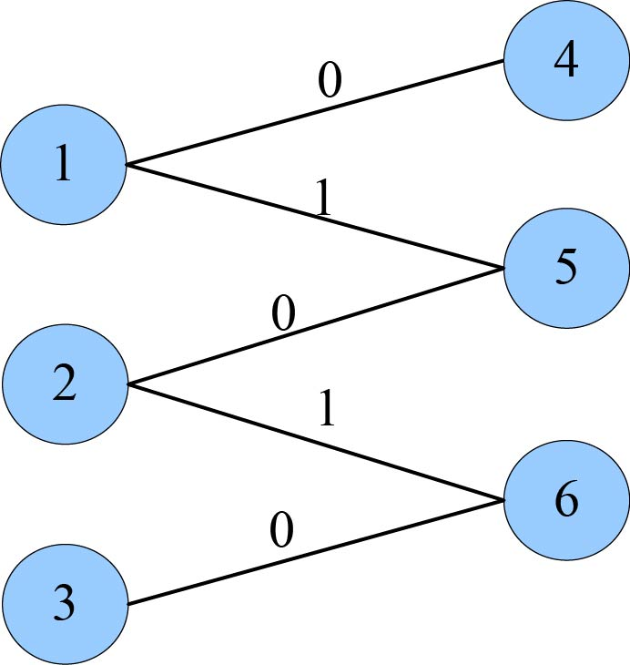
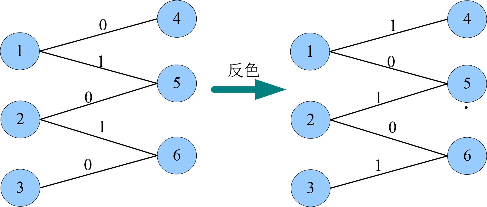
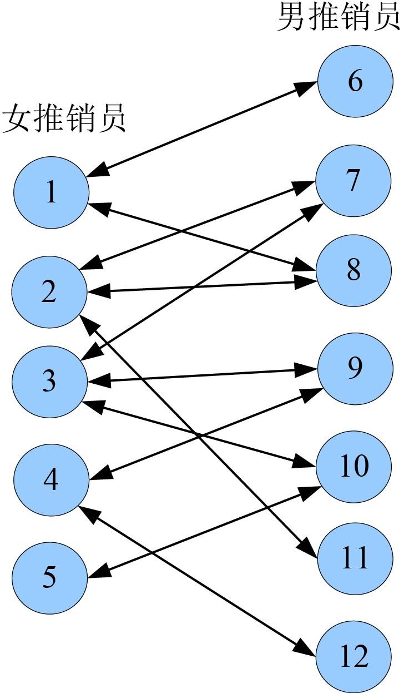
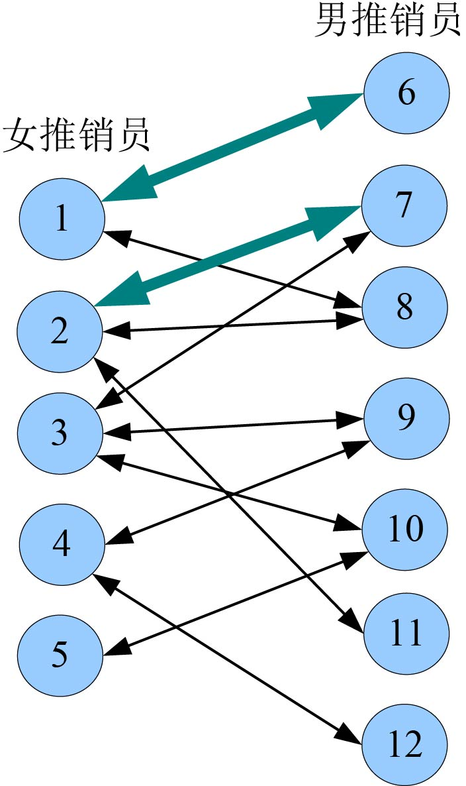
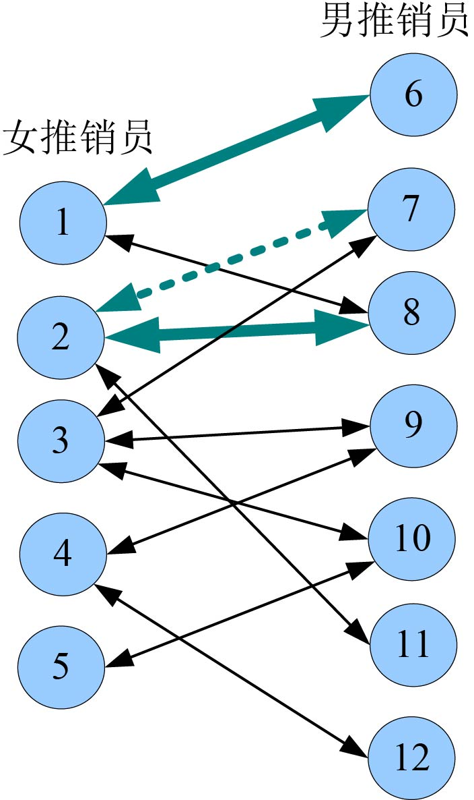
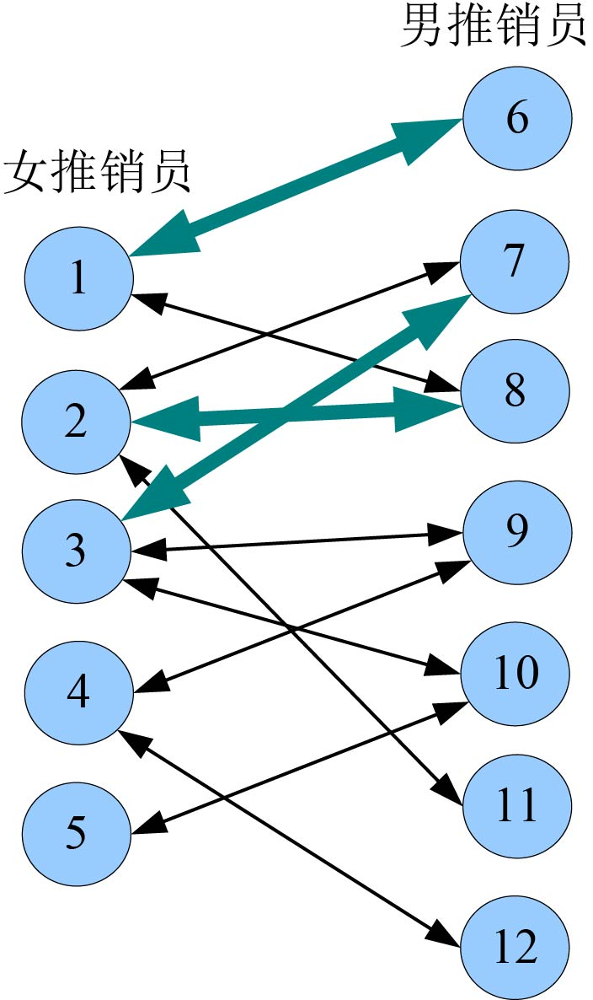
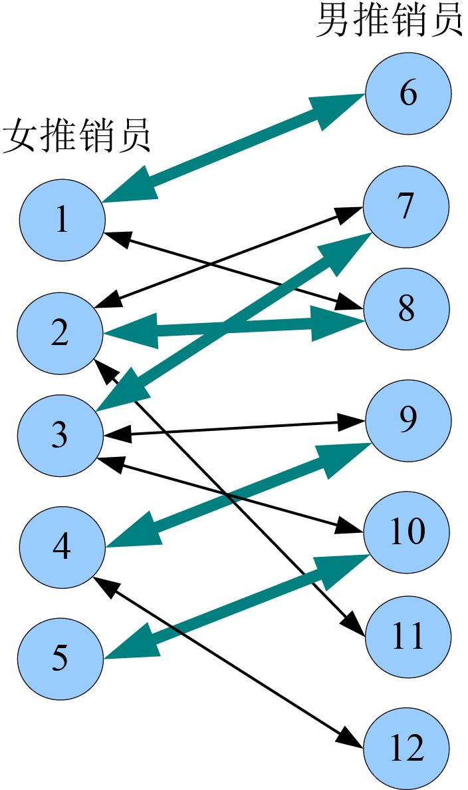
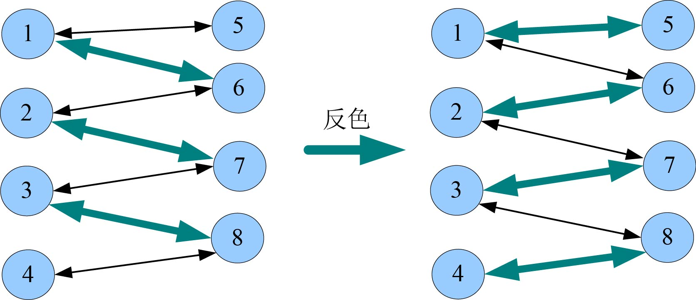

### 7.5.7　算法优化拓展——匈牙利算法

若P是图G中一条连通两个未匹配结点的路径，待匹配的边（边值为0）和已匹配边（边值为1）在P上交替出现，则称P为一条增广路径。

如图7-135所示，有一条增广路径4—1—5—2—6—3：


<center class="my_markdown"><b class="my_markdown">图7-135　增广路径</b></center>

对于图7-135中的增广路径，我们可以将第一条边改为已匹配（边值为1），第二条边改为未匹配（边值为0），以此类推。也就是将所有的边进行“反色”，容易发现这样修改以后，匹配仍然是合法的，但是匹配数增加了一对，如图7-136所示。


<center class="my_markdown"><b class="my_markdown">图7-136　增广路径（反色）</b></center>

原来的匹配数是2，现在匹配数是3，匹配数增多了，而且仍然满足匹配要求（任意两条边都没有公共结点）。

在这里，增广路径顾名思义是指一条可以使匹配数变多的路径。

**注意** ：和最大流的增广路径含义不同，最大流中的增广路径是指可以增加流量的路径。

在匹配问题中，增广路径的表现形式是一条“交错路径”，也就是说，这条由边组成的路径，它的第一条边还没有参与匹配，第二条边已参与匹配，第三条边没有参与匹配，最后一条边没有参与匹配，并且始点和终点还没有匹配。另外，单独的一条连接两个未匹配点的边显然也是交错路径。算法的思路是不停地找增广路径，并增加匹配的个数，可以证明，当不能再找到增广路径时，就得到了一个最大匹配，这就是 **匈牙利算法** 的思路。

#### 1．算法设计

（1）根据输入的数据，创建邻接表。

（2）初始化所有结点为未访问，检查第一个集合中的每一个结点u。

（3）依次检查u的邻接点v，如果v未被访问，则标记已访问，然后判断如果v未匹配，则令u、v匹配，即match[u]=v，match[v]=u，返回true; 如果v已匹配，则从v的邻接点出发，查找是否有增广路径，如果有则沿增广路径反色，然后令u、v匹配，即match[u]=v，match[v]=u，返回true。否则，返回false，转向第（2）步。

（4）当找不到增广路径时，即得到一个最大匹配。

#### 2．完美图解

仍以最佳的推销员配对方案问题为例，输入数据见7.5.3节。

（1）根据输入数据，构建邻接表

**注意** ：邻接表中边是双向的，1的邻接点是6，6的邻接点是1。如图7-137所示，为了方便，用双箭头表示，实际上是两条线。


<center class="my_markdown"><b class="my_markdown">图7-137　配对方案问题</b></center>

（2）初始化访问数组vis[i]=0，i=1，…，12；检查1的第一个邻接点6，6未被访问，标记vis[6]=1。6未匹配，则令1和6匹配，即match[1]=6，match[6]=1，返回true。

（3）初始化访问数组vis[i]=0；检查2的第一个邻接点7，7未被访问，标记vis[7]=1。7未匹配，则令2和7匹配，即match[2]=7，match[7]=2，返回true，如图7-138所示。


<center class="my_markdown"><b class="my_markdown">图7-138　配对过程</b></center>

（4）初始化访问数组vis[i]=0；检查3的第一个邻接点7，7未被访问，标记vis[7]=1。7已匹配，match[7]=2，即7的匹配点为2，从2出发寻找增广路径，实际上就是为2号结点再找一个其他匹配点，如果找到了，就“舍己为人”把原来的匹配点7让给3号，如果2号结点没找到匹配点，那只好对3号说：“抱歉，我也帮不了你，你再找下一个邻居吧。”

从2出发，检查2的第一个邻接点7，7已访问，检查第二个邻接点8，8未被访问，标记vis[8]=1。8未匹配，则令match[2]=8，match[8]=2，返回true，如图7-139所示。


<center class="my_markdown"><b class="my_markdown">图7-139　配对过程</b></center>

2号找到了一个匹配点8，把原来的匹配点7让给3号，令match[3]=7，match[7]=3。返回true，如图7-140所示。


<center class="my_markdown"><b class="my_markdown">图7-140　配对过程</b></center>

这条增广路径太简单，只是从2—8，如果8也有匹配点那就继续找下去。如果没找到增广路径会返回false，接着检查3号的下一个邻接点。

（5）初始化访问数组vis[i]=0；检查4的第一个邻接点9，9未被访问，标记vis[9]=1。9未匹配，则令match[4]=9，match[9]=4，返回true。

（6）初始化访问数组vis[i]=0；检查5的第一个邻接点10，10未被访问，标记vis[10]=1，10未匹配，则令match[5]=10，match[10]=5，返回true，如图7-141所示。


<center class="my_markdown"><b class="my_markdown">图7-141　配对结果</b></center>

本题中的增广路径非常简单，但在实际的案例中，增广路径有可能较长，如图7-142所示。


<center class="my_markdown"><b class="my_markdown">图7-142　反色过程</b></center>

**反色过程：** 检查4号的邻接点8，发现8已经有匹配，match[8]=3，从3出发，检查3号的邻接点7，发现7已经有匹配，match[7]=2，检查2号的邻接点6，发现6已经有匹配，match[6]=1，检查1号的邻接点5，发现5未匹配，找到一条增广路径：3—7—2—6—1—5，立即 **反色** ！令match[1]=5。1号找到了匹配点就把原来的匹配点6让给2号，match[2]=6；2号找到了匹配点就把原来的匹配点7让给3号，match[3]=7；3号找到了匹配点就把原来的匹配点8让给4号，match[4]=8。

#### 3．实战演练

```c
//program 7-4-1
#include <iostream>
#include <cstring>
#include <queue>
#include <algorithm>
using namespace std; 
const int inf = 0x3fffffff; 
const int N=100; 
const int M=10000; 
int match[N];
bool vis[N];
int top;
struct Vertex
{
    int first;
}V[N];
struct Edge
{
    int v, next;
}E[M];
void init()
{
     memset(V, -1, sizeof(V));
     top = 0;
     memset(match, 0, sizeof(match));
}
void add(int u, int v)
{
     E[top].v = v;
     E[top].next = V[u].first;
     V[u].first = top++;
}
void printg(int n)               //输出网络邻接表
{
    cout<<"----------邻接表如下：----------"<<endl;
    for(int i=1;i<=n;i++)
    {
         cout<<"v"<<i<<"  ["<<V[i].first;
         for(int j=V[i].first;~j;j=E[j].next)
             cout<<"]--["<<E[j].v<<"   "<<E[j].next;
         cout<<"]"<<endl;
    }
}
void print(int n)                //输出配对方案
{
    cout<<"----------配对方案如下：----------"<<endl;
    for(int i=1;i<=n;i++)
        if(match[i])
            cout<<i<<"--"<<match[i]<<endl;
}
bool maxmatch(int u)             //为u找匹配点，找到返回true，否则返回false
{
     int v;
     for(int j=V[u].first;~j;j=E[j].next) //检查u的所有邻接边
     {
         v=E[j].v;               //u的邻接点v
         if(!vis[v])
         {
                vis[v]=1;
                if(!match[v]||maxmatch(match[v])) 
                {                //v未匹配或者为v的匹配点找到了其他匹配
                     match[u]=v; //u和v匹配
                     match[v]=u;
                     return true;
                }
         }
     }
     return false;    //所有邻接边都检查完毕，还没找到匹配点
}
int main()
{
     int n, m,total,num=0;
     int u, v;
     cout<<"请输入女推销员人数m和男推销员人数n："<<endl;
     cin>>m>>n;
     init();
     total=m+n;
     cout<<"请输入可以配合的女推销员编号u和男推销员编号v（两个都为-1结束）："<<endl;
     while(cin>>u>>v,u+v!=-2)
     {
          add(u,v);
          add(v,u);
     }
     cout<<endl;
     printg(total);   //输出网络邻接表
     for(int i=1;i<=m;i++)
     {
          memset(vis,0,sizeof(vis));
          if(maxmatch(i))
               num++;
     }
     cout<<"最大配对数："<<num<<endl; 
     cout<<endl; 
     print(m);        //输出配对方案
     return 0; 
}
```

**算法实现和测试**

（1）运行环境

Code::Blocks

（2）输入

```c
请输入女推销员人数m和男推销员人数n：
5 7
请输入可以配合的女推销员编号u和男推销员编号v（两个都为-1结束）：
1 6
1 8
2 7
2 8
2 11
3 7
3 9
3 10
4 12
4 9
5 10
-1 -1
```

（3）输出

```c
最大配对数：5
----------配对方案如下：----------
1--8
2--11
3--9
4--12
5--10
```

**注意** ：和图解中答案不同，是因为在创建邻接表时，后输入的边在邻接表的前面。所有匹配点可能会不同，但最大匹配数是一定相同的。

#### 4．算法复杂度分析

找一条增广路的复杂度最坏情况为O(E)，最多找V条增广路，故时间复杂度为O(VE)。而最大网络流求解算法时间复杂度为O(V<sup class="my_markdown">2</sup>E)，相比之下，匈牙利算法的时间复杂度下降不少。

