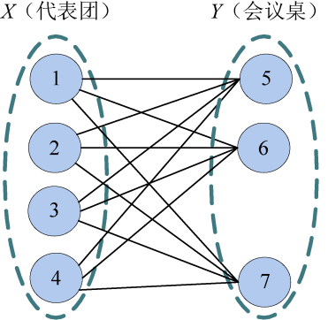
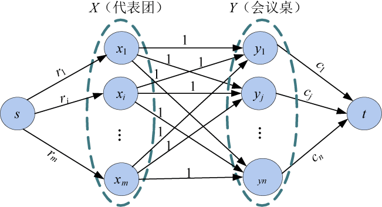

### 7.6.1　问题分析

把代表团看作X集合，会议桌看作Y集合，就构成了一个二分图。X集合中的点到Y集合中的每一个点都有连线，所有连线容量全部是1，保证两个点只能匹配一次（一个餐桌上只能有一个单位的一个人）。

如图7-144所示，代表团1如果有3个人，就要匹配Y集合中的3个桌子号，而如果7号桌子能够坐5个人，那么7号结点最多可以匹配X集合中的5个结点。

<b class="my_markdown">图7-144　圆桌会议二分图</b>

对于一个二分图，每个结点可以有多个匹配结点，称这类问题为 **二分图多重匹配问题** 。求解时需要添加源点和汇点，源和汇的边容量分别限制X、Y集合中每个点匹配的个数。

该题属于二分图多重匹配问题。如图7-145所示，建立一个二分图，每个代表团为X集合中的结点，每个会议桌为Y集合中的结点，增设源点s和汇点t。从源点s向每个xi结点连接一条容量为该代表团人数ri的有向边。从每个yj结点向汇点t连接一条容量为该会议桌容量cj的有向边。X集合中每个结点向Y集合中每个结点连接一条容量为1的有向边。

<b class="my_markdown">图7-145　圆桌会议网络</b>

