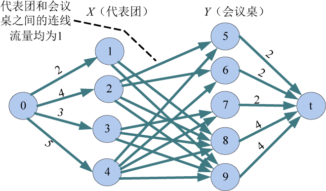

### 7.6.3　完美图解

假设代表团数m=4，每个代表团的人数依次为2、4、3、5；会议桌数n=5，每个会议桌可安排人数依次为3、4、2、5、4。

（1）构建网络

根据输入数据，增设源点s和汇点t，建立二分图。从源点s向每个xi结点连接一条容量为该代表团人数ri的有向边。从每个yj结点向汇点t连接一条容量为该会议桌容量cj的有向边。X集合中每个结点向Y集合中每个结点连接一条容量为1的有向边，构建的网络如图7-146所示（注：程序中构建的是混合网络）。

<b class="my_markdown">图7-146　圆桌会议网络</b>

（2）求网络最大流

在图7-146的混合网络上，使用7.3.6节中优化的ISAP算法求网络最大流，找到14条增广路径。

+ 增广路径：10—9—4—0。增流：1。
+ 增广路径：10—8—4—0。增流：1。
+ 增广路径：10—7—4—0。增流：1。
+ 增广路径：10—6—4—0。增流：1。
+ 增广路径：10—5—4—0。增流：1。
+ 增广路径：10—9—3—0。增流：1。
+ 增广路径：10—8—3—0。增流：1。
+ 增广路径：10—7—3—0。增流：1。
+ 增广路径：10—9—2—0。增流：1。
+ 增广路径：10—8—2—0。增流：1。
+ 增广路径：10—6—2—0。增流：1。
+ 增广路径：10—5—2—0。增流：1。
+ 增广路径：10—9—1—0。增流：1。
+ 增广路径：10—8—1—0。增流：1。

相当于给代表团中的每一个人找一个增广路径，增广路径上有代表团编号对应会议桌号。增流后的实流网络如图7-147所示。

<b class="my_markdown">图7-147　圆桌会议实流网络</b>

（3）输出安排方案

最大流值等于源点s与X集合所有结点边容量之和14，说明每个代表团都有完备的多重匹配。对于每个代表团，从代表团结点出发的所有流量为1的边指向的结点就是该代表团人员的会议桌号。在程序中，会议桌存储编号=实际编号+代表团数m，输出时需要输出会议桌实际编号，即会议桌存储编号−m。

安排方案如下。

第1个代表团安排的会议桌号：4　5 （即网络图中的存储编号8　9）

第2个代表团安排的会议桌号：1　2　4　5

第3个代表团安排的会议桌号：3　4　5

第4个代表团安排的会议桌号：1　2　3　4　5

