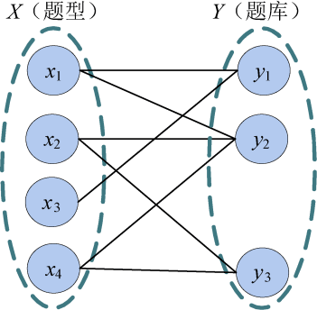
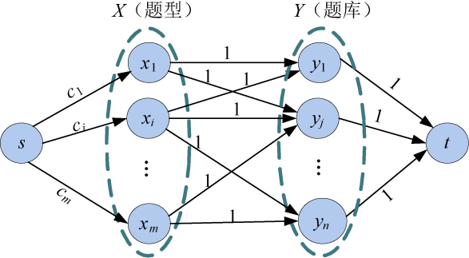

### 7.7.1　问题分析

把题型看作X集合，试题库看作Y集合，就构成了一个二分图。Y集合中的题yj属于哪些题型，则这些题型xi与yj之间有连线，连线的容量全部是1，保证该题型只能选择题yj一次，如图7-149所示。

<b class="my_markdown">图7-149　试题库问题</b>

例如题库中试题y1属于x1、x3两种题型，比如一道题既属于填空题又属于计算题。

该题属于二分图多重匹配问题。建立一个二分图，每个题型为X集合中的结点，每个试题为Y集合中的结点，增设源点s和汇点t。从源点s向每个题型xi结点连接一条有向边，容量为该题型选出的数量ci。从每个yj结点向汇点t连接一条有向边，容量为1，以保证每道题只能被选中一次。Y集合中的题yj属于哪些题型，则这些题型xi与yj之间有一条有向边，容量为1，如图7-150所示。

<b class="my_markdown">图7-150　试题库问题网络</b>

