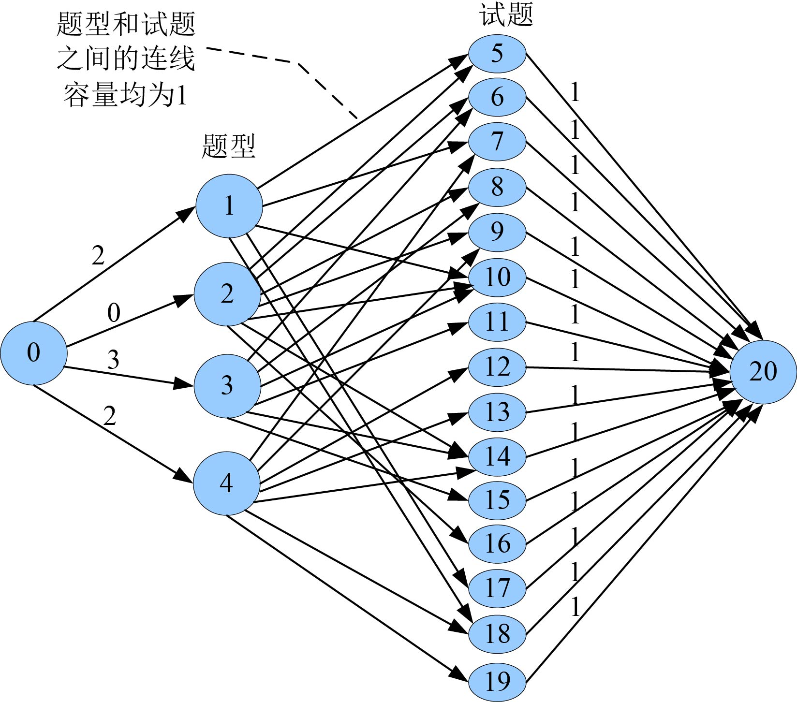
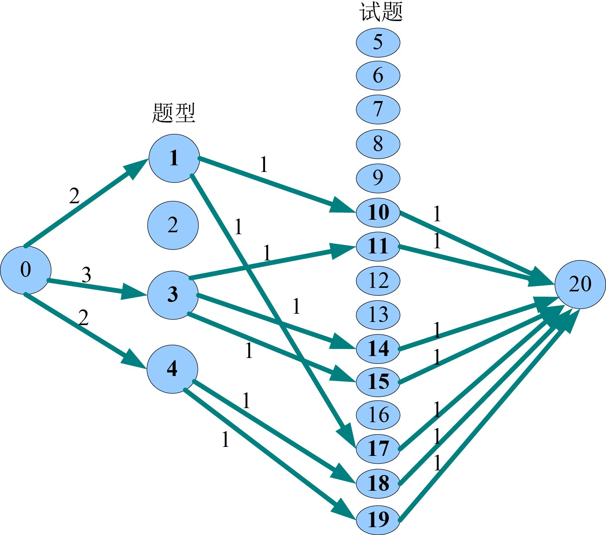

### 7.7.3　完美图解

假设题型数m=4，试题总数n=15。我们要在每种题型依次选择2、0、3、2个试题。上述的15个试题中，每个试题所属的题型依次为：1、2；2、3；1、4；2、3；2、4；1、2、3；3；4；4；2、3、4；3；2；1；1、4；4。

（1）构建网络

根据输入数据，增设源点s和汇点t，建立二分图。从源点s向每个题型xi结点连接一条有向边，容量为该题型选出的数量ci。从每个yj结点向汇点t连接一条有向边，容量为1，以保证每道题只能被选中一次。Y集合中的题yj属于哪些题型，则这些题型xi与yj之间有一条有向边，容量为1，构建的网络如图7-151所示（注：程序中构建的是混合网络）。

<b class="my_markdown">图7-151　试题库问题网络</b>

（2）在图7-151所示的混合网络上使用优化的ISAP算法求网络最大流，找到7条增广路径。

+ 增广路径：20—19—4—0。增流：1。
+ 增广路径：20—18—4—0。增流：1。
+ 增广路径：20—15—3—0。增流：1。
+ 增广路径：20—14—3—0。增流：1。
+ 增广路径：20—11—3—0。增流：1。
+ 增广路径：20—17—1—0。增流：1。
+ 增广路径：20—10—1—0。增流：1。

相当于给题型中的每一个试题找一个增广路径，增广路径上有题型和对应试题号，增流后的实流网络如图7-152所示。

<b class="my_markdown">图7-152　试题库问题实流网络</b>

（3）输出抽取方案

最大流值等于抽取的试题数之和，则说明试题抽取成功。对于每个题型，搜索题型结点的所有流量为1的邻接结点就是该题型选中的试题号。在程序中，试题存储编号=试题实际编号+题型数m，输出时需要输出试题实际编号，即试题存储编号−m。

试题抽取方案如下。

第1个题型抽取的试题号：13　6（即上图中的存储编号17　10）

第2个题型抽取的试题号：

第3个题型抽取的试题号：11　10　7

第4个题型抽取的试题号：15　14

