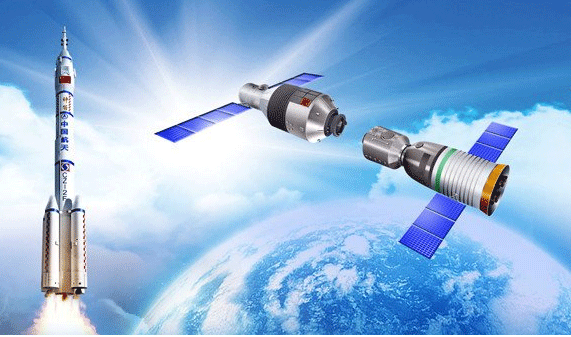

### 7.8　太空实验计划——最大收益问题

某理工学院的实验室计划了一系列的实验项目E＝{E1，E2，…，Em},这些实验需要使用的全部仪器集合I＝{I1，I2，…，In}。每个实验需要的仪器是全部仪器集合的子集。配置仪器Ij需要的费用为cj，实验Ei产生的经济效益为pi美元。需要设计一个有效的算法，确定要进行哪些实验，使最终得到的经济效益减去需要配置的仪器费用后得到的净收益最大。

<b class="my_markdown">图7-153　太空实验计划</b>

