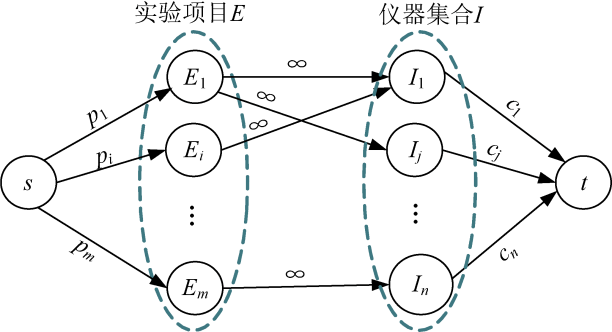
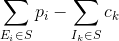
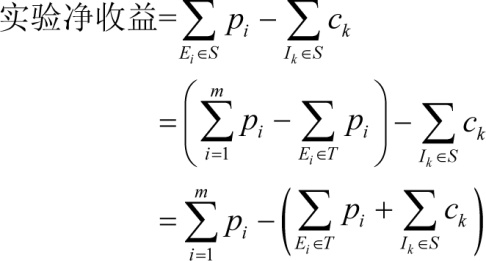
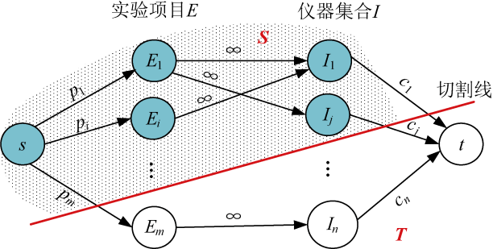

### 7.8.1　问题分析

给出一些实验项目E＝{ E1，E2，…，Em }和一些仪器I＝{ I1，I2，…，In }，做一个实验需要一些仪器，一个实验会有对应的经济效益，同时使用仪器也需要花费费用，配置仪器Ij需要的费用为cj，实验Ei产生的经济效益为pi美元。最后的问题是进行哪些实验可以获得最大的净利润。

首先构建一个网络，添加源点和汇点，从源点s到每个实验项目Ei有一条有向边，容量是pi，从每个实验仪器Ij到汇点t有一条有向边容量是cj，每个实验项目到该实验项目用到的仪器有一条有向边容量是∞，如图7-154所示。

<b class="my_markdown">图7-154　太空实验计划网络</b>

假设我们选中的实验和仪器组成S集合，如图7-155中的阴影部分结点。该方案包含了选中的实验及其用到的仪器集S，剩下没选中的实验和仪器构成了T集合，那么原图分成了两部分（S，T）：

**实验方案的净收益** = **选中实验项目收益**  **−**  **选中的仪器费用** ，即：

实验净收益=

**选中的实验项目收益** =所有实验项目收益−未选中的实验项目收益，所以上式可转化为：

<b class="my_markdown">图7-155　太空实验计划方案</b>

要想使净收益最大，那么后两项之和就要最小。而后两项正好是图7-155中切割线切中的边容量之和，它们的最小值就是最小割容量。即：实验方案的净收益=所有实验项目收益-最小割容量。

而根据最大流最小割定理（见附录J），最大流的流值等于最小割容量。即： **实验方案的净收益** = **所有实验项目收益**  **−**  **最大流值。** 那么我们只需要求出最大流值即可！该题是最大权闭合图问题，可以转化成最小割问题，然后用最大流解决。

