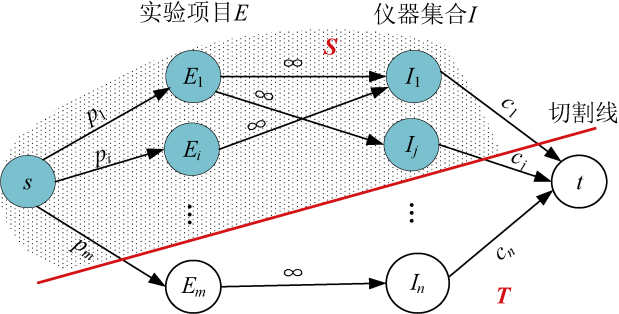
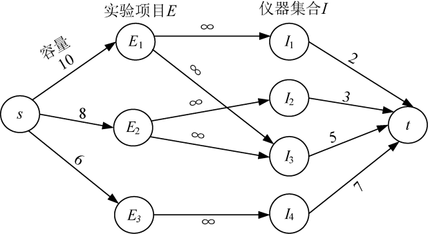
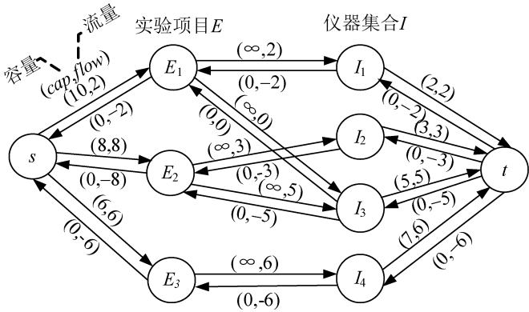
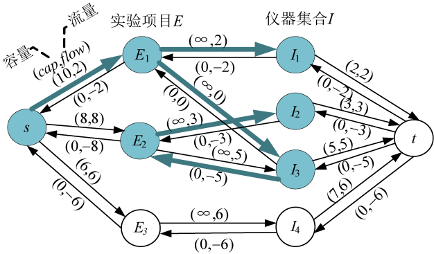
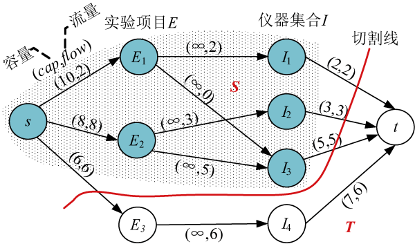

### 7.8.2　算法设计

（1）构建网络

根据输入的数据，添加源点和汇点，从源点s到每个实验项目Ei有一条有向边，容量是项目产生的效益pi，从每个实验仪器Ij到汇点t有一条有向边，容量是仪器费用cj，每个实验项目到该实验项目用到的仪器有一条有向边容量是∞，创建混合网络。

（2）求网络最大流

（3）输出最大收益及实验方案

最大收益=所有实验项目收益−最大流值。 **最大收益实验方案就是最小割中的** S **集合去掉源点** ，如图7-156所示。

<b class="my_markdown">图7-156　太空实验计划方案</b>

那么如何找到S集合呢？很多人认为在源点的邻接边中，凡是 **容量>流量** 的边对应的实验项目肯定是盈利的，就是选中的实验，该实验邻接的仪器结点就是选中的仪器。这样做是否正确呢？

下面来看一个实例，假设有3个实验项目和4个仪器，实验项目E1需要I1、I3两个实验仪器，实验项目E2需要I2、I3两个实验仪器，、实验项目E3需要I4实验仪器。实验项目E1 获益为10，E2获益为8，E3获益为6；实验仪器I1、I2、I3、I4分别需要费用为2、3、5、7，构建网络如图7-157所示。

<b class="my_markdown">图7-157　实验项目仪器网络</b>

求最大流后的混合网络如图7-158所示。

<b class="my_markdown">图7-158　最大流对应的混合网络</b>

可以得知，最大获益=所有实验项目收益−最大流值=（10+8+6）−（2+8+6）=8。

那么究竟做了哪些实验，用了哪些仪器呢？

很多人认为在源点的邻接边中，凡是容量>流量的边对应的邻接点肯定是盈利的，就是选中的实验，该实验邻接的仪器结点就是选中的仪器，但这样做是否正确呢？

图7-158中，如果我们只选cap>flow的边对应的邻接点，也就是选中实验E1，该实验需要仪器I2、I3，那么实验项目E1获益为10，实验仪器I1、I3需要费用为2、5，不可能得到最大获益8。显然，这种想法是错误的。因为实验E2虽然cap=flow，不算是盈利的，但它为实验项目E1需要的仪器I3提供了经费，使实验E1不用再购买仪器I3，相当于为实验E1的盈利奠定了基础，没有E2的支持，实验E1就不可能得到最大盈利8。

那么如何得到选中的实验方案呢？

在最大流对应的混合网络中，从源点开始，沿着cap>flow的边深度优先遍历，遍历到的结点就是S集合，即对应的实验项目和仪器就是选中的实验方案，如图7-159所示。

<b class="my_markdown">图7-159　深度优先遍历结果</b>

图7-158中粗线表示深度优先遍历的路径，遍历到的结点E1、E2、I1、I2、I3就是最大获益的实验方案。最大流对应的最小割（S，T），如图7-160所示。S={s，E1，E2，I1，I2，I3}，T={ E3，I4，t}。

<b class="my_markdown">图7-160　最大流对应的最小割（S，T）</b>

从图7-160可以看出，切割线切割的边容量之和正好是最大流值16，这也验证了最大流最小割定理：最大流的流值等于最小割容量。

最小割（S，T）：从源点出发，沿着cap>flow的边深度优先遍历，遍历到的结点就是S集合，没遍历到的结点就是T集合。

