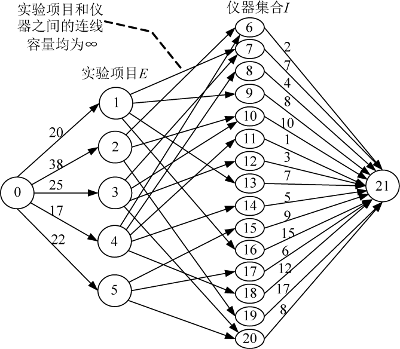
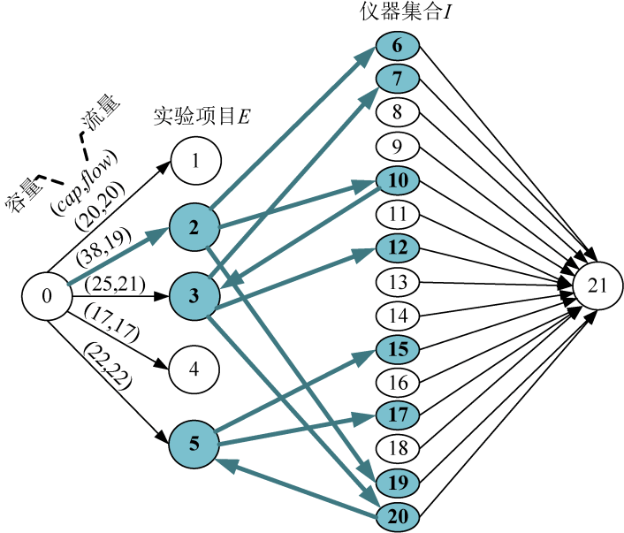

### 7.8.3　完美图解

假设实验数为5（编号1～5），仪器数为15（编号6～20）。实验1产生的效益为20，需要的仪器编号为4、2、8、11；实验2产生的效益为38，需要的仪器编号为1、5、14；实验3产生的效益为25，需要的仪器编号为2、5、7、15；实验4产生的效益为17，需要的仪器编号为1、3、6、9、13；实验5产生的效益为22，需要的仪器编号为10、12、15。配置每个仪器需要的费用依次为2、7、4、8、10、1、3、7、5、9、15、6、12、17、8。

（1）构建网络

根据输入数据，添加源点和汇点，从源点s到每个实验项目Ei有一条有向边，容量是项目产生的效益pi，从每个实验仪器Ij到汇点t有一条有向边，容量是仪器费用cj，每个实验项目到该实验项目用到的仪器有一条有向边容量是∞，构建的网络如图7-161所示。

<b class="my_markdown">图7-161　太空实验计划网络</b>

（2）求网络最大流

在上图的混合网络上（程序中构建的是混合网络，为了方便，图示用实流网络表示），使用优化的ISAP算法求网络最大流，找到如下13条增广路径。

+ 增广路径：21—20—5—0。增流：8。
+ 增广路径：21—17—5—0。增流：6。
+ 增广路径：21—15—5—0。增流：8。
+ 增广路径：21—18—4—0。增流：12。
+ 增广路径：21—14—4—0。增流：5。
+ 增广路径：21—12—3—0。增流：3。
+ 增广路径：21—10—3—0。增流：10。
+ 增广路径：21—7—3—0。增流：7。
+ 增广路径：21—19—2—0。增流：17。
+ 增广路径：21—6—2—0。增流：2。
+ 增广路径：21—16—1—0。增流：15。
+ 增广路径：21—13—1—0。增流：5。
+ 增广路径：21—15—5—20—3—0。增流：1。

增流后的网络如图7-162所示。

<b class="my_markdown">图7-162　增流后的实流网络</b>

（3）输出最大的净收益及实验方案

最大净收益为23（所有实验项目收益−最大流值）。

在最大流对应的混合网络上，从源点出发，沿着容量>流量的边深度优先遍历。遍历到的结点就是S集合，没遍历到的结点就是T集合，如图7-163所示。

<b class="my_markdown">图7-163　深度优先遍历结果</b>

S集合就是选中的实验项目和实验仪器。实验仪器存储编号=实际编号+实验项目数m，输出时需要输出实验仪器实际编号，即实验仪器存储编号−m。

选择方案如下。

选中的实验编号：2　3　5

选中的仪器编号：1　2　5　7　10　12　14　15

