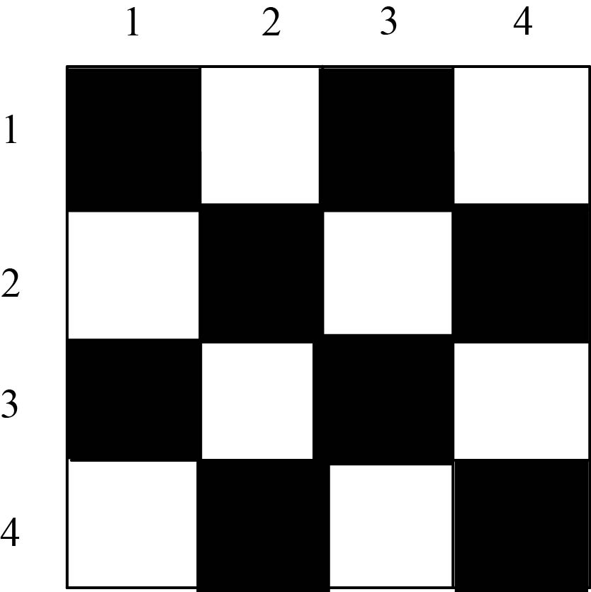
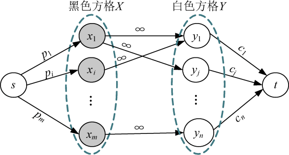
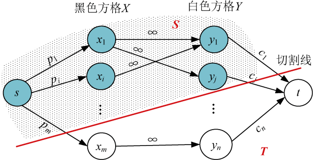

### 7.9.1　问题分析

问题可抽象为：从一个矩阵中选取一些数，要求满足任意两个数不相邻，使这些数的和最大。实际是将矩阵中的数分为两部分，对矩阵中的点进行黑白着色（相邻的点颜色不同）。

例如，货架上有 4 行 4 列的方格，每一个商品放在一个方格内，方格的权值对应商品的价值。首先对其黑白着色，如图7-165所示。

<b class="my_markdown">图7-165　黑白着色</b>

这样黑色的方格作为一个集合X，白色的方格作为一个集合Y，可以将一个图分为两部分，构成一个二分图。添加源点和汇点，从源点向黑色方格连一条边，容量为该黑色方格的权值，从白色方格向汇点连一条边，容量为该白色方格的权值，对于每一对相邻的黑白方格，从黑方格向白方格连一条边，容量为无穷大，如图7-166所示。

<b class="my_markdown">图7-166　方格取数网络</b>

假设有一个割集（S，T），如图7-167所示。

<b class="my_markdown">图7-167　图方格取数最小割（S，T）</b>

切割线切到的边容量表示没选中的方格权值，如果没选中的方格权值之和最小，那么选中的方格权值之和必然最大。因此，我们只有求出最小割， **选中方格的最大权值=所有方格权值之和−最小割容量。** 因为最大流值等于最小割容量，所以求出最大流即可。

