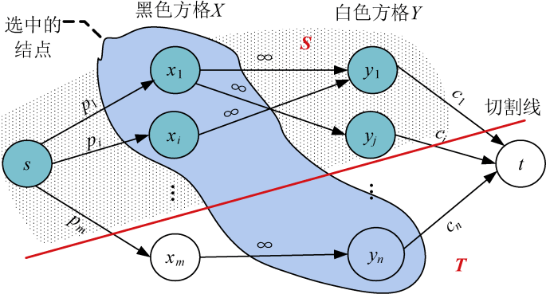

### 7.9.2　算法设计

（1）构建网络

根据输入的数据，按行编号，根据编号黑白染色。添加源点和汇点，从源点s向黑色方格连一条边，容量为该黑色方格的权值，从白色方格向汇点t连一条边，容量为该白色方格的权值，对于每一对相邻的黑白方格，从黑方格向白方格连一条边，容量为∞，创建混合网络。

（2）求网络最大流

（3）输出选中物品的最大价值，物品选择方案

**选中物品的最大价值=所有物品价值之和−最大流值。**

**注意** ：切割线切到的边容量是没选中的方格权值。

**物品选择方案** 就是最小割中的S集合中的黑色方格和T集合中的白色方格。那么如何找到呢？找到最小割之后，从源点出发，沿着cap>flow的边深度优先遍历，遍历到的结点就是S集合，没遍历到的结点就是T集合。输出S集合中的黑色方格，输出T集合的白色方格，如图7-168所示。

<b class="my_markdown">图7-168　方格取数选择方案</b>

