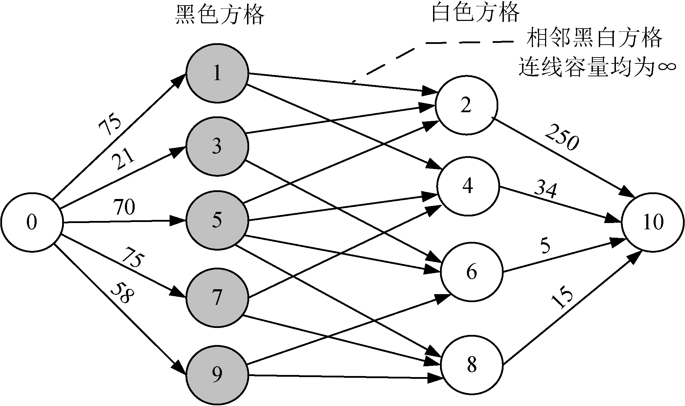
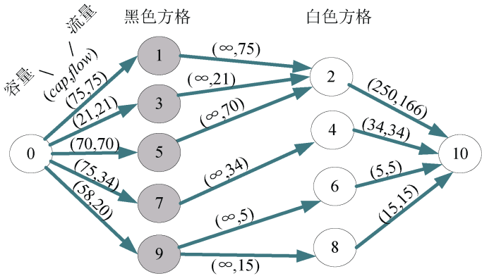
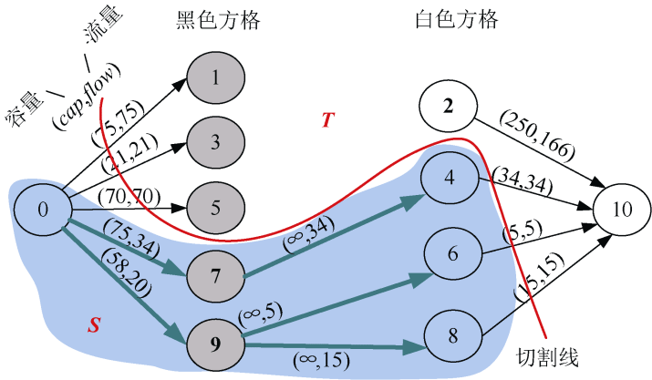

### 7.9.3　完美图解

假设货架上有3行3列的方格。第1行方格中每种商品的价值依次为75、250、21；第2行方格中每种商品的价值依次为34、70、5；第3行方格中每种商品的价值依次为75、15、58。

（1）构建网络

根据输入的数据，按行编号，第1行编号1、2、3；第2行编号4、5、6；第3行编号7、8、9。根据编号黑白染色，如图7-169所示。

<b class="my_markdown">图7-169　黑白着色</b>

添加源点和汇点，从源点s向黑色方格连一条边，容量为该黑色方格的权值，从白色方格向汇点t连一条边，容量为该白色方格的权值，对于每一对相邻的黑白方格，从黑方格向白方格连一条边，容量为∞。创建网络，如图7-170所示。

<b class="my_markdown">图7-170　方格取数网络</b>

（2）在上图的混合网络上（程序中构建的是混合网络，为了方便，图示用实流网络表示），使用优化的ISAP算法求网络最大流，找到如下6条增广路径。

+ 增广路径：10—6—9—0。增流：5。
+ 增广路径：10—8—9—0。增流：15。
+ 增广路径：10—4—7—0。增流：34。
+ 增广路径：10—2—5—0。增流：70。
+ 增广路径：10—2—3—0。增流：21。
+ 增广路径：10—2—1—0。增流：75。

增流后的网络如图7-171所示。

<b class="my_markdown">图7-171　增流后的实流网络</b>

（3）输出选中物品的最大价值，物品选择方案

选中物品的最大价值=所有物品价值之和−最大流值。挑选物品的最大价值为383。

**物品选择方案** 就是最小割中的S集合中的黑色方格和T集合中的白色方格，那么如何找到呢？

在最大流对应的混合网络上，从源点出发，沿着容量>流量的边深度优先遍历。遍历到的结点就是S集合，没遍历到的结点就是T集合，深度遍历结果如图7-172所示。

<b class="my_markdown">图7-172　深度遍历得到S集合</b>

输出S集合中的黑色方格7、9，输出T集合的白色方格2，即物品最大价值选择方案。

