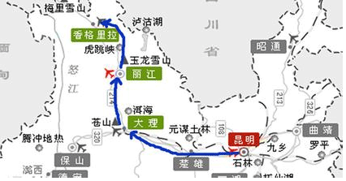

### 7.10　走着走着，就走到了西藏——旅游路线问题

演员陈坤有本书叫《突然就走到了西藏》，我没看过，但这名字很不错。西藏一直给人一种神秘的感觉，好像没到过西藏的人，就不是一个真正的行者。于是我们开始筹划西藏之行，拿出旅游地图，标记出沿途想要去的景点，我们希望从家出发，一路向西，坐火车沿途经过若干景点，到达西藏游玩后，再一路向东，坐火车途经过若干景点，最后回到家中。但是有的景点之间没有火车直达，为了节约开支，不希望产生转换汽车费用，也不要走重复的景点，怎样设计一个算法，使途经的景点最多。

<b class="my_markdown">图7-173　旅游路线</b>

