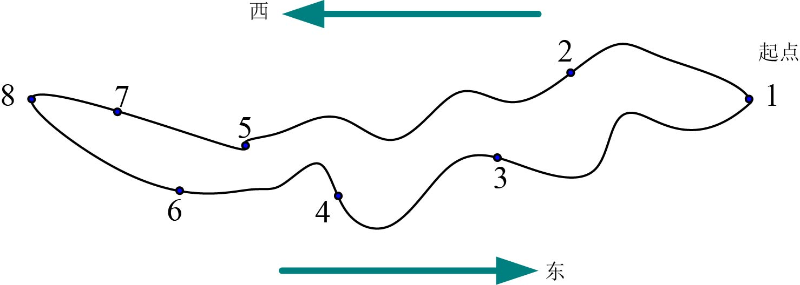
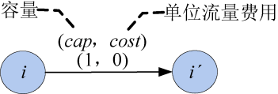
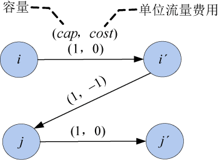
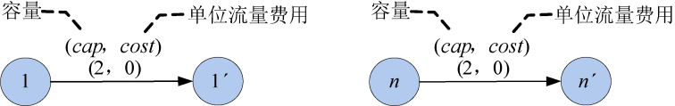
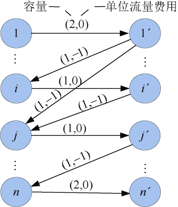

### 7.10.1　问题分析

给定一张地图，图中结点代表景点，边代表两景点间可以直达。现要求找出一条满足下述限制条件且途经景点最多的旅行路线。

（1）从最东端起点（家）出发，从东向西途经若干景点到达最西端景点，然后再从西向东回到家（可途经若干景点）。

（2）除起点外，任何景点只能访问1次。

如图7-174所示，可以从起点出发经过2、5、7，到达8号，再从8出发，经过6、4、3，回到起点。

<b class="my_markdown">图7-174　旅游路线</b>

因为每个景点只能经过一次，如果转化为网络流就要拆点，即景点i对应结点i，拆为两个结点i和i'，且从i到i'连接一条边，边的容量为1（只能经过一次），单位流量费用为0（相当于自己到自己的费用），如图7-175所示。

<b class="my_markdown">图7-175　结点拆成两个</b>

如果景点i到景点j可以直达，则从结点i'到结点j连接一条边，边的容量为1（只能经过一次），单位流量费用为−1，如图7-176所示。

<b class="my_markdown">图7-176　景点i到景点j可直达</b>

为什么单位流量费用设为−1呢？因为本题要求经过的景点最多，如果费用为负值，则经过的景点越多，费用越小，就转化为最小费用最大流问题了。

虽然找到的路线是一个简单环形，如图7-174中的路线（1—2—5—7—8—6—4—3—1），其实只需要找起点到终点的两条不同线路（1—2—5—7—8和1—3—4—6—8）就可以了。

这样起点和终点相当于都要访问两次，即起点和终点拆点时容量设为2，单位流量费用为0。如图7-177所示。

<b class="my_markdown">图7-177　起点和终点的拆点</b>

n个景点转化成的网络如图7-178所示。

<b class="my_markdown">图7-178　旅游路线网络</b>

这样，问题就转化为从源点1出发，到汇点n'的最小费用最大流问题。

