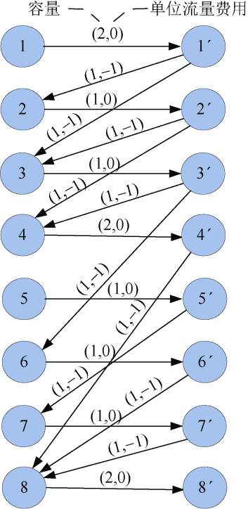
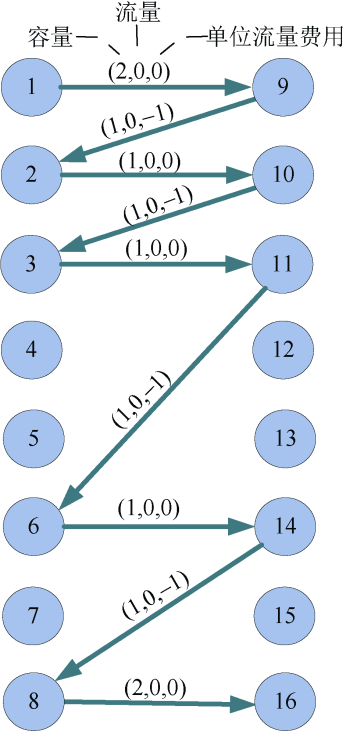
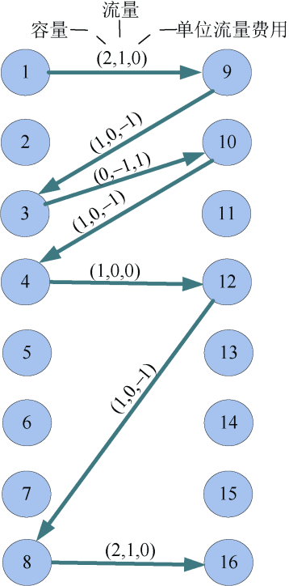
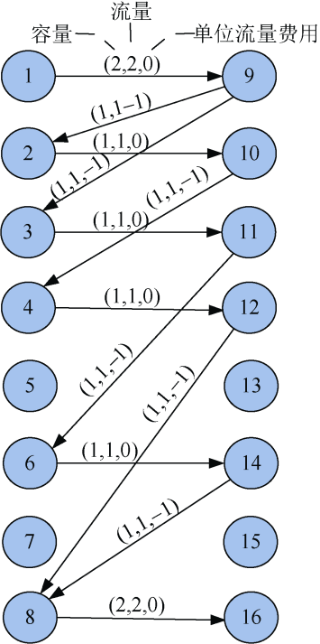
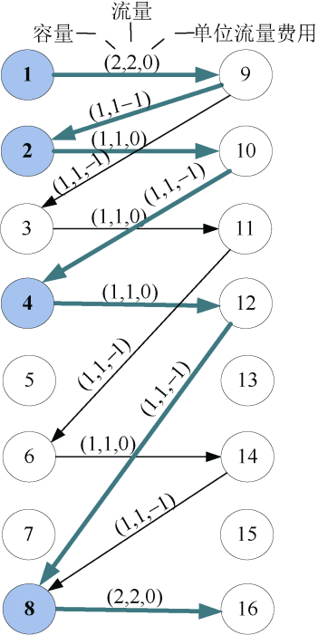
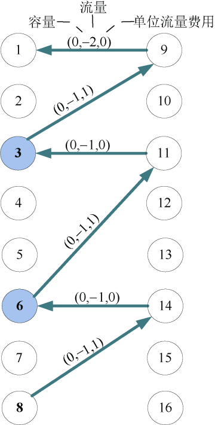

### 7.10.3　完美图解

假设景点个数n=8，直达线路数m=10。景点名分别为：Zhengzhou、Luoyang、Xian、Chengdu、Kangding、Xianggelila、Motuo、Lasa。可以直达的两个景点名分别为：Zhengzhou—Luoyang、Zhengzhou—Xian、Luoyang—Xian、Luoyang—Chengdu、Xian—Chengdu、Xian—Xianggelila、Chengdu—Lasa、Kangding—Motuo、Xianggelila—Lasa、Motuo—Lasa。

（1）构建网络

根据输入的数据，按顺序对景点编号，即景点 i对应结点i，对每个结点拆点，拆为2个结点i和i'，且从i到i'连接一条边，边的容量为1，单位流量费用为0；源点和终点拆点时，边的容量为2，单位流量费用为0；如果景点i到景点j可以直达，则从结点i'到结点j连接一条边，边的容量为1，单位流量费用为−1，如图7-179所示。

<b class="my_markdown">图7-179　旅游路线网络</b>

（2）求网络最小费用最大流

在图7-179的混合网络上，为了方便，图示用实流网络表示，上图中带'的数字，程序中存储数i'为i+n，例如3'在程序中存储数为11，使用7.5.5节中最小费用路算法求解网络的最小费用最大流，找到如下两条最小费用路。

+ 最小费用路1：16—8—14—6—11—3—10—2—9—1。增流：1。
+ 最小费用路2：16—8—12—4—10—3—9—1。增流：1。

最小费用路1如图7-180所示，最小费用路2如图7-181所示。

<b class="my_markdown">图7-180　最小费用路1</b>

<b class="my_markdown">图7-181　最小费用路2</b>

增流后最小费用最大流对应的实流网络如图7-182所示。

<b class="my_markdown">图7-182　实流网络（最小费用最大流）</b>

（3）输出最优的旅游路线

在最小费用最大流对应的混合网络上，从源点出发，沿着flow>0且cost0的方向深度优先遍历，到达终点后，再沿着flow<0且cost0的方向深度优先遍历，返回到源点。注意：图7-183中只显示了有流量的边，且没有画出实流边的反向边，图7-184中的路径是沿着图7-183中的反向边（混合网络中实流边对应的有反向边）搜索的。

<b class="my_markdown">图7-183　深度遍历1</b>

<b class="my_markdown">图7-184　深度遍历2</b>

在遍历的过程中，把经过结点号小于等于n的输出（结点号大于n的是拆点），就是最优的旅行线路。即1—2—4—8—6—3—1，最多经过的景点个数为6。

依次经过的景点：Zhengzhou、Luoyang、Chengdu、Lasa、Xianggelila、Xian、Zhengzhou。

