### 附录A　特征方程和通项公式

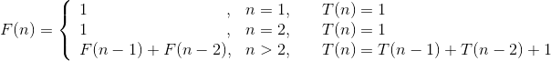
当n>2时：F(n)即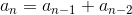，它的 **特征方程** 为：

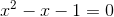
求解得：

那么F(n)的 **通项公式** 为：

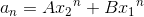
斐波那契数列中，F（1）=1，F（2）=1，所以：

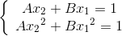
又因为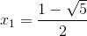，解方程得：

因此斐波那契数列通项为：

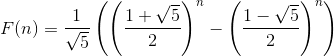
当n趋近于无穷时，。

由于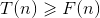，这是一个指数阶的算法！如果我们今年计算出了F(100)，那么明年才能算出F(101)，多算一个斐波那契数需要一年的时间， **爆炸增量函数** 是算法设计的噩梦！

那么上面的 **特征方程** 和 **通项公式** 是怎么回事呢？

这个问题我们首先看看线性数列的 **特征方程** ：

如果一个数列形式为：

①

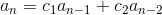
设有x、y，使得：

②

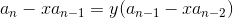
移项运算得：

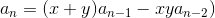
与原方程①一一对应得：

③

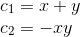
消去y就导出特征方程：

即

那么对于公式，对照上面式①得，，因此公式的 **特征方程** 为：

特征方程求解得：

再根据式③求出对应y：

再看式②，即，此式是一个公比为y的等比数列｛｝，此题的第1项为，第2项为，以此类推，第n项为，根据等比数列公式：

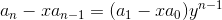
将两组不同解x，y代入得到两个方程：

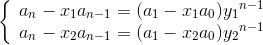
将第一个式子乘以x2，第二个式子乘以x1，两式相减得：

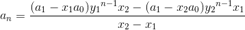
在的特征方程解中，y1= x2，y2= x1，因此：

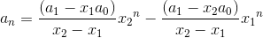
因为a0，a1，x1，x2均已知，可记为常项，得到的 **通项公式** ：

