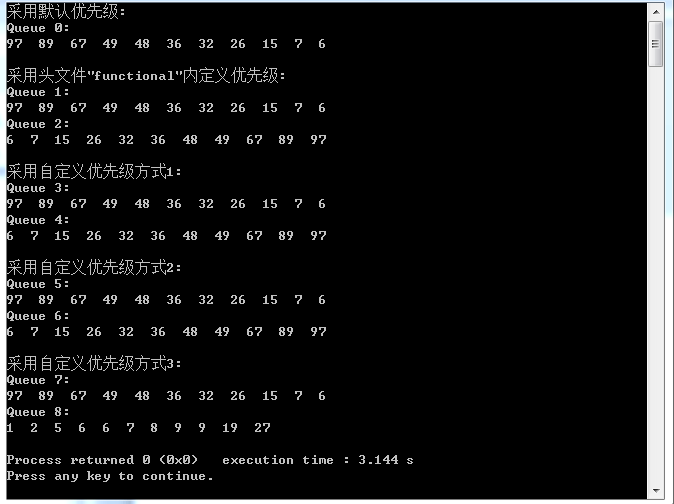

### 附录C　优先队列

普通的队列是一种先进先出的数据结构，元素在队列尾追加，而从队列头删除。在优先队列中，元素被赋予优先级。当访问元素时，具有最高优先级的元素最先删除。

优先队列（priority queue）具有最高级先出的行为特征。优先队列是0个或多个元素的集合，每个元素都有一个优先权或值,对优先队列执行的操作有：

+ 查找。
+ 插入一个新元素。
+ 删除。

在最小优先队列（min priority queue）中，查找操作用来搜索优先权最小的元素，删除操作用来删除该元素；对于最大优先队列（max priority queue），查找操作用来搜索优先权最大的元素，删除操作用来删除该元素。优先权队列中的元素可以有相同的优先权，查找与删除操作可根据任意优先权进行。

C++优先队列类似队列，但是在这个数据结构中的元素按照一定的断言排列有序。

+ empty() 如果优先队列为空，则返回真。
+ pop() 删除第一个元素。
+ push() 加入一个元素。
+ size() 返回优先队列中拥有的元素的个数。
+ top() 返回优先队列中有最高优先级的元素。

优先队列，其构造及具体实现可以先不用深究，我们现在只需要了解其特性：

```c
priority_queue<int, vector<int>, cmp >que;
```

其中，第1个参数为数据类型，第2个参数为容器类型，第3个参数为比较函数。后两个参数根据需要也可以省略。

优先队列最常用的用法：

```c
priority_queue<int> que; //参数为数据类型，默认优先级（最大值优先）构造队列
```

如果我们要把元素从小到大输出怎么办呢？有4种方法可以实现优先级控制：

+ 使用C++自带的库函数<functional>。
+ 自定义优先级①。
+ 自定义优先级②。
+ 自定义优先级③。

**如何控制优先队列的优先级？**

如果不是最大值优先，下面三种方法可以控制优先队列的优先级，根据需要添加程序即可。

方法1：使用C++自带的库函数<functional>，在本书2.3.4节已经用过。

首先在头文件中引用include库函数：

```c
#include<functional>
```

functional提供了如下的基于模板的比较函数对象。

+ equal_to<Type>：等于。
+ not_equal_to<Type>：不等于。
+ greater<Type>：大于。
+ greater_equal<Type>：大于等于。
+ less<Type>：小于。
+ less_equal<Type>：小于等于。

创建优先队列：

```c
priority_queue<int,vector<int>, less <int> >que1; //最大值优先 
                                           //注意">>"会被认为错误，">>"是右移运算符
                                           //所以这里用空格号隔开，表示的含义不同
priority_queue<int,vector<int>, greater <int> >que2;//最小值优先
```

方法2：自定义优先级① ， 队列元素为数值型。

```c
struct cmp1{  
     bool operator ()(int &a,int &b){  
     return a<b;//最大值优先
  } 
};  
struct cmp2{  
        bool operator ()(int &a,int &b){ 
        return a>b;//最小值优先 
  }  
};  
创建优先队列：
priority_queue<int,vector<int>,cmp1>que3;//最大值优先 
priority_queue<int,vector<int>,cmp2>que4;//最小值优先
```

方法3：自定义优先级 ②，队列元素为结构体型 。

```c
struct node1{  
   int x,y;  //结构体中的成员
   bool operator < (const node1 &a) const {  
     return x<a.x;//最大值优先
   }  
};  
struct node2{  
   int x,y;  
   bool operator < (const node2 &a) const {
     return x>a.x;//最小值优先  
   }  
创建优先队列：
priority_queue<node1>que5; //使用时要把数据定义为node1类型
priority_queue<node2>que6; //使用时要把数据定义为node2类型
```

方法4：自定义优先级 ③，队列元素为结构体型 。

```c
struct node3{  
   int x,y;  //结构体中的成员
};  
bool operator <(const node3 &a, const node3 &b)//在结构体外面定义
{
     return a.x<b.x; //按成员x最大值优先 
   }
struct node4{  
   int x,y;  //结构体中的成员
};  
bool operator <(const node4 &a, const node4 &b)
{
     return a.y>b.y; //按成员y最小值优先 
}
创建优先队列：
priority_queue<node3>que7; //使用时要把数据定义为node3类型
priority_queue<node4>que8; //使用时要把数据定义为node4类型
```

下面我们写一段代码来测试上面的几种优先队列，看看结果如何？特别注意它们的定义和使用方法的不同。

```c
/*优先队列的基本使用  */
#include <iostream>
#include<functional>
#include<queue>
#include<vector>
using namespace std;
//自定义优先级1，数值类型
struct cmp1{
     bool operator ()(int &a,int &b){
          return a<b;//最大值优先
     }
};
struct cmp2{
     bool operator ()(int &a,int &b){
          return a>b;//最小值优先
     }
};
//自定义优先级2,结构体类型
struct node1{
     int x,y;//结构体中的成员
     node1() {} 
     node1(int _x,int _y) //为方便赋值，采用构造函数
     {
          x = _x;
          y = _y;
     };
     bool operator < (const node1 &a) const {
          return x<a.x;//按成员x最大值优先
     }
};
struct node2{
     int x,y;//结构体中的成员
     node2() {}
     node2(int _x,int _y)
     {
         x = _x;
         y = _y;
     };
     bool operator < (const node2 &a) const {
          return x>a.x;//按成员x最小值优先
     }
};
//自定义优先级3,结构体类型
struct node3{
     int x,y;  //结构体中的成员
     node3() {}
     node3(int _x,int _y)
     {
         x = _x;
         y = _y;
     };
};
bool operator <(const node3 &a, const node3 &b)//优先级定义在结构体外面
{
  return a.x<b.x; //按成员x最大值优先
}
struct node4{
     int x,y;  //结构体中的成员
     node4() {}
     node4(int _x,int _y)
     {
         x = _x;
         y = _y;
     };
};
bool operator <(const node4 &a, const node4 &b)
{
   return a.y>b.y; //按成员y最小值优先
}
int a[]={15,7,32,26,97,48,36,89,6,49,67,0};
int b[]={1,2,5,6,9,8,6,9,7,19,27,0};
int main()
{    priority_queue<int>que;//采用默认优先级构造队列
     //使用C++自带的库函数<functional>，
     priority_queue<int,vector<int>,less<int> >que1;//最大值优先,注意“>>”会被认为错误，这是右移运算符，所以这里用空格号隔开
     priority_queue<int,vector<int>,greater<int> >que2;  //最小值优先
     //自定义优先级1
     priority_queue<int,vector<int>,cmp1>que3;
     priority_queue<int,vector<int>,cmp2>que4;
   //自定义优先级2
     priority_queue<node1>que5;
     priority_queue<node2>que6;
     //自定义优先级3
     priority_queue<node3>que7;
     priority_queue<node4>que8;
     int i;
     for(i=0;a[i];i++)
     {//a[i]为0时停止，数组最后一个数为0
           que.push(a[i]);
           que1.push(a[i]);
           que2.push(a[i]);
           que3.push(a[i]);
           que4.push(a[i]);
     }
       for(i=0;a[i]&&b[i];i++)
     {//a[i]或b[i]为0时停止，数组最后一个数为0
           que5.push(node1(a[i],b[i]));
           que6.push(node2(a[i],b[i]));
           que7.push(node3(a[i],b[i]));
           que8.push(node4(a[i],b[i]));
     }
     cout<<"采用默认优先级:"<<endl;
     cout<<"Queue 0:"<<endl;
     while(!que.empty()){
          cout<<que.top()<<"  ";
          que.pop();
     }
     cout<<endl;
     cout<<endl;
     cout<<"采用头文件\"functional\"内定义优先级:"<<endl;
     cout<<"Queue 1:"<<endl;
     while(!que1.empty()){
          cout<<que1.top()<<"  ";
          que1.pop();
     }
     cout<<endl;
     cout<<"Queue 2:"<<endl;
     while(!que2.empty()){
          cout<<que2.top()<<"  ";
          que2.pop();
     }
     cout<<endl;
     cout<<endl;
     cout<<"采用自定义优先级方式1:"<<endl;
     cout<<"Queue 3:"<<endl;
     while(!que3.empty()){
          cout<<que3.top()<<"  ";
          que3.pop();
     }
     cout<<endl;
     cout<<"Queue 4:"<<endl;
     while(!que4.empty()){
          cout<<que4.top()<<"  ";
          que4.pop();
     }
     cout<<endl;
     cout<<endl;
     cout<<"采用自定义优先级方式2:"<<endl;
     cout<<"Queue 5:"<<endl;
     while(!que5.empty()){
          cout<<que5.top().x<<"  ";
          que5.pop();
     }
     cout<<endl;
     cout<<"Queue 6:"<<endl;
     while(!que6.empty()){
          cout<<que6.top().x<<"  ";
          que6.pop();
     }
     cout<<endl;
     cout<<endl;
     cout<<"采用自定义优先级方式3:"<<endl;
     cout<<"Queue 7:"<<endl;
     while(!que7.empty()){
          cout<<que7.top().x<<"  ";
          que7.pop();
     }
     cout<<endl;
     cout<<"Queue 8:"<<endl;
     while(!que8.empty()){
          cout<<que8.top().y<<"  ";
          que8.pop();
     }
     cout<<endl;
     return 0;
}
```

运行结果如图C-1所示。


<center class="my_markdown"><b class="my_markdown">图C-1　优先队列运行结果</b></center>


