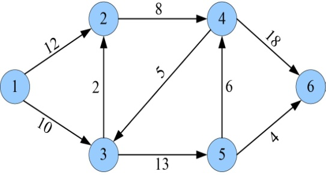
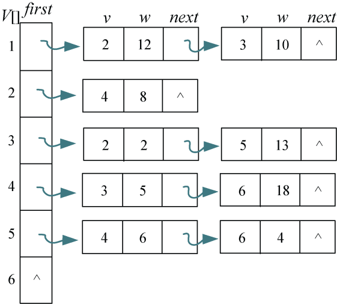
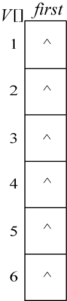
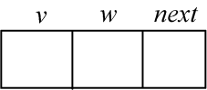
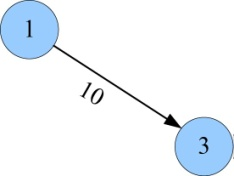
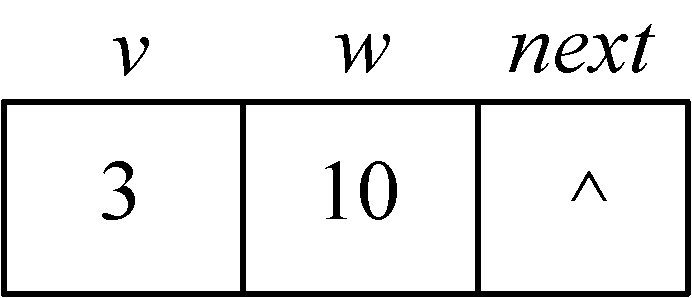
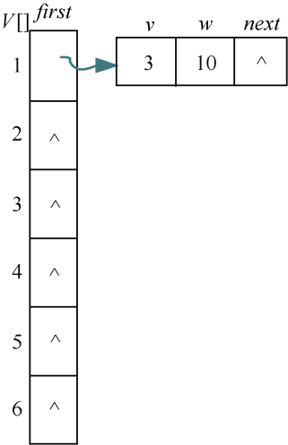
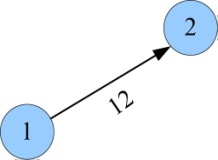
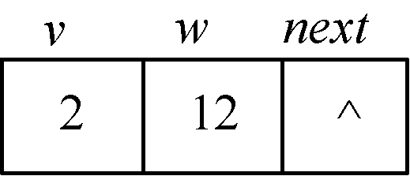
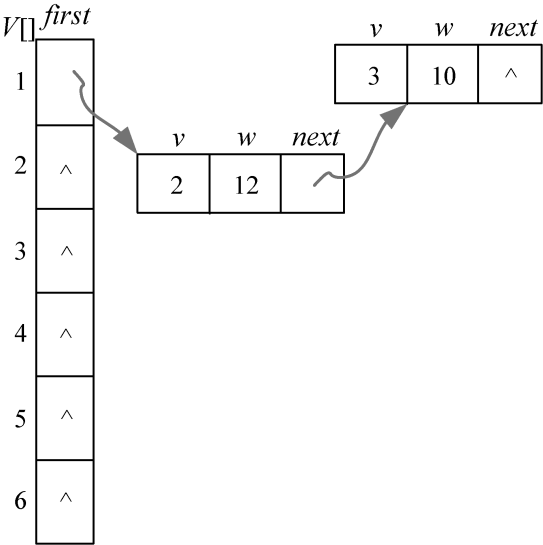

### 附录D　邻接表

邻接表是图的一种最主要存储结构，用来描述图上的每一个点。对图的每个顶点建立一个容器（n个顶点建立n个容器），第i个容器中的结点包含顶点v<sub class="my_markdown">i</sub>的所有邻接顶点。

例如，有向图如图D-1所示，其邻接表如图D-2所示。


<center class="my_markdown"><b class="my_markdown">图D-1　有向图**G**</b></center>


<center class="my_markdown"><b class="my_markdown">图D-2　邻接表</b></center>

#### 1．数据结构

邻接表用到两个数据结构：

（1）一个是头结点表，用一维数组存储。包括顶点和指向第一个邻接点的指针。

（2）一个是每个顶点v<sub class="my_markdown">i</sub>的所有邻接点构成一个线性表，用单链表存储。无向图称为顶点v<sub class="my_markdown">i</sub>的边表，有向图称为顶点v<sub class="my_markdown">i</sub>作为弧尾的出边表，存储的是顶点的序号，和指向下一个边的指针。

头结点：

```c
struct Hnode{ //定义顶点类型
   Node *first; //指向第一个邻接点
};
```

首先创建邻接表表头，初始化每个结点的第一个邻接点first为NULL，如图D-3所示。


<center class="my_markdown"><b class="my_markdown">图D-3　头结点表</b></center>

表结点：

```c
struct Node { //定义表结点
  int v; //以v为弧头的顶点编号
  int w; //边的权值
  Node *next; //指向下一个邻接结点
};
```

表结点如图D-4所示。


<center class="my_markdown"><b class="my_markdown">图D-4　表结点</b></center>

#### 2．创建邻接表

刚开始的时候把顶点表初始化，指针指向null。然后邻接点的表结点插入进来，插入到first指向的结点之前。

（1）输入第一条边的结点和权值u、v、w分别为1、3、10。

创建一条边，如图D-5所示。


<center class="my_markdown"><b class="my_markdown">图D-5　有向图中的边</b></center>

对应的表结点，如图D-6所示。


<center class="my_markdown"><b class="my_markdown">图D-6　表结点</b></center>

将表结点链接到头结点表中，如图D-7所示。


<center class="my_markdown"><b class="my_markdown">图D-7　邻接表创建过程</b></center>

（2）输入第二条边的结点和权值u、v、w分别为1、2、12。

创建一条边，如图D-8所示。


<center class="my_markdown"><b class="my_markdown">图D-8　有向图中的边</b></center>

对应的表结点，如图D-9所示。


<center class="my_markdown"><b class="my_markdown">图D-9　表结点</b></center>

将表结点链接到头结点表中，实际上是插入到 1 号顶点的邻接单链表的表头，即 first指向的邻接点之前，如图D-10所示。


<center class="my_markdown"><b class="my_markdown">图D-10　邻接表创建过程</b></center>

**注意** ：由于后输入的插入到了单链表的前面，因此输入顺序不同，建立的单链表也不同。

#### 3．输出邻接表

```c
void printg(int n)//输出邻接表
{
   cout<<"----------邻接表如下：----------"<<endl;
   for(int i=1;i<=n;i++)
   {
         Node *t=g[i].first;
         cout<<"v"<<i<<"：  ";
         while(t!=NULL)
         {
              cout<<"["<<t->v<<"  "<<t->w<<"]   ";
              t=t->next;
         }
         cout<<endl;
   }
}
```

#### 4．实战演练

```c
//adjlist
#include <iostream>
using namespace std;
const   int N=10000;
struct Node { //定义表结点
   int v; //以v为弧头的顶点编号
   int w; //边的权值
   Node *next; //指向下一个邻接结点
};
struct Hnode{ //定义顶点类型
    Node *first; //指向第一个邻接点
};
Hnode g[N];
int n,m,i,u,v,w;
void insertedge(Hnode &p,int x,int y) //插入一条边
{
     Node *q;
     q=new(Node);
     q->v=x;
     q->w=y;
     q->next=p.first;
     p.first=q;
}
void printg(int n)//输出邻接表
{
    cout<<"----------邻接表如下：----------"<<endl;
    for(int i=1;i<=n;i++)
    {
          Node *t=g[i].first;
          cout<<"v"<<i<<"：  ";
          while(t!=NULL)
          {
               cout<<"["<<t->v<<"  "<<t->w<<"]   ";
               t=t->next;
          }
          cout<<endl;
   }
}
int main()
{
     cout<<"请输入顶点数n和边数m："<<endl;
     cin >>n>>m;
     for(i=1; i<=n; i++)
          g[i].first=NULL;
     cout<<"请依次输入每条边的两个顶点u,v和边的权值w："<<endl;
     for(i=0;i<m;i++)
     {
           cin>>u>>v>>w;
           insertedge(g[u],v,w);
           //无向图时还要插入一条反向边
     }
     printg(n);//输出邻接表
     return 0;
}
```

**算法实现和测试**

（1）运行环境

Code::Blocks

（2）输入

```c
请输入顶点数n和边数m：
6 9
请依次输入每条边的两个顶点u，v和边的权值w：
1 3 10
1 2 12
2 4 8
3 5 13
3 2 2
4 6 18
4 3 5
5 6 4
5 4 6
```

（3）输出

```c
----------邻接表如下：----------
v1：  [2  12]   [3  10]
v2：  [4  8]
v3：  [2  2]   [5  13]
v4：  [3  5]   [6  18]
v5：  [4  6]   [6  4]
v6：
```


