### 附录E　并查集

若某个家族人员过于庞大，要判断两个人是否是亲戚，确实很不容易。给出某个亲戚关系图，现在任意给出两个人，判断其是否具有亲戚关系。规定：x和y是亲戚，y和z是亲戚，那么x和z也是亲戚。如果x和y是亲戚，那么x的亲戚都是y的亲戚，y的亲戚也都是x的亲戚。

那么如何很快判断两个人是否是亲戚呢？

#### 1．并查集

并查集是一种树型的数据结构，用于处理一些不相交集合（Disjoint Sets）的合并及查询问题。主要有以下3种操作：

（1）初始化

把每个点所在集合初始化为其自身。

（2）查找

查找两个元素所在的集合，即找祖宗。 **注意** ：查找时，采用递归的方法找其祖宗，祖宗集合号等于自己时即停止。在回归时，把当前结点到祖宗路径上的所有结点统一为祖宗的集合号。

（3）合并

如果两个元素的集合号不同，将两个元素合并为一个集合。 **注意** ：合并时只需要把一个元素的祖宗集合号，改为另一个元素的祖宗集合号。擒贼先擒王，只改祖宗即可！

#### 2．完美图解

假设现在有7个人，通过输入亲戚关系图，判断两个人是否有亲戚关系。

（1）初始化

把每个人的集合号初始化为其自身编号，如图E-1和图E-2所示。

<b class="my_markdown">图E-1　集合号初始化</b>

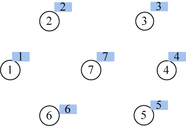

<b class="my_markdown">图E-2　祖宗关系图</b>

（2）输入亲戚关系2和7。

（3）查找

查找2所在的集合号为2，7所在的集合号为7。

（4）合并

两个元素集合号不同，将两个元素合并为一个集合。在此约定把小的集合号赋值给大的集合号，因此修改father[7]=2，如图E-3和图E-4所示。

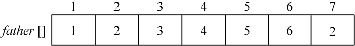

<b class="my_markdown">图E-3　集合号更新</b>

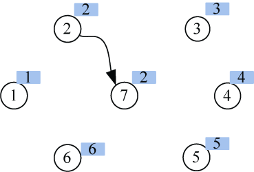

<b class="my_markdown">图E-4　祖宗关系图</b>

（5）输入亲戚关系4和5。

（6）查找

查找4所在的集合号为4，5所在的集合号为5。

（7）合并

两个元素集合号不同，将两个元素合并为一个集合。在此约定把小的集合号赋值给大的集合号，因此修改father[5]=4，如图E-5和图E-6所示。

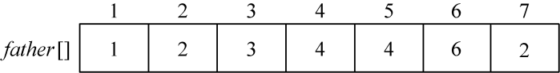

<b class="my_markdown">图E-5　集合号更新</b>

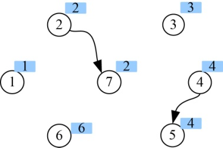

<b class="my_markdown">图E-6　祖宗关系图</b>

（8）输入亲戚关系3和7。

（9）查找

查找3所在的集合号为3，7所在的集合号为2。

（10）合并

两个元素集合号不同，将两个元素合并为一个集合。在此约定把小的集合号赋值给大的集合号，因此修改father[3]=2，如图E-7和图E-8所示。

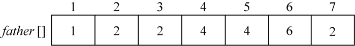

<b class="my_markdown">图E-7　集合号更新</b>

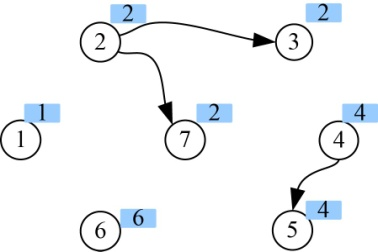

<b class="my_markdown">图E-8　祖宗关系图</b>

（11）输入亲戚关系4和7。

（12）查找

查找4所在的集合号为4，7所在的集合号为2。

（13）合并

两个元素集合号不同，将两个元素合并为一个集合。在此约定把小的集合号赋值给大的集合号。因此修改father[4]=2。擒贼先擒王，只改祖宗即可！集合号为4的有两个结点，在此只需要修改这两个结点中的祖宗即可，并不需要把集合号为4的所有结点都检索一遍，这正是并查集的巧妙之处，如图E-9和图E-10所示。

<b class="my_markdown">图E-9　集合号更新</b>

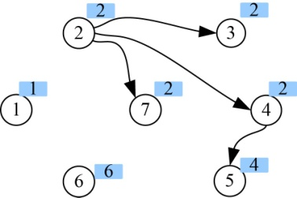

<b class="my_markdown">图E-10　祖宗关系图</b>

（14）输入亲戚关系3和4。

（15）查找

查找3所在的集合号为2，4所在的集合号为2。

（16）合并

两个元素集合号相同，什么也不做。

（17）输入亲戚关系5和7。

（18）查找

查找5所在的集合号时， **注意** ：因为5的集合号不等于5，因此，找其父亲的集合号为4，4的父亲集合号是2，2的父亲的集合号等于2，停止。在查找返回时，把当前结点到祖宗路径上的所有结点集合号统一为祖宗的集合号。

这时，5所在的集合号更新为祖宗的集合号2，如图E-11和图E-12所示。

<b class="my_markdown">图E-11　集合号更新</b>

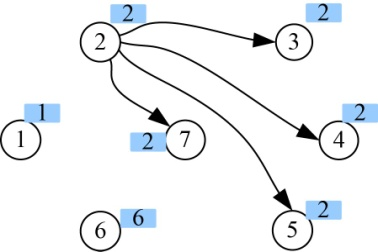

<b class="my_markdown">图E-12　祖宗关系图</b>

7所在的集合号为2。

（19）合并

两个元素集合号相同，什么也不做。

（20）输入亲戚关系5和6。

（21）查找

查找5所在的集合号为2，6所在的集合号为6。

（22）合并

两个元素集合号不同，将两个元素合并为一个集合。在此约定把小的集合号赋值给大的集合号，因此修改father[6]=2，如图E-13和图E-14所示。

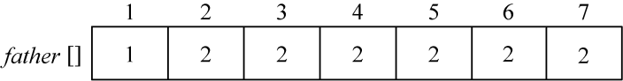

<b class="my_markdown">图E-13　集合号更新</b>

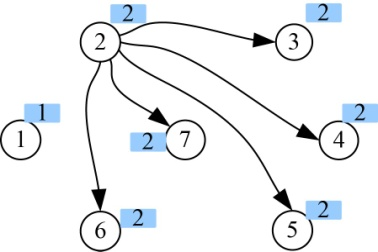

<b class="my_markdown">图E-14　祖宗关系图</b>

（23）输入亲戚关系2和3。

（24）查找

查找2所在的集合号为2，3所在的集合号为2。

（25）合并

两个元素集合号相同，什么也不做。

（26）输入亲戚关系1和2。

（27）查找

查找1所在的集合号为1，2所在的集合号为2。

两个元素集合号不同，将两个元素合并为一个集合。在此约定把小的集合号赋值给大的集合号，因此修改father[2]=1，如图E-15和图E-16所示。

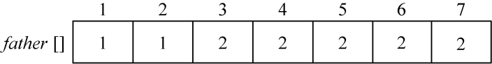

<b class="my_markdown">图E-15　集合号更新</b>

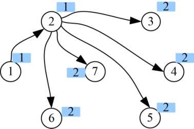

<b class="my_markdown">图E-16　祖宗关系图</b>

假设到此为止，亲戚关系图已经输入完毕。

我们可以看到3、4、5、6、7这些结点集合号并没有改为1，这样真的可以吗？

现在要判断5和2是不是亲戚关系：需要查找5的父亲2，2的父亲1，1的父亲是1，搜索停止，那么5到其祖宗1这条路径上所有的结点集合号更新为1。2的祖宗是1，1的祖宗是1，搜索停止，那么2到其祖宗1这条路径上所有的结点集合号更新为1。5和2的集合号都为1，所以5和2是亲戚关系。

