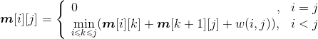
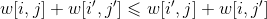
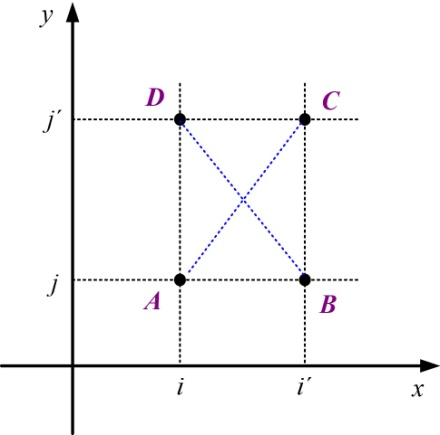
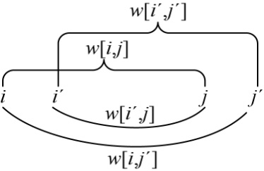
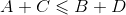
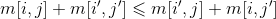
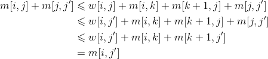
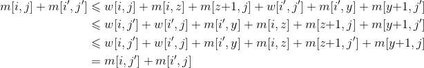
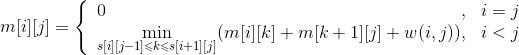
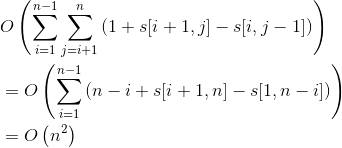

### 附录F　四边不等式

石子合并问题最小得分递归式：

**s**[i][j]表示取得最优解**Min**[i][j]的最优策略位置。

**四边不等式** ：当函数w[i，j]满足时，称w满足四边形不等式。如图F-1和图F-2所示。

<b class="my_markdown">图F-1　四边不等式坐标表示</b>

<b class="my_markdown">图F-2　四边不等式区间表示</b>

四边不等式的坐标表示中，。

四边不等式的区间表示中，。

**区间包含关系单调** ：当函数w[i，j]满足w[iˊ，j]w[i，jˊ]时称w关于区间包含关系单调。

下面只需要证明3个问题：

（1）w[i，j]满足四边不等式。

（2）m[i，j]也满足四边不等式。

（3）s[i，j]具有单调性。

**证明1** ：w[i，j]满足四边不等式。

在石子归并问题中，因为w[i，j]=，所以，则w[i，j]满足四边形不等式，同时由a[i]0，可知w[i，j]满足单调性。

**证明2** ：m[i，j]满足四边不等式。

对于满足四边形不等式的单调函数w[i，j]，可推知由递归式定义的函数m[i，j]也满足四边形不等式，即。

数学归纳法证明：

对四边形不等式中“长度”l=j'−i进行归纳：

当i=iˊ或j=jˊ时，不等式显然成立。由此可知，当l1时，函数m[i，j]满足四边不等式。

下面分两种情形。

情形1：i<iˊ=j<jˊ

在这种情形下，四边形不等式简化为反三角不等式：m[i，j]+m[j，jˊ]m[i，jˊ]。

设k=min{p|m[i，jˊ]=m[i，p]+m[p+1，jˊ]+w[i，jˊ]}，再分两种情形kj或k>j。下面只讨论kj的情况，k>j同理。

kj：

情形2：i<iˊ<j<jˊ

设 y= min {p | m[iˊ，j]=m[iˊ，p]+m[p+1，j]+w[iˊ，j] }

z= min {p | m[i，jˊ]=m[i，p]+m[p+1，jˊ]+w[i，jˊ] }

仍需再分两种情形讨论，即zy或z>y。下面只讨论zy的情况，z>y同理。

由i<zyj，有：

综上所述，m[i，j]满足四边形不等式。

**证明3** ：s[i，j]具有单调性。

令s[i，j]= min {k | m[i，j]=m[i，k]+m[k+1，j]+w[i，j]}

由函数m[i，j]满足四边形不等式可以推出函数s[i，j]的单调性，即，

s[i，j]s[i，j+1]s[i+1，j+1]　，ij

当i=j时，单调性显然成立。因此下面只讨论i<j的情形。由于对称性，只要证明s[i，j]s[i，j+1]。

令mk[i，j]=m[i，k]+m[k+1，j]+w[i，j]。要证明s[i，j]s[i，j+1]，只要证明对于所有i<kkˊj且mkˊ[i，j]mk[i，j]，有mkˊ[i，j+1]mk[i，j+1]成立。

事实上，我们可以证明一个更强的不等式

mk[i，j]−mkˊ[i，j]mk[i，j+1]−mkˊ[i，j+1]

也就是：

mk[i，j]+mkˊ[i，j+1]mk[i，j+1]+mkˊ[i，j]

利用递归式将其展开整理可得：m[k，j]+m[kˊ，j+1]m[kˊ，j]+m[k，j+1]，这正是kkˊj<j+1时的四边形不等式。

综上所述，当w满足四边形不等式时，函数s[i，j]具有单调性。

于是，我们利用s[i，j]的单调性，得到优化的状态转移方程为：

用类似的方法可以证明，对于最大得分问题，也可采用同样的优化方法。

改进后的状态转移方程所需的计算时间为：

上述方法利用四边形不等式推出最优决策的单调性，从而减少每个状态转移的状态数，降低算法的时间复杂度。

上述方法是具有普遍性的。状态转移方程与上述递归式类似，且w[i，j]满足四边形不等式的动态规划问题，都可以采用相同的优化方法，如最优二叉排序树等。

