### 附录G　排列树

例如3个机器零件的解空间树，如图G-1所示。

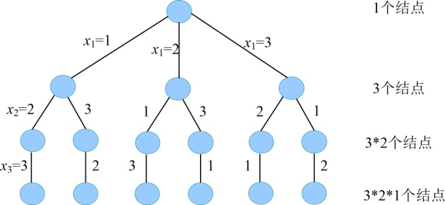
<center class="my_markdown"><b class="my_markdown">图G-1　解空间树</b></center>

从根到叶子的路径就是机器零件的一个加工顺序，例如最右侧路径（3，1，2），表示先加工3号零件，再加工1号零件，最后加工2号零件。

那么我们如何得到这n个机器零件号的排列呢？

（1）1与1交换，求（2，3，…，n）的排列。

（2）2与1交换，求（1，3，…，n）的排列。

（3）3与1交换，求（2，1，…，n）的排列。

……

（n）n与1交换，求（2，3，…，1）的排列。

这样每个数开头一次，递归求解剩下序列的排列，即可得到n个数的全排列。

我们可以很容易得到3个数的排列：

（1） **1与1交换，求（2，3）的排列** 。

（2，3）的排列是（2，3）和（3，2），得到1开头的排列：1 2 3，1 3 2。

（2） **2与1交换，求（1，3）的排列** 。

（1，3）的排列是（1，3）和（3，1），得到2开头的排列：2 1 3，2 3 1。

（3） **3与1交换，求（2，1）的排列** 。

（2，1）的排列是（2，1）和（1，2），得到3开头的排列：：3 2 1，3 1 2。

可以看出每个数与第一个数的交换都是在序列1 2 3的基础上操作的，因此执行完交换后要复位成1 2 3，以便下次在序列1 2 3的基础上继续操作。

那么程序具体怎么实现呢？

首先初始化，x[i]=i，即x[1]=1，x[2]=2，x[3]=3，如图G-2所示。

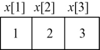
<center class="my_markdown"><b class="my_markdown">图G-2　初始化</b></center>

（1）扩展A（t=1）：for(int i=t;i<=n;i++)，如图G-3所示。


<center class="my_markdown"><b class="my_markdown">图G-3　扩展A</b></center>

因为for语句，我们首先执行i=t=1，其他分支先悬空等待。然后交换元素swap(x[t]，x[i])，因为t=1、i=1，相当于x[1]与x[1]交换，交换完毕，x[1]=1，生成一个新结点B，如图G-4和图G-5所示。

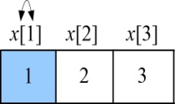
<center class="my_markdown"><b class="my_markdown">图G-4　x[1]与x[1]交换</b></center>

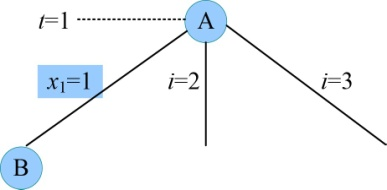
<center class="my_markdown"><b class="my_markdown">图G-5　生成B</b></center>

（2）扩展B（t=2）：for(int i=t;i<=n;i++)，如图G-6所示。

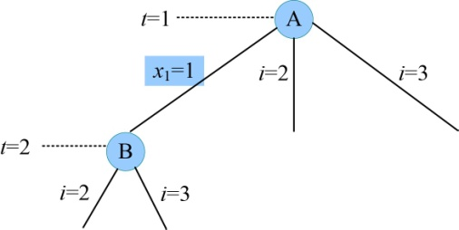
<center class="my_markdown"><b class="my_markdown">图G-6　扩展B</b></center>

首先执行i=t=2，其他分支先悬空等待。然后交换元素swap(x[t]，x[i])，因为t=2、i=2，相当于x[2]与x[2]交换，交换完毕，x[2]=2，生成一个新结点C，如图G-7和图G-8所示。

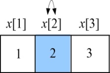
<center class="my_markdown"><b class="my_markdown">图G-7　x[2]与x[2]交换</b></center>


<center class="my_markdown"><b class="my_markdown">图G-8　生成C</b></center>

（3）扩展C（t=3）：for(int i=t;i<=n;i++)。

首先执行i=t=3，因为n=3，for语句无其他的分支。然后交换元素swap(x[t]，x[i])，因为t=3、i=3，相当于x[3]与x[3]交换，交换完毕，x[3]=3，生成一个新结点D，如图G-9和图G-10所示。


<center class="my_markdown"><b class="my_markdown">图G-9　x[3]与x[3]交换</b></center>

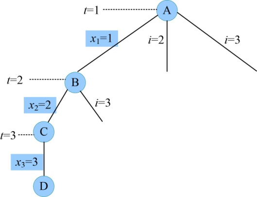
<center class="my_markdown"><b class="my_markdown">图G-10　生成D</b></center>

（4）扩展D（t=4）：t>n，输出当前排列x[1]=1，x[2]=2，x[3]=3。即（1，2，3）。

回溯到最近的结点C，回溯时怎么来的怎么换回去。

因为从C→D，执行了x[3]与x[3]交换，现在需要换回去，再次执行交换swap(x[3]，x[3])，如图G-11所示。


<center class="my_markdown"><b class="my_markdown">图G-11　x[3]与x[3]交换</b></center>

C没有悬空的分支，孩子已全部生成，成为死结点。继续向上回溯到B。

因为从B→C，执行了x[2]与x[2]交换，现在需要换回去，再次执行交换swap(x[2]，x[2])，如图G-12所示。


<center class="my_markdown"><b class="my_markdown">图G-12　x[2]与x[2]交换</b></center>

回溯到B的排列树，如图G-13所示。

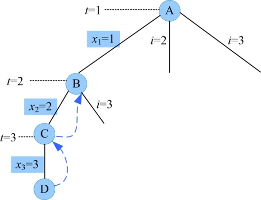
<center class="my_markdown"><b class="my_markdown">图G-13　回溯到B</b></center>

为什么可以回溯呢？因为我们刚才执行时，for语句的其他分支在悬空等待状态，当深度搜索到叶子时，将回溯回来执行这些悬空等待的分支。B结点还有一个悬空的分支（i=3）待生成，重新扩展B。 **注意** ：回溯重新扩展时，不再重新执行for语句，只执行待生成的悬空分支。

（5）重新扩展B结点（t=2）。

i=3，然后交换元素swap(x[t]，x[i])，因为t=2、i=3，相当于x[2]与x[3]交换，交换完毕，x[2]=3，x[3]=2，生成一个新结点E，如图G-14和图G-15所示。

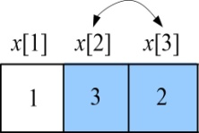
<center class="my_markdown"><b class="my_markdown">图G-14　x[2]与x[3]交换</b></center>

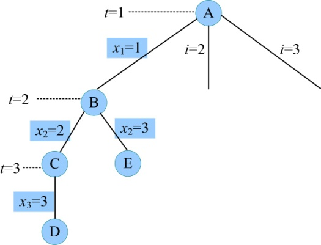
<center class="my_markdown"><b class="my_markdown">图G-15　生成E</b></center>

（6）扩展E（t=3）：for(int i=t;i<=n;i++)。

首先执行i=t=3，因为n=3，for语句无其他的分支。然后交换元素swap(x[t]，x[i])，因为t=3、i=3，相当于x[3]与x[3]交换，因为在第（6）步的交换中x[3]=2，因此交换后，x[3]=2，生成一个新结点F。如图G-16和图G-17所示。

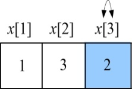
<center class="my_markdown"><b class="my_markdown">图G-16　x[3]与x[3]交换</b></center>

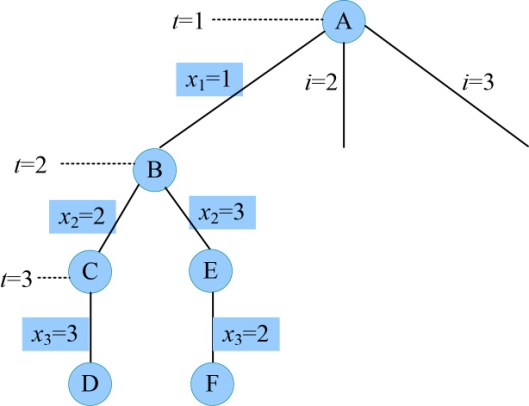
<center class="my_markdown"><b class="my_markdown">图G-17　生成F</b></center>

（7）扩展F（t=4）。

t>n，输出当前排列x[1]=1，x[2]=3，x[3]=2，即（1，3，2）。

（8）回溯到最近的结点E，回溯时怎么来的怎么换回去。

因为从E→F，执行了x[3]与x[3]交换，现在需要换回去，再次执行交换swap(x[3]，x[3])，如图G-18所示。


<center class="my_markdown"><b class="my_markdown">图G-18　x[3]与x[3]交换</b></center>

此时x[3]=2。E没有悬空的分支，孩子已全部生成，成为死结点。继续向上回溯到B。

因为从B→E，执行了x[2]与x[3]交换，现在需要换回去，再次执行交换swap(x[2]，x[3])，如图G-19所示。


<center class="my_markdown"><b class="my_markdown">图G-19　x[2]与x[3]交换</b></center>

此时x[2]=2，x[3]=3。B没有悬空的分支，孩子已全部生成，成为死结点，继续向上回溯到A。

因为从A→B，执行了x[1]与x[1]交换，现在需要换回去，再次执行交换swap(x[1]，x[1])，如图G-20所示。

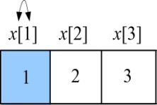
<center class="my_markdown"><b class="my_markdown">图G-20　x[1]与x[1]交换</b></center>

此时x[1]=1，x[2]=2，x[3]=3。恢复到初始状态，如图G-21所示。

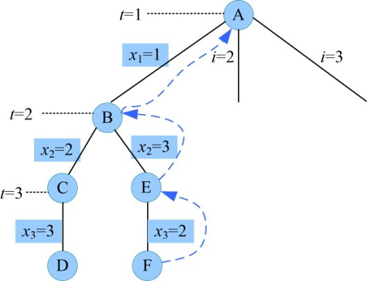
<center class="my_markdown"><b class="my_markdown">图G-21　回溯到A</b></center>

A结点还有下一个悬空的分支（i=2）待生成。

（9）重新扩展A结点（t=1）。

i=2，然后交换元素swap(x[t]，x[i])，因为t=1、i=2，相当于x[1]与x[2]交换，交换完毕，x[1]=2，x[2]=1，生成一个新结点G，如图G-22和图G-23所示。

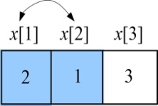
<center class="my_markdown"><b class="my_markdown">图G-22　x[1]与x[2]交换</b></center>

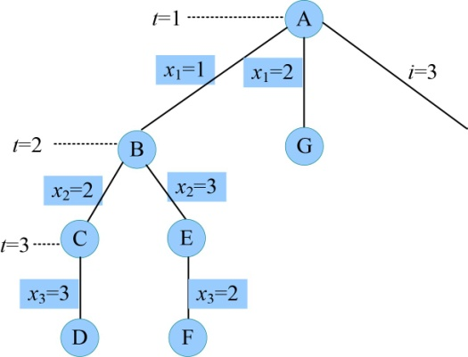
<center class="my_markdown"><b class="my_markdown">图G-23　生成G</b></center>

（10）扩展G（t=2）：for(int i=t;i<=n;i++)，如图G-24所示。

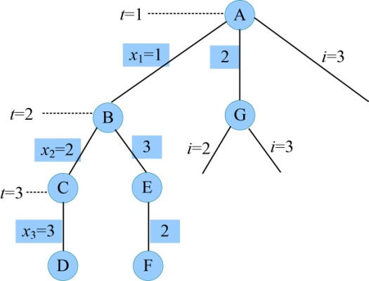
<center class="my_markdown"><b class="my_markdown">图G-24　扩展G</b></center>

首先执行i=t=2，其他分支先悬空等待。然后交换元素swap(x[t]，x[i])，因为t=2、i=2，相当于x[2]与x[2]交换，因为在第（9）步的交换中x[2]=1，因此交换后，x[2]=1，生成一个新结点H，如图G-25和图G-26所示。


<center class="my_markdown"><b class="my_markdown">图G-25　x[2]与x[2]交换</b></center>

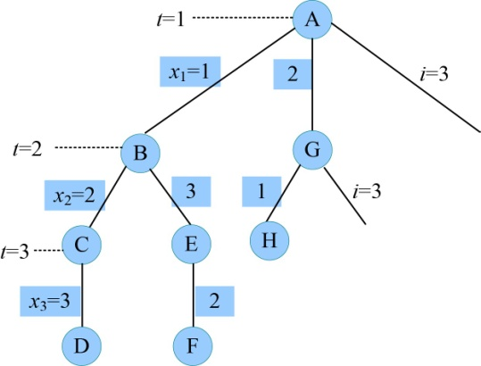
<center class="my_markdown"><b class="my_markdown">图G-26　生成H</b></center>

（11）扩展H（t=3）：for(int i=t;i<=n;i++)。

首先执行i=t=3，因为n=3，for语句无其他的分支。然后交换元素swap(x[t]，x[i])，因为t=3、i=3，相当于x[3]与x[3]交换，交换后，x[3]=3，生成新结点I，如图G-27和图G-28所示。


<center class="my_markdown"><b class="my_markdown">图G-27　x[3]与x[3]交换</b></center>

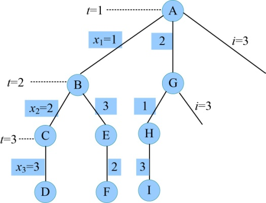
<center class="my_markdown"><b class="my_markdown">图G-28　生成I</b></center>

（12）扩展I（t=4）。

t>n，输出当前排列x[1]=2，x[2]=1，x[3]=3，即（2，1，3）。

（13）回溯到最近的结点H，回溯时怎么来的怎么换回去。

因为从H→I，执行了x[3]与x[3]交换，现在需要换回去，再次执行交换swap(x[3]，x[3])，如图G-29所示。


<center class="my_markdown"><b class="my_markdown">图G-29　x[3]与x[3]交换</b></center>

H没有悬空的分支，孩子已全部生成，成为死结点。继续向上回溯到G。

因为从G→H，执行了x[2]与x[2]交换，现在需要换回去，再次执行交换swap(x[2]，x[2])，如图G-30和图G-31所示。

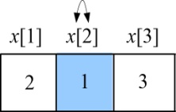
<center class="my_markdown"><b class="my_markdown">图G-30　x[2]与x[2]交换</b></center>

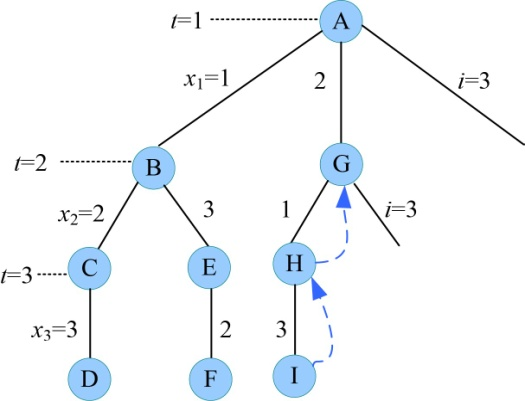
<center class="my_markdown"><b class="my_markdown">图G-31　回溯到G</b></center>

G结点还有一个悬空的分支（i=3）待生成，重新扩展G。

（14）重新扩展G（t=2）。

i=3，然后交换元素swap(x[t]，x[i])，因为t=2、i=3，相当于x[2]与x[3]交换，交换完毕，x[2]=3，x[3]=1，生成一个新结点J，如图G-32和图G-33所示。


<center class="my_markdown"><b class="my_markdown">图G-32　x[2]与x[3]交换</b></center>

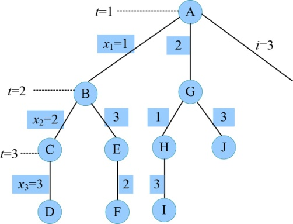
<center class="my_markdown"><b class="my_markdown">图G-33　生成J</b></center>

（15）扩展J（t=3）：for(int i=t;i<=n;i++)。

我们首先执行i=t=3，因为n=3，for语句无其他的分支。然后交换元素swap(x[t]，x[i])，因为t=3、i=3，相当于x[3]与x[3]交换，因为在第（14）步的交换中x[3]=1，因此交换后，x[3]=1，生成新结点K，如图G-32和图G-33所示。


<center class="my_markdown"><b class="my_markdown">图G-34　x[3]与x[3]交换</b></center>

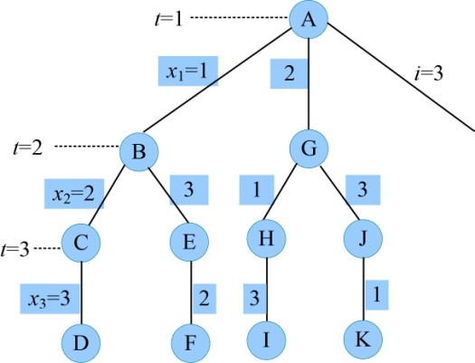
<center class="my_markdown"><b class="my_markdown">图G-35　生成K</b></center>

（16）扩展K（t=4）。

t>n，输出当前排列x[1]=2，x[2]=3，x[3]=1，即（2，3，1）。

（17）回溯到最近的结点J，回溯时怎么来的怎么换回去。

因为从J→K，执行了x[3]与x[3]交换，现在需要换回去，再次执行交换swap(x[3]，x[3])，如图G-36所示。

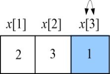
<center class="my_markdown"><b class="my_markdown">图G-36　x[3]与x[3]交换</b></center>

J没有悬空的分支，孩子已全部生成，成为死结点。继续向上回溯到G。

因为从G→J，执行了x[2]与x[3]交换，现在需要换回去，再次执行交换swap(x[2]，x[3])，如图G-37所示。


<center class="my_markdown"><b class="my_markdown">图G-37　x[2]与x[3]交换</b></center>

G没有悬空的分支，孩子已全部生成，成为死结点。继续向上回溯到A。

因为A→G，执行了x[1]与x[2]交换，现在需要换回去，再次执行交换swap(x[1]，x[2])，如图G-38所示。

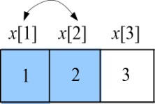
<center class="my_markdown"><b class="my_markdown">图G-38　x[1]与x[2]交换</b></center>

此时x[1]=1，x[2]=2，x[3]=3。恢复到初始状态。A结点还有下个悬空的分支（i=3）待生成，如图G-39所示。

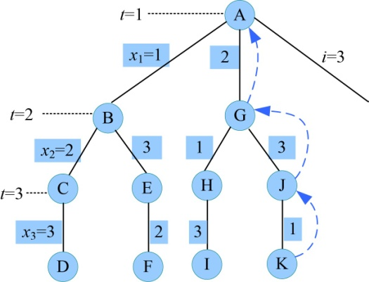
<center class="my_markdown"><b class="my_markdown">图G-39　回溯到A</b></center>

（18）重新扩展A结点（t=1）。

i=3，然后交换元素swap(x[t]，x[i])，因为t=1、i=3，相当于x[1]与x[3]交换，交换完毕，x[1]=3，x[3]=1，生成一个新结点L，如图G-40和图G-41所示。

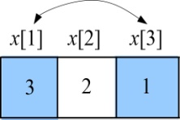
<center class="my_markdown"><b class="my_markdown">图G-40　x[1]与x[3]交换</b></center>

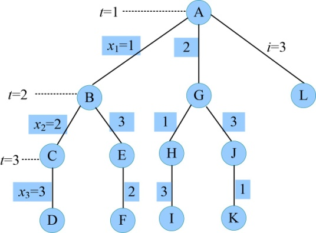
<center class="my_markdown"><b class="my_markdown">图G-41　生成L</b></center>

（19）扩展L（t=2）：for(int i=t;i<=n;i++)，如图G-42所示。

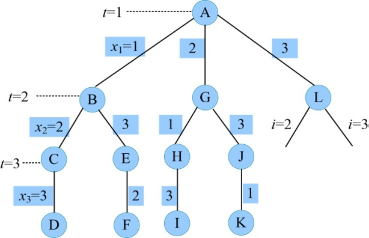
<center class="my_markdown"><b class="my_markdown">图G-42　扩展L</b></center>

首先执行i=t=2，其他分支先悬空等待。然后交换元素swap(x[t]，x[i])，因为t=2、i=2，相当于x[2]与x[2]交换，交换后，x[2]=2，生成一个新结点M，如图G-43和图G-44所示。

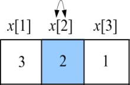
<center class="my_markdown"><b class="my_markdown">图G-43　x[2]与x[2]交换</b></center>

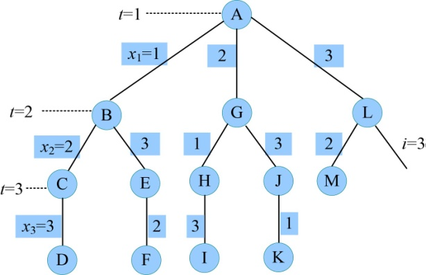
<center class="my_markdown"><b class="my_markdown">图G-44　生成M</b></center>

（20）扩展M（t=3）：for(int i=t;i<=n;i++)。

首先执行i=t=3，因为n=3，for语句无其他的分支。然后交换元素swap(x[t]，x[i])，因为t=3、i=3，相当于x[3]与x[3]交换，因为在第（19）步的交换中x[3]=1，因此交换后，x[3]=1，生成一个新结点N，如图G-45和图G-46所示。

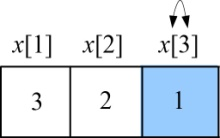
<center class="my_markdown"><b class="my_markdown">图G-45　x[3]与x[3]交换</b></center>

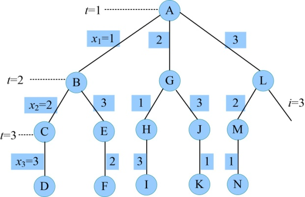
<center class="my_markdown"><b class="my_markdown">图G-46　生成N</b></center>

（21）扩展N（t=4）。

t>n，输出当前排列x[1]=3，x[2]=2，x[3]=1，即（3，2，1）。

（22）回溯到最近的结点M。

回溯时怎么来的怎么换回去，因为从M→N，执行了x[3]与x[3]交换，现在需要换回去，再次执行交换swap(x[3]，x[3])，如图G-47所示。


<center class="my_markdown"><b class="my_markdown">图G-47　x[3]与x[3]交换</b></center>

M没有悬空的分支，孩子已全部生成，成为死结点。继续向上回溯到L。

因为从L→M，执行了x[2]与x[2]交换，现在需要换回去，再次执行交换swap(x[2]，x[2])，如图G-48所示。

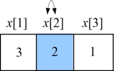
<center class="my_markdown"><b class="my_markdown">图G-48　x[2]与x[2]交换</b></center>

继续向上回溯到L，L结点还有一个悬空的分支（i=3）待生成，重新扩展L，如图G-49所示。

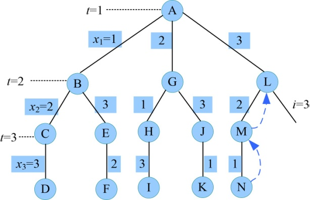
<center class="my_markdown"><b class="my_markdown">图G-49　回溯到L</b></center>

（23）重新扩展L（t=2）：i=3，然后交换元素swap(x[t]，x[i])。

因为t=2，i=3，相当于x[2]与x[3]交换，因为在第（22）步的交换中x[1]=3，因此交换后，x[3]=1，交换完毕，x[2]=1，x[3]=2，生成一个新结点O，如图G-50和图G-51所示。

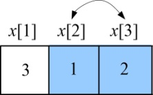
<center class="my_markdown"><b class="my_markdown">图G-50　x[2]与x[3]交换</b></center>

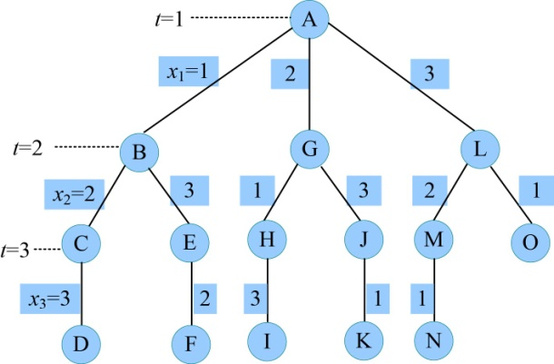
<center class="my_markdown"><b class="my_markdown">图G-51　生成O</b></center>

（24）扩展O（t=3）：for(int i=t;i<=n;i++)。

首先执行i=t=3，因为n=3，for语句无其他的分支。然后交换元素swap(x[t]，x[i])，因为t=3、i=3，相当于x[3]与x[3]交换，因为在第（23）步的交换中x[3]=2，因此交换后，x[3]=2，生成一个新结点P，如图G-52和图G-53所示。


<center class="my_markdown"><b class="my_markdown">图G-52　x[3]与x[3]交换</b></center>

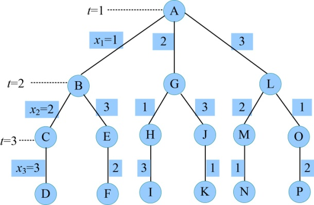
<center class="my_markdown"><b class="my_markdown">图G-53　生成P</b></center>

（25）扩展P（t=4）。

t>n，输出当前排列x[1]=3，x[2]=1，x[3]=2，即（3，1，2）。

（26）回溯到最近的结点O。

回溯时怎么来的怎么换回去，因为从O→P，执行了x[3]与x[3]交换，现在需要换回去，再次执行交换swap(x[3]，x[3])，如图G-54所示。


<center class="my_markdown"><b class="my_markdown">图G-54　x[3]与x[3]交换</b></center>

O没有悬空的分支，孩子已全部生成，成为死结点。继续向上回溯到L，因为从L→O，执行了x[2]与x[3]交换，现在需要换回去，再次执行交换swap(x[2]，x[3])。如图G-55所示。


<center class="my_markdown"><b class="my_markdown">图G-55　x[2]与x[3]交换</b></center>

此时x[1]=3，x[2]=2，x[3]=1。L没有悬空的分支，孩子已全部生成，成为死结点。继续向上回溯到A，我们从A→L，x[1]与x[3]交换，现在需要换回去，再次执行交换操作swap(x[1]，x[3])，如图G-56所示。


<center class="my_markdown"><b class="my_markdown">图G-56　x[1]与x[3]交换</b></center>

此时x[1]=1，x[2]=2，x[3]=3。恢复到初始状态。A结点没有悬空的分支，孩子已全部生成，成为死结点，所有的结点已成为死结点，算法结束。

程序代码如下：

```c
//program G-1
#include <iostream>
#define MX 50
using namespace std;
int x[MX];         //解分量
int n;
void myarray(int t)
{
     if(t>n)
     {
           for(int i=1;i<=n;i++) // 输出排列
                 cout<<x[i]<<" ";
           cout<<endl;
           return ;
     }
     for(int i=t;i<=n;i++)  // 枚举
     {
         swap(x[t],x[i]);  // 交换
         myarray(t+1);  // 继续深搜
         swap(x[t],x[i]); // 回溯时反操作
     }
}
int main()
{
     cout << "输入排列的元素个数n（求1..n的排列）：" << endl;
     cin>>n;
     for(int i=1;i<=n;i++) //初始化
         x[i]=i;
     myarray(1);
     return 0;
}
```

**算法实现和测试**

（1）运行环境

Code::Blocks

（2）输入

```c
输入排列的元素个数n（求1..n的排列）：
3
```

（3）输出

```c
1 2 3
1 3 2
2 1 3
2 3 1
3 2 1
3 1 2
```


