### 附录H　贝尔曼规则

有n个机器零件的集合记为S={J1，J2，…，Jn}，设最优加工方案第一个加工的零件为i，当第一台机器加工零件i时，第二台机器需要t时间空闲下来。该加工方案第一个零件开始在第一台机器上加工到最后一个零件在第二台机器上结束所需要的总时间为T（S，t），如图H-1所示。t有两种情况，可能比t1i小，也可能比t1i大。

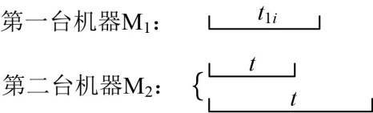

<b class="my_markdown">图H-1　加工零件i时M2需要t时间空闲</b>

接下来，当第一台机器加工余下集合S−{i}的零件时，第二台机器需要tˊ时间空闲下来，如图H-2所示。

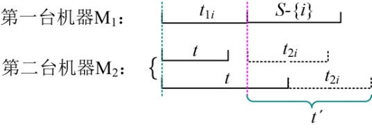

<b class="my_markdown">图H-2　加工余下零件时M2需要tˊ时间空闲</b>

这个空闲时间tˊ等于t2i（第一种情况），或者等于t−t1i+t2i（第二种情况）。

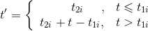
即：

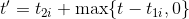
那么总的加工时间为：

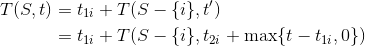
因为不知道第一个加工的零件i是多少，因此i可以是S中的任何一个零件编号，那么最优解（最少的加工时间）递归式为：

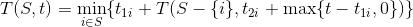
集合S有n!种加工顺序，但对于其中的两个零件编号i、j来说，只有两种方案：

（1）先加工i，再加工j。

（2）先加工j，再加工i。

这两种方案哪种是最优的呢？

通过下面推导可以比较分析出来。

**方案1** （先i后j）：

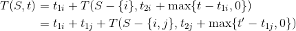

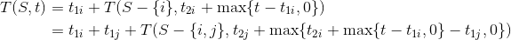
整理后面一项，令其为：

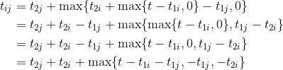
**注意** ：第1步到第2步，max里面的两项都加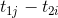，max外面的减（相当于加）。第2步到第3步，两者求最大值后，再与第三个数求最大值，相当于三者求最大值。第3步到第4步，max里面的三项都减，max外面的加。

方案1的加工时间为：

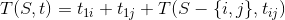
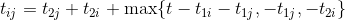
**方案2** （先j后i）：

把方案1的加工时间公式i、j交换即可得到。

方案2的加工时间为：

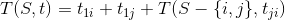
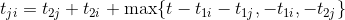
可以看出，方案1和方案2的区别仅仅在于和中的max最后两项。

如果方案1和方案2优，则：

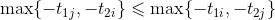
两边同时乘以−1：

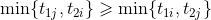
因此，方案1和方案2优的充分必要条件是：

