### 附录I　增广路中称为关键边的次数

在残余网络中，如果一条增广路径上的可增广量是该路径上边（u，v）的残余容量，则称边（u，v）为增广路径上的关键边。

如图I-1所示，一条可增广路径P: 1—2—4—6，这条增广路径的可增广量为8（增广路径上所有边的残余容量最小值），2—4这条边的残余容量正好是可增广量，那么2—4就是关键边。

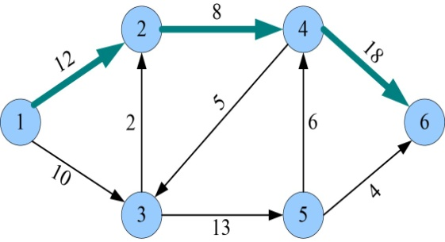

<b class="my_markdown">图I-1　残余网络**G***</b>

沿着增广路径P增加流量8后，残余网络如图I-2所示。

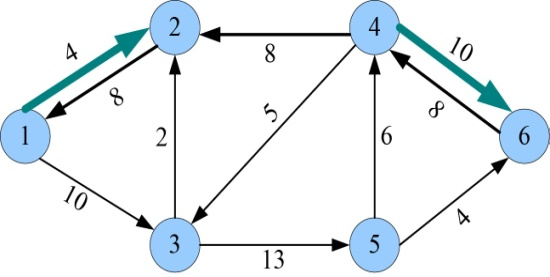

<b class="my_markdown">图I-2　残余网络**G***（增流后）</b>

**增流后，关键边从残余网络中消失！** 其反向边（4，2）出现。

而且任何一条增广路径都至少存在一条关键边。其实增广路径上残余容量最小的边就是关键边，如果有多个边都是最小的，那关键边就有多个，如图I-1所示，如果边4—6的残余容量也是8，那么就有两条关键边。

**证明** ：残余网络中，每条边称为关键边的次数最多为|V|/2次。

残余网络中，任意一条边（u，v），当第一次成为关键边时，s到v的最短路径等于s到u的最短路径加1，因为增广路径都是最短路径。即：

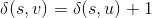
如图I-3所示。

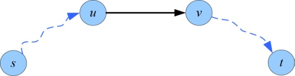

<b class="my_markdown">图I-3　增广路径P1</b>

沿着该增广路径增流后，关键边（u，v）从残余网络中消失。其反向边（v，u）出现。

那么，边（u，v）消失后还会不会再出现呢？什么时候会“重出江湖”？

残余网络中的边有3种情况：

（1） **有的边永远不能成为关键边。** 例如图I-1中的1—2，3—2等边。因为找到3条增广路径后达到最大流，1—2—4—6，1—3—5—6，1—3—5—4—6。

（2） **有的边只能成为一次关键边。** 增流后就消失了，而且永不再出现，例如图I-1中的2—4边。

（3） **有的边可以多次成为关键边。** 第一次成为关键边，增流后消失，但过一段又出现了，再次成为关键边，如图I-4和图I-5所示。

<b class="my_markdown">图I-4　（u，v）第一次成为关键边</b>

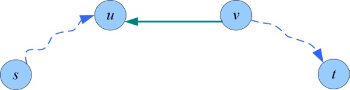

<b class="my_markdown">图I-5　增流后（u，v）消失</b>

什么时候边（u，v）会再次出现呢？

如果又找到了一条增广路径P2，如图I-6所示。

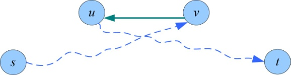

<b class="my_markdown">图I-6　增广路径P2</b>

此时，s到u的最短路径等于s到v的最短路径加1，即：

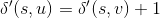
那么沿增广路径P2增流后，（u，v）会再次出现，如图I-7所示。

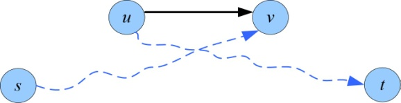

<b class="my_markdown">图I-7　增流后（u，v）再次出现</b>

因为下一次找到的最短路径大于等于前一次找到的最短路径，即：

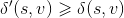
因此，

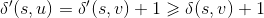
又因为，所以，

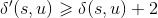
也就是说，（u，v）下一次成为关键边时，从源点到u的距离至少增加了两个单位，而从源点s到u的最初距离至少为0，从s到u的最短路径上的中间结点中不可能包括结点s、u、t。因此，一直到u成为不可到达的结点前，其距离最多为|V|−2，因为每次成为关键边，距离至少增加两个单位，那么（u，v）第一次成为关键边后，还可以至多成为关键边(|V|−2)/2=|V|/2−1次。（u，v）成为关键边的总次数最多为|V|/2。

因为每条边都有可能成为关键边，达到最多次数|V|/2，所以关键边总数为O(VE)。每条增广路至少有一条关键边，也就是说最多会有O(VE)条增广路，而找到一条增广路的时间为O(E)，因此Edmonds-Karp算法的总运行时间为O(VE2)。

而重贴标签算法，找到一条增广路的时间是O(V)，最多会执行O(VE)次，因为关键边的总数为O(VE)。因此总的时间复杂度为O(V2E)，其中V为结点个数，E为边的数量。

