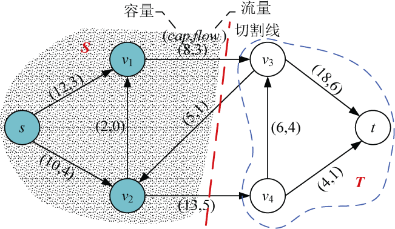
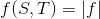
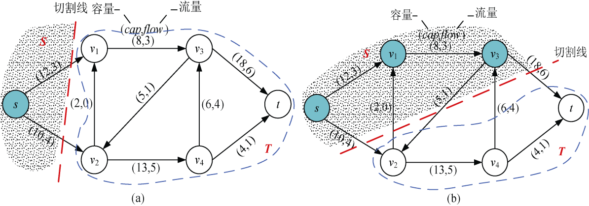
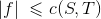
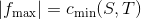

### 附录J　最大流最小割定理

最大流最小割定理（max-flow min-cut the-orem）是网络流理论中的重要定理。它是图论中的一个核心定理。

关于判定流的最大性的定理，任何网络中最大流的流量等于最小割的容量，简称为最大流最小割定理。它描述了最大流的特征，图论中的很多结果在适当选择网络后，都可以由这个定理推出。

**割** ：是网络中顶点的划分，它把网络中的所有顶点划分成S和T两个集合，源点s∈S，汇点t∈T，记为CUT（S，T）。

如图J-1所示，源点为s，汇点为t。有一条切割线把图中的结点切割成了两部分S={s，v1，v2}，T={ v3，v4，t}。

<b class="my_markdown">图J-1　割</b>

**割的净流量** f（S，T）：切割线切中的边中，从S到T的边的流量减去从T到S的边的流量。

如图J-1所示，割的净流量f（S，T）=3+5−1=7。从S到T的边v1—v3，v2—v4，流量为3和5，从T到S的边v3—v2，流量为1。

**割的容量** c（S，T）：切割线切中的边中，从S到T的边的容量之和。

如图J-1所示，割的容量c（S，T）=8+13=21。从S到T的边v1—v3，v2—v4，流量为8和13。

**注意** ：割的容量不计算反向边（T到S的边）的容量。

一个网络有很多切割， **最小割是容量最小的切割。**

**引理** ：如果f是网络**G**的一个流，CUT（S，T）为**G**的任意一个割，那么流量f的值等于割的净流量f（S，T）。

如图J-2（a）所示，割的净流量f（S，T）=3+4=7。如图J-2（b）所示，割的净流量f（S，T）=4+1+6−4−0=7。

<b class="my_markdown">图J-2　两种割</b>

大家可以画出任意一个割，会发现所有割的净流量f（S，T）都等于流量f的值。

**推论** ：如果f是网络**G**的一个流，CUT（S，T）为**G**的任意一个割，那么f的值不超过割的容量c（S，T）。

由于所有的流值小于等于割的容量，那么我们把流值和割的容量用图表示出来，如图J-3所示。

<b class="my_markdown">图J-3　割的容量和净流量的关系图</b>

从图J-3可以看出，所有的净流量小于等于割的容量，网络中的最大流不超过任何割的容量，流值最大只能达到最小割容量，即流值不超过上确界（最小上界）。

**最大流最小割定理：** 如果f是网络**G**的最大流，CUT（S，T）为**G**的最小割，那么最大流f的值等于最小割的容量c（S，T）。

因此，在很多问题中，如果需要得到最小割，只需要求出最大流即可。

