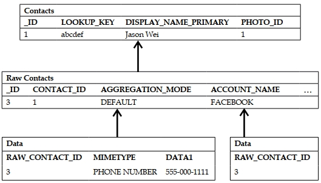

如果你可以通过下面链接查看每个表中的所有列：

<http://developer.android.com/reference/android/provider/ContactsContract.Contacts.html>

<http://developer.android.com/reference/android/provider/ContactsContract.RawContacts.html>

<http://developer.android.com/reference/android/provider/ContactsContract.Data.html>

或

<http://developer.android.google.cn/reference/android/provider/ContactsContract.Contacts.html>

<http://developer.android.google.cn/reference/android/provider/ContactsContract.RawContacts.html>

<http://developer.android.google.cn/reference/android/provider/ContactsContract.Data.html>

在之前的 Android 版本（API 4 及以下）中，联系人表只是一个典型的、直观的联系人表，其中包含每个联系人的唯一  ID 以及他们的姓名、电话号码、电子邮件等等。

然而在 Android 2.0（API 5 及以上版本），用户可以与 Facebook、Twitter、Google 以及许多其他服务同步联系人。仅仅有一个简单的联系人已经满足不了需求了。

因此，谷歌开发了第二层引用联系人表的表——这些表被称为原始联系人。用户的每个联系人都是原始联系人的集合，其中每个原始联系人代表来自特定来源的单个联系人。所以，假设你有一个朋友，并且你已经将该联系人与 Facebook 和 Twitter 同步。然后，这位朋友将有两个原始联系人表，一个描述他/她的 Facebook 元数据，另一个描述他的/她的 Twitter 元数据。然后，这两个原始联系人都将指向 "联系人" 表中的一个条目。

以前每个联系人的元数据或多或少只限于几个电话号码和几封电子邮件，现在由于社交网络，每个联系人都有大量的元数据可用。那么，我们将如何存储所有这些元数据呢？

因此，谷歌的团队决定创建第三层表，称为数据表。这些数据表都引用了原始联系人，而原始联系人又引用了联系人。因此，这基本上就是Android操作系统中对联系人的描述——联系人是原始联系人的集合，每个原始联系人都特定于某个来源（即Facebook或Twitter），而每个原始联系人是单独数据表的集合，其中每个数据表包含特定类型的数据（即电话号码、电子邮件、状态消息等）。

系统会自动聚合原始联系人，因此每次创建新联系人或将新账户同步到现有联系人时，都会将
