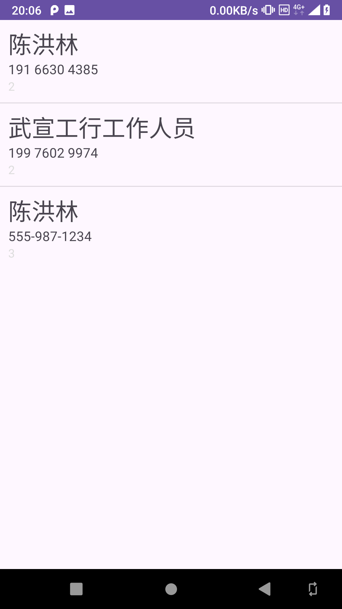

[toc]

`SimpleCursorAdapter` 构造函数如下：

```java
@Deprecated
public SimpleCursorAdapter(Context context, int layout, Cursor c, String[] from, int[] to)
public SimpleCursorAdapter(Context context, int layout, Cursor c, String[] from, int[] to, int flags)
```

因为第一个构造函数已经被标记为弃用，因此需要使用第二个构造函数。

第二个构造函数的参数说明如下：

+ `context`：`Context` 对象
+ `layout`：列表子视图布局文件 ID
+ `c`：`Cursor` 对象，要显示的数据库数据
+ `from`：要显示数据库的栏信息数组
+ `to`：要将数据库的栏数据显示到的控件 ID
+ `flag`：用于确定适配器行为的标志;可以是 `FLAG_AUTO_REQUERY` 和 `FLAG_REGISTER_CONTENT_OBSERVER`的任意组合。注意：`FLAG_AUTO_REQUERY` 已被标记为弃用。

### 1. 完整示例代码

#### 1.1 SimpleContactsActivity.java

```java
package com.qty.simplecontacts;

import androidx.annotation.NonNull;
import androidx.annotation.Nullable;
import androidx.appcompat.app.AppCompatActivity;
import androidx.loader.app.LoaderManager;
import androidx.loader.content.CursorLoader;
import androidx.loader.content.Loader;

import android.Manifest;
import android.content.Intent;
import android.content.pm.PackageManager;
import android.database.Cursor;
import android.os.Build;
import android.os.Bundle;
import android.provider.ContactsContract;
import android.widget.ListView;
import android.widget.SimpleCursorAdapter;

public class SimpleContactsActivity extends AppCompatActivity implements LoaderManager.LoaderCallbacks<Cursor> {

    private static final int PERMISSION_REQUEST_CODE = 66;
    private ListView listView;
    private LoaderManager loaderManager;
    private SimpleCursorAdapter adapter;

    @Override
    protected void onCreate(Bundle savedInstanceState) {
        super.onCreate(savedInstanceState);
        setContentView(R.layout.list);

        listView = findViewById(android.R.id.list);

        loaderManager = LoaderManager.getInstance(this);

        if (checkCallingOrSelfPermission(Manifest.permission.READ_CONTACTS) != PackageManager.PERMISSION_GRANTED) {
            requestPermissions(new String[]{Manifest.permission.READ_CONTACTS}, PERMISSION_REQUEST_CODE);
        } else {
            refreshUI();
        }
    }

    @Override
    protected void onActivityResult(int requestCode, int resultCode, @Nullable Intent data) {
        super.onActivityResult(requestCode, resultCode, data);
        if (requestCode == PERMISSION_REQUEST_CODE && resultCode == RESULT_OK
            && checkCallingOrSelfPermission(Manifest.permission.READ_CONTACTS) == PackageManager.PERMISSION_GRANTED) {
            refreshUI();
        } else {
            finish();
        }
    }

    private void refreshUI() {
        if (Build.VERSION.SDK_INT >= Build.VERSION_CODES.ICE_CREAM_SANDWICH_MR1) {
            loaderManager.initLoader(0, null, this);
        } else {
            // Make query to contact contentprovider
            String[] projections = new String[]{
                    ContactsContract.CommonDataKinds.Phone._ID,
                    ContactsContract.CommonDataKinds.Phone.DISPLAY_NAME,
                    ContactsContract.CommonDataKinds.Phone.NUMBER,
                    ContactsContract.CommonDataKinds.Phone.TYPE
            };
            Cursor c = getContentResolver().query(ContactsContract.CommonDataKinds.Phone.CONTENT_URI,
                    projections, null, null, null);
            startManagingCursor(c);

            // The desired columns to be bound
            String[] columns = new String[]{
                    ContactsContract.CommonDataKinds.Phone.DISPLAY_NAME,
                    ContactsContract.CommonDataKinds.Phone.NUMBER,
                    ContactsContract.CommonDataKinds.Phone.TYPE
            };

            // The xml defined views for each field to be bound to
            int[] to = new int[]{
                    R.id.name_entry,
                    R.id.number_entry,
                    R.id.number_type_entry
            };

            // Create adapter with cursor pointing to desired data
            adapter = new SimpleCursorAdapter(this, R.layout.list_entry, c, columns, to, SimpleCursorAdapter.FLAG_REGISTER_CONTENT_OBSERVER);

            // Set this adapter as your list activity's adapter
            listView.setAdapter(adapter);
        }
    }

    @NonNull
    @Override
    public Loader<Cursor> onCreateLoader(int id, @Nullable Bundle args) {
        String[] projections = new String[]{
                ContactsContract.CommonDataKinds.Phone._ID,
                ContactsContract.CommonDataKinds.Phone.DISPLAY_NAME,
                ContactsContract.CommonDataKinds.Phone.NUMBER,
                ContactsContract.CommonDataKinds.Phone.TYPE
        };
        return new CursorLoader(this,
                ContactsContract.CommonDataKinds.Phone.CONTENT_URI,
                projections,
                null,
                null,
                null
                );
    }

    @Override
    public void onLoadFinished(@NonNull Loader<Cursor> loader, Cursor data) {
        if (data != null) {
            // The desired columns to be bound
            String[] columns = new String[]{
                    ContactsContract.CommonDataKinds.Phone.DISPLAY_NAME,
                    ContactsContract.CommonDataKinds.Phone.NUMBER,
                    ContactsContract.CommonDataKinds.Phone.TYPE
            };

            // The xml defined views for each field to be bound to
            int[] to = new int[]{
                    R.id.name_entry,
                    R.id.number_entry,
                    R.id.number_type_entry
            };

            // Create adapter with cursor pointing to desired data
            adapter = new SimpleCursorAdapter(this, R.layout.list_entry, data, columns, to, SimpleCursorAdapter.FLAG_REGISTER_CONTENT_OBSERVER);

            // Set this adapter as your list activity's adapter
            listView.setAdapter(adapter);
        }
    }

    @Override
    public void onLoaderReset(@NonNull Loader<Cursor> loader) {
        adapter.swapCursor(null);
    }
}
```

#### 1.2 list.xml

```xml
<?xml version="1.0" encoding="utf-8"?>
<LinearLayout xmlns:android="http://schemas.android.com/apk/res/android"
    android:orientation="vertical"
    android:layout_width="match_parent"
    android:layout_height="wrap_content">

    <ListView
        android:id="@android:id/list"
        android:layout_width="match_parent"
        android:layout_height="wrap_content" />

</LinearLayout>
```

#### 1.3 list_entry.xml

```xml
<?xml version="1.0" encoding="utf-8"?>
<LinearLayout xmlns:android="http://schemas.android.com/apk/res/android"
    android:orientation="vertical"
    android:layout_width="match_parent"
    android:layout_height="match_parent"
    android:padding="10dp">

    <TextView
        android:id="@+id/name_entry"
        android:layout_width="wrap_content"
        android:layout_height="wrap_content"
        android:textSize="28sp" />

    <TextView
        android:id="@+id/number_entry"
        android:layout_width="wrap_content"
        android:layout_height="wrap_content"
        android:textSize="16sp" />

    <TextView
        android:id="@+id/number_type_entry"
        android:layout_width="wrap_content"
        android:layout_height="wrap_content"
        android:textColor="#DDD"
        android:textSize="14sp" />

</LinearLayout>
```

#### 1.4 运行效果

