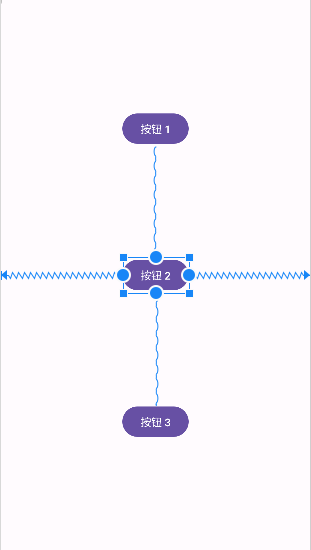

用于 `ConstraintLayout` 布局的基本属性有：

+ `app:layout_constraintStart_toStartOf`：控件的开始处在指定控件的开始位置，父控件为 `parent`。
+ `app:layout_constraintStart_toEndOf`：控件的开始处在指定控件的结束位置，父控件为 `parent`。
+ `app:layout_constraintEnd_toEndOf`：控件的结束处在指定控件的结束位置，父控件为 `parent`。
+ `app:layout_constraintEnd_toStartOf`：控件的结束处在指定控件的开始位置，父控件为 `parent`。
+ `app:layout_constraintTop_toTopOf`：控件的顶部在指定控件的顶部位置，父控件为 `parent`。
+ `app:layout_constraintTop_toBottomOf`：控件的顶部在指定控件的底部位置，父控件为 `parent`。
+ `app:layout_constraintBottom_toBottomOf`：控件的底部在指定控件的底部位置，父控件为 `parent`。
+ `app:layout_constraintBottom_toTopOf`：控件的底部在指定控件的顶部位置，父控件为 `parent`。
+ `app:layout_constraintLeft_toLeftOf`：控件的左侧在指定控件的左侧位置，父控件为 `parent`。
+ `app:layout_constraintLeft_toRightOf`：控件的左侧在指定控件的右侧位置，父控件为 `parent`。
+ `app:layout_constraintRight_toRightOf`：控件的右侧在指定控件的右侧位置，父控件为 `parent`。
+ `app:layout_constraintRight_toLeftOf`：控件的左侧在指定控件的左侧位置，父控件为 `parent`。

> 提示：当多个控件只使用上面属性进行布局，且控件的宽高为 `wrap_content` 时，这些控件将平均分布在 `ConstraintLayout` 容器中。

例如：

```xml
<androidx.constraintlayout.widget.ConstraintLayout xmlns:android="http://schemas.android.com/apk/res/android"
    xmlns:app="http://schemas.android.com/apk/res-auto"
    xmlns:tools="http://schemas.android.com/tools"
    android:layout_width="match_parent"
    android:layout_height="match_parent">

    <Button
        android:id="@+id/button1"
        android:layout_width="wrap_content"
        android:layout_height="wrap_content"
        android:text="按钮 1"
        app:layout_constraintTop_toTopOf="parent"
        app:layout_constraintStart_toStartOf="parent"
        app:layout_constraintEnd_toEndOf="parent"
        app:layout_constraintBottom_toTopOf="@+id/button2"/>

    <Button
        android:id="@+id/button2"
        android:layout_width="wrap_content"
        android:layout_height="wrap_content"
        android:text="按钮 2"
        app:layout_constraintTop_toBottomOf="@+id/button1"
        app:layout_constraintStart_toStartOf="parent"
        app:layout_constraintEnd_toEndOf="parent"
        app:layout_constraintBottom_toTopOf="@+id/button3"/>

    <Button
        android:id="@+id/button3"
        android:layout_width="wrap_content"
        android:layout_height="wrap_content"
        android:text="按钮 3"
        app:layout_constraintTop_toBottomOf="@+id/button2"
        app:layout_constraintStart_toStartOf="parent"
        app:layout_constraintEnd_toEndOf="parent"
        app:layout_constraintBottom_toBottomOf="parent"/>

</androidx.constraintlayout.widget.ConstraintLayout>
```

效果如下：

