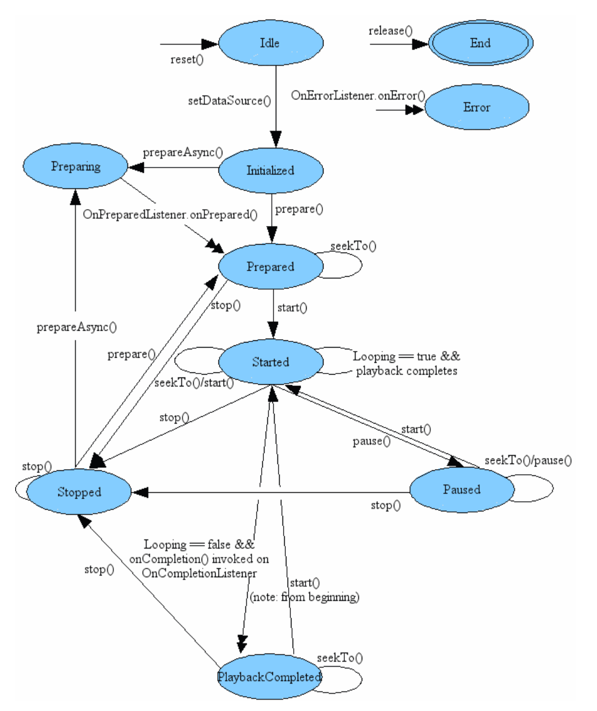

[toc]

MediaPlayer 生命周期

+ **Idle 状态及 End 状态**

  在 `MediaPlayer` 创建实例或者调用 `reset` 函数后，播放器就被创建了，这时处于 `Idle` （就绪）状态，调用 `release` 函数后，就会变成 `End` （结束）状态，在这两种状态之间的就是 `MediaPlayer` 的生命周期。

+ **Error 状态**

  在构造一个薪 `MediaPlayer` 或者调用 `reset` 函数后，上层应用程序调用 `getCurrentPosition`、`getVideoHeight`、`getDuration`、`getVideoWidth`、`setAudioStreamType(int)`、`setLooping(boolean)`、`setVolume(float, float)`、`pause`、`start`、`stop`、`seekTo(int)`、`prepare`、`prepareAsync` 这些函数会出错。如果调用 `reset` 函数后再调用它们，用户提供的回调函数 `OnErrorListener.onError` 将触发 `MediaPlayer` 状态到 `Error` （错误）状态，所以一旦不再使用 `MediaPlayer`，就需要调用 `release` 函数，以便 `MediaPlayer` 资源得到合理释放。

  当 `MediaPlayer` 处于 `End` （结束）状态时，它将不能再被使用，这时不能再回到 `MediaPlayer` 的其他状态，因为本次生命周期已经终止。

  一旦有错误，`MediaPlayer` 会进入 `Error`（错误）状态，为了重新使用 `MediaPlayer`，调用 `reset` 函数，这时将重新恢复到 `Idle`（就绪）状态，所以需要给 `MediaPlayer` 设置错误监听器，出错后就可以从播放器内部返回的信息中找到错误原因。

+ **Initialized 状态**

  当调用 `setDataSource` 函数时，将传递 `MediaPlayer` 的 `Idle` 状态变成 `Initialized`（初始化）状态，如果 `setDataSource` 在非 `Idle` 状态时调用，会抛出 `IllegalStateException` 异常。当重载 `setDataSource` 时，需要抛出 `IllegalArgumentException` 和 `IOException` 这两个异常。

+ **Prepared 状态**

  `MeidaPlayer` 有两种途径到达 `Prepared` 状态，一种是同步方式，另一种是异步方式。同步方式主要使用本地音视频文件，异步方式主要使用网络数据，需要缓冲数据。调用 `prepare`（同步函数）或  `prepareAsync`（异步函数） 将传递 `MediaPlayer` 的 `Initialized` 状态变成 `Prepared` 状态。如果应用层事先注册过 `setOnPreparedListener`，播放器内部将回调用户设置的 `OnPreparedListener` 中的 `onPrepared` 回调函数。注意，`Preparing` 是一个瞬间状态（可理解为时间比较短）。

+ **Started 状态**

  在 `MediaPlayer` 进入 `Prepared` 状态后，上层应用即可设置一些属性，如音视频的音量、`screenOnWhilePlaying`、`looping` 等。在播放控制开始之前，必须调用 `start` 函数并成功返回，`MediaPlayer` 的状态开始由 `Prepared` 状态变成 `Started` 状态。当处于 `Started` 状态时，如果用户事先注册过 `setOnBufferingUpdateListener`，播放器内部会开始回调 `OnBufferingUpdateListener.onBufferingUpdate`，这个回调函数主要使应用程序保持跟踪音视频流的 buffering（缓冲） status，如果 `MediaPlayer` 已经处于 `Started` 状态，再调用 `start` 函数时没有任何作用的。

+ **Paused 状态**

  `MediaPlayer` 再播放控制时可以是 `Paused`（暂停）和 `Stopped`（停止）状态的，且当前的播放时进度可以被调整，当调用 `MediaPlayer.paused` 函数时，`MediaPlayer` 开始由 `Started` 状态变成 `Paused` 状态，这个从 `Started` 状态到 `Paused` 状态的过程是瞬时的，反之在播放器内部是异步过程的。在状态更新并调用 `isPlaying` 函数前，将有一些耗时。

+ **Stopped 状态**

  当调用 `stop` 函数时，`MediaPlayer` 无论正处于 `Started`、`Paused`、`Prepared` 或 `PlaybackCompleted` 中的哪种状态，都将进入 `Stopped` 状态。一旦处于 `Stopped` 状态，playback 将不能开始，知道重新调用 `prepare` 或 `prepareAsync` 函数，且处于 `Prepared` 状态时才可以开始。

+ **PlaybackCompleted 状态**

  当 `MediaPlayer` 播放到数据流的末尾时，一次播放过程完成。在 `MediaPlayer` 中事先调用 `setLooping(boolean)` 并设置为 false（表示不循环播放），并且事先在 `MediaPlayer` 上注册过 `setOnCompletionListener`，播放器内部将回调 `OnCompletion.onCompletion` 函数，这就表明 `MediaPlayer` 开始进入 `PlaybackCompleted`（播放完成）状态。当处于 `PlaybackCompleted` 状态时，调用 `start` 函数，将重启播放器从头开始播放数据。

