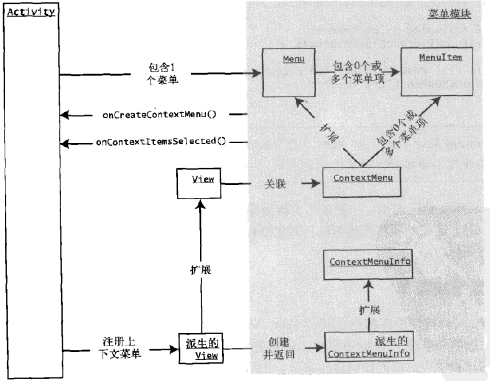

[toc]



### 1. 为上下文菜单注册视图

首先确定要注册上下文的视图，然后在 Activity 上调用 `registerForContextMenu()` ：

**Kotlin**

```kotlin
val tv = findViewById<TextView>(R.id.textViewId)
registerForContextMenu(tv)
```

**Java**

```java
TextView tv = (TextView) this.findViewById(R.id.textViewId);
registerForContextMenu(tv);
```

### 2. 填充上下文菜单

重写 Activity 的 `onCreateContextMenu()` 方法，在该方法中填充上下文菜单：

**Kotlin**

```kotlin
override fun onCreateContextMenu(
    menu: ContextMenu?,
    v: View?,
    menuInfo: ContextMenu.ContextMenuInfo?
) {
    menu?.apply {
        setHeaderTitle("Sample menu")
        add(200, 200, 200, "item1")
    }
}
```

**Java**

```Java
@Override
public void onCreateContextMenu(ContextMenu menu, View v, ContextMenu.ContextMenuInfo menuInfo) {
    menu.setHeaderTitle("Sample menu");
    menu.add(200, 200, 200, "item1");
}
```

派生自 `ContextMenuInfo` 的类包括 `AdapterContextMenuInfo` 和 `ExpandableContextMenuInfo` 等。在 Android 中，绑定到数据库游标的视图使用 `AdapterContextMenuInfo` 类，将行 ID 传入将显示上下文菜单的视图中。

### 3. 响应上下文菜单项

响应上下文菜单项的方法为 `onContextItemSelected()`，重写该方法即可：

**Kotlin**

```kotlin
override fun onContextItemSelected(item: MenuItem): Boolean {
    super.onContextItemSelected(item)
    // menu item has been handled
    return true
}
```

**Java**

```java
@Override
public boolean onContextItemSelected(MenuItem item) {
    this.appendMenuItemText(item);
    //menu item has been handled
    return true;
}
```

