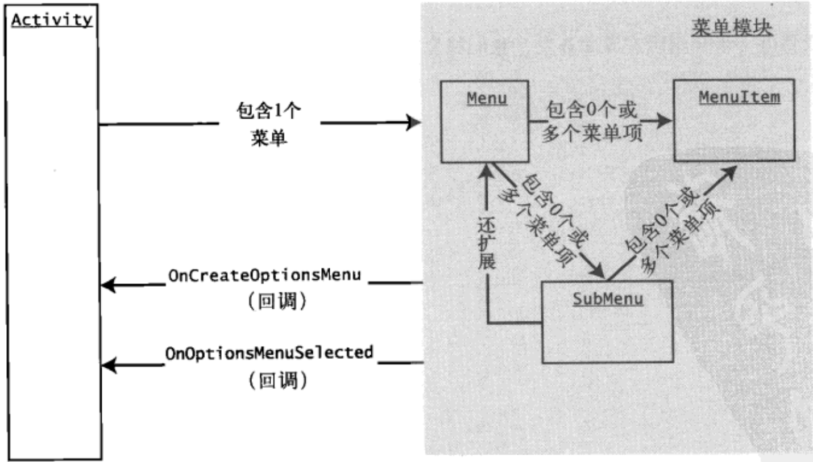

[toc]



从上图可以看出 `SubMenu` 与 `Menu` 和 `MenuItem` 之间的结构关系。`Menu` 对象可以有多个 `SubMenu` 对象。每个 `SubMenu` 对象通过调用 `Menu.addSubMenu()` 方法被添加到 `Menu` 对象中。但是，无法向子菜单添加更多子菜单。

**Kotlin**

```kotlin
private fun addSubMenu(menu: Menu?) {
    menu?.apply {
        // Secondary items are shown just like everything else
        var base = Menu.FIRST + 100

        val sm = addSubMenu(base, base + 1, Menu.NONE, "submenu")
        val item1 = sm.add(base, base + 2, base + 2, "sub item1")

        sm.add(base, base + 3, base + 3, "sub item2")
        sm.add(base, base + 4, base + 4, "sub item3")

        // work the icons
        // submenu item icons are not supported
        item1.setIcon(R.drawable.icon48x48_2)

        // the foolwing is ok
        sm.setIcon(R.drawable.icon48x48_1)
        // This will result in an exception
        // sm.addSubMenu("try this")
    }
}
```

**Java**

```java
private void addSubMenu(Menu menu) {
    //Secondary items are shown just like everything else
    int base = Menu.FIRST + 100;
    SubMenu sm = menu.addSubMenu(base, base + 1, Menu.NONE, "submenu");
    MenuItem item1 = sm.add(base, base + 2, base + 2, "sub item1");

    sm.add(base, base + 3, base + 3, "sub item2");
    sm.add(base, base + 4, base + 4, "sub item3");

    //work the icons
    //submenu item icons are not supported
    item1.setIcon(R.drawable.icon48x48_2);

    //the following is ok
    sm.setIcon(R.drawable.icon48x48_1);
    //This will result in an exception
    //sm.addSubMenu("try this");
}
```

>   注意：作为 `Menu` 对象的子类，`SubMenu` 也包含 `addSubMenu()` 方法。但如果向子菜单中添加另一个子菜单，编译器不会报错，如果尝试这么做，将会抛出运行时异常。

