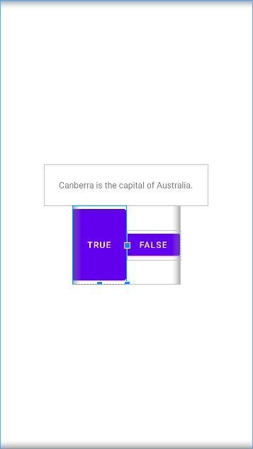

可以在布局文件中使用 `tools` 命名空间，使用 `tools` 命名空间修改的属性不会影响最终应用运行时的效果，它只改变其在 AndroidStudio 中的预览效果。例如：

```xml
<?xml version="1.0" encoding="utf-8"?>
<LinearLayout xmlns:android="http://schemas.android.com/apk/res/android"
    xmlns:tools="http://schemas.android.com/tools"
    android:layout_width="match_parent"
    android:layout_height="match_parent"
    android:gravity="center"
    android:orientation="vertical">

    <TextView
        android:layout_width="wrap_content"
        android:layout_height="wrap_content"
        android:padding="24dp"
        android:text="@string/question_text"/>

    <LinearLayout
        android:layout_width="wrap_content"
        android:layout_height="wrap_content">

        <Button
            android:id="@+id/true_button"
            android:layout_width="wrap_content"
            android:layout_height="wrap_content"
            tools:layout_height="128dp"
            android:text="@string/true_button"/>

        <Button
            android:id="@+id/false_button"
            android:layout_width="wrap_content"
            android:layout_height="wrap_content"
            android:text="@string/false_button"/>

    </LinearLayout>

</LinearLayout>
```

预览效果如下：



运行效果如下：

