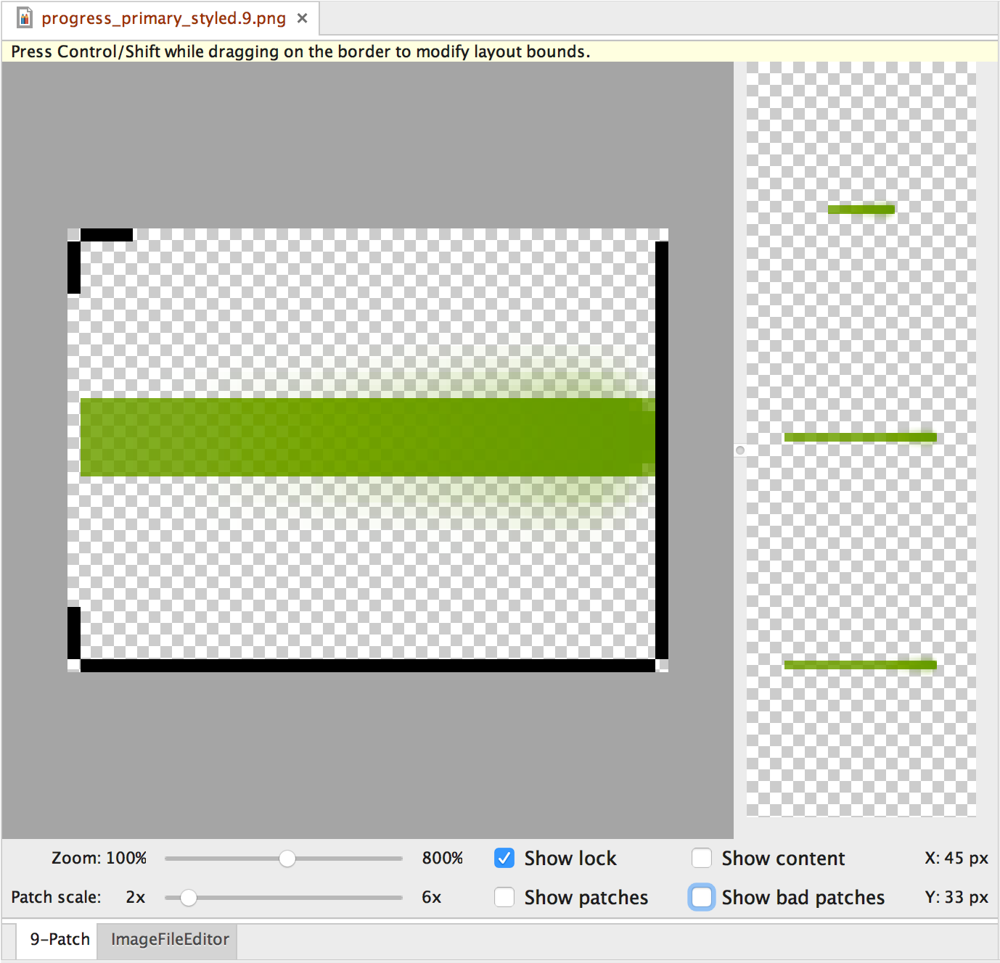
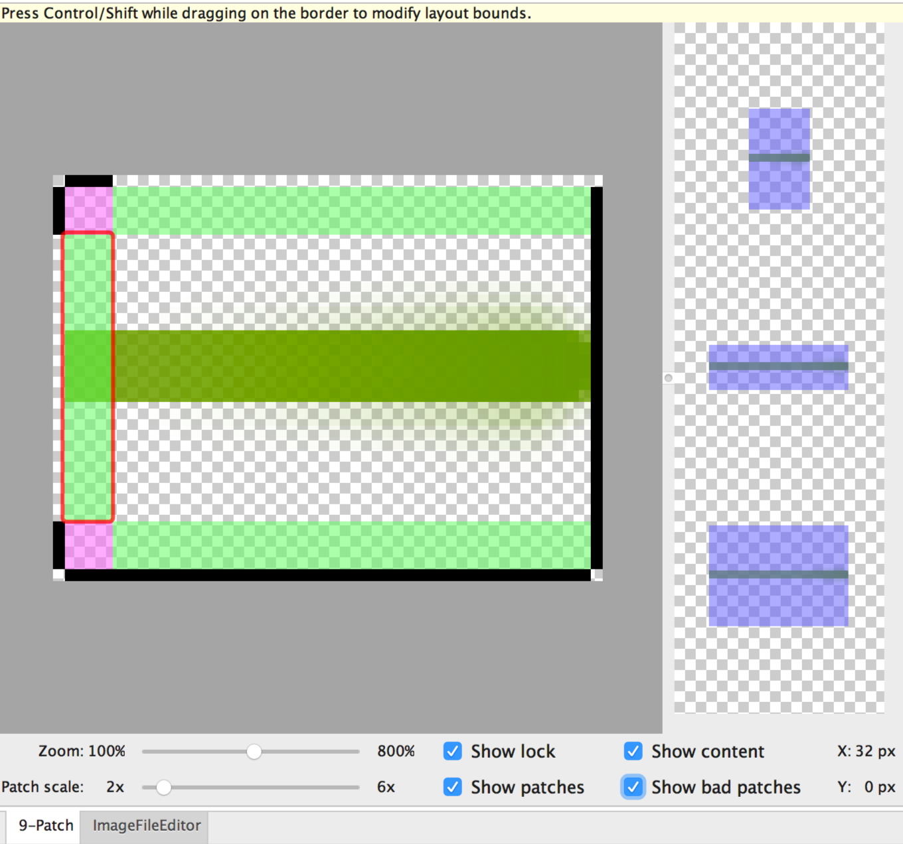

Draw 9-patch 工具是 Android Studio 中包含的一种 WYSIWYG（所见即所得）编辑器，利用此工具，您可以创建能够自动调整大小以适应视图内容和屏幕尺寸的位图图像。图像的选定部分可以根据图像内绘制的指示器在水平或竖直方向上调整比例。

有关 NinePatch 图形及其工作原理的介绍，请阅读 [画布和可绘制对象](https://developer.android.google.cn/guide/topics/graphics/2d-graphics#nine-patch) 文档中有关 NinePatch 可绘制对象的部分。

**图 1.** Android Studio 的 Draw 9-patch 工具中的一个 NinePatch 图像。

下面是使用 Android Studio 中的 Draw 9-patch 工具创建一个 NinePatch 图形的快速指南。您需要一个想要用来创建 NinePatch 图像的 PNG 图像。

1. 在 Android Studio 中，右键点击您想要用来创建 NinePatch 图像的 PNG 图像，然后点击 **Create 9-patch file**。

2. 为您的 NinePatch 图像输入一个文件名，然后点击 **OK**。您将创建一个文件扩展名为 `.9.png` 的图像。

3. 双击您的新 NinePatch 文件，将其在 Android Studio 中打开。您的工作区现在将打开。

   左侧窗格是您的绘制区域，您可以在其中修改可拉伸图块和内容区域的线条。右侧窗格是预览区域，您可以在其中预览拉伸的图形。

4. 在 1 像素周长的范围内点击，以绘制定义可拉伸图块和（可选）内容区域的线条。点击右键（在 Mac 上，在按住 Shift 键的同时点击）可以擦除之前绘制的线条。

5. 完成后，依次点击 **File** > **Save** 以保存您所做的更改。

您可以双击现有的 NinePatch 文件以在 Android Studio 中将其打开。

要确保您的 NinePatch 图形正确缩小，请验证任意可拉伸区域的尺寸是否至少为 2x2 像素。否则，它们可能会在缩小时消失。另外，也要在图形中的可拉伸区域前后各额外提供 1 像素的安全空间，以避免比例调整期间发生内插。如果发生内插，可能会导致边界处的颜色发生变化。

**注意**：正常的 PNG 文件 (`*.png`) 加载时会在图像周围添加 1 像素的空边框，您可以在其中绘制可拉伸图块和内容区域。之前保存的 NinePatch 文件 (`*.9.png`) 将按原样加载，不会添加绘制区域，因为此区域已经存在。

**图 2.** 一个显示内容、图块和不良图块的 NinePatch 图像。

可选控件包括：

- **Zoom**：调整图形在绘制区域中的缩放级别。
- **Patch scale**：调整图像在预览区域中的比例。
- **Show lock**：当鼠标悬停在图形的不可绘制区域上时以直观方式呈现。
- **Show patches**：预览绘制区域中的可拉伸图块（粉色为可拉伸图块），如上面的图 2 所示。
- **Show content**：突出显示预览图像中的内容区域（紫色为允许绘制内容的区域），如图 2 所示。
- **Show bad patches**：在拉伸时可能会在图形中产生伪影的图块区域周围添加红色边框，如图 2 所示。如果您消除所有不良图块，已拉伸图像的视觉连贯性将得以保持。