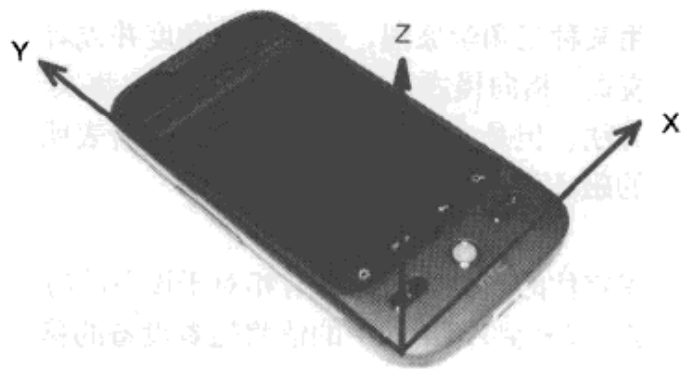

[toc]

加速度计坐标系统的工作原理为：加速度计的 x 轴原点位于设备左下角，并沿底边向右增长。y 轴的原点也在左下角，但沿显示屏左边向上增长。z 轴的原点也位于左下角，但在控件上沿远离设备的方向增长。



<center><b>加速度计坐标系统</b></center>

加速度以米每平方秒（m/s<sup>2</sup>）为单位。标准的重力加速度为 9.81 m/s<sup>2</sup>，方向指向地心。从加速度计的角度讲，重力加速度的测量值为 -9.81。如果设备完全静止（没有移动），而且位于一个极为平坦的平面上，那么 x 和 y 的读数将为 0，z 的读数为 +9.81。

### 1. 示例代码

#### 1.1 Kotlin

```kotlin
```

#### 1.2 Java

```java
package com.android.androidtest;

import android.hardware.Sensor;
import android.hardware.SensorEvent;
import android.hardware.SensorEventListener;
import android.hardware.SensorManager;
import android.os.Bundle;
import android.widget.TextView;

import androidx.annotation.Nullable;
import androidx.appcompat.app.AppCompatActivity;

public class MainActivity extends AppCompatActivity implements SensorEventListener {

    private static final String TAG = "MainActivity";

    private SensorManager mgr;
    private Sensor accelerometer;
    private TextView text;
    private float[] gravity = new float[3];
    private float[] motion = new float[3];
    private double ratio;
    private double mAngle;
    private int counter = 0;

    @Override
    protected void onCreate(@Nullable Bundle savedInstanceState) {
        super.onCreate(savedInstanceState);
        setContentView(R.layout.main);

        mgr = (SensorManager) getSystemService(SENSOR_SERVICE);
        accelerometer = mgr.getDefaultSensor(Sensor.TYPE_ACCELEROMETER);
        text = findViewById(R.id.text);
        if (accelerometer == null) {
            text.setText("Device has no accelerometer sensor.");
        }
    }

    @Override
    protected void onResume() {
        super.onResume();
        if (accelerometer != null) {
            mgr.registerListener(this, accelerometer, SensorManager.SENSOR_DELAY_NORMAL);
        }
    }

    @Override
    protected void onPause() {
        super.onPause();
        if (accelerometer != null) {
            mgr.unregisterListener(this, accelerometer);
        }
    }

    @Override
    public void onSensorChanged(SensorEvent event) {
        // use a low-pass filter to get gravity.
        // Motion is what's left over
        for (int i = 0; i < 3; i++) {
            gravity[i] = (float) (0.1 * event.values[i] + 0.9 * gravity[i]);
            motion[i] = event.values[i] - gravity[i];
        }

        // ratio is gravity on the Y axis compared to full gravity
        // should be no more than 1, no less than -1
        ratio = gravity[1] / SensorManager.GRAVITY_EARTH;
        if (ratio > 1.0) {
            ratio = 1.0;
        }
        if (ratio < -1.0) {
            ratio = -1.0;
        }

        // conver radians to degrees, make negative if facing up
        mAngle = Math.toDegrees(Math.acos(ratio));
        if (gravity[2] < 0) {
            mAngle = -mAngle;
        }

        // Display every 10th value
        if (counter++ % 10 == 0) {
            String msg = String.format("Raw values\nX: %8.4f\nY: %8.4f\nZ: %8.4f\nGravity\nX: %8.4f\nY: %8.4f\nZ: %8.4f\nnMotion\nX: %8.4f\nY: %8.4f\nZ: %8.4f\nAngle: %8.1f",
                    event.values[0], event.values[1], event.values[2], gravity[0], gravity[1], gravity[2], motion[0], motion[1], motion[2], mAngle);
            text.setText(msg);
            text.invalidate();
            counter = 1;
        }
    }

    @Override
    public void onAccuracyChanged(Sensor sensor, int accuracy) {
    }

}
```

