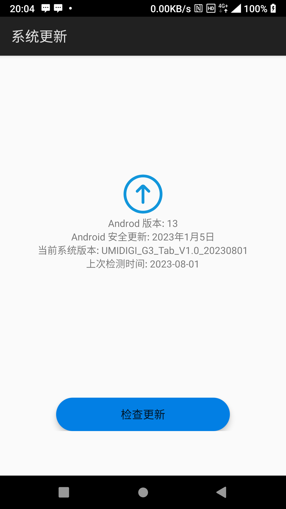

使用如下代码给 `Button` 控件设置背景图片时，控件背景有灰色阴影，手指按下控件阴影更明显：

```xml
<Button
    android:layout_width="wrap_content"
    android:layout_height="wrap_content"
    android:layout_gravity="center_horizontal"
    android:background="@drawable/ic_btn_update"
    android:textSize="16sp"
    android:text="检查更新" />
```

**ic_btn_update.xml**

```xml
<?xml version="1.0" encoding="utf-8"?>
<selector xmlns:android="http://schemas.android.com/apk/res/android">

    <item android:state_selected="true" android:drawable="@drawable/ic_btn_update_selected" />
    <item android:state_pressed="true" android:drawable="@drawable/ic_btn_update_selected" />
    <item android:state_enabled="false" android:drawable="@drawable/ic_btn_update_disabled" />
    <item android:drawable="@drawable/ic_btn_update_normal" />

</selector>
```

**ic_btn_update_normal.xml**

```xml
<?xml version="1.0" encoding="utf-8"?>
<shape xmlns:android="http://schemas.android.com/apk/res/android"
    android:shape="rectangle">

    <corners android:radius="24dp" />

    <size
        android:width="250dp"
        android:height="48dp" />

    <solid android:color="#2196F3" />

</shape>
```

**ic_btn_update_selected.xml**

```xml
<?xml version="1.0" encoding="utf-8"?>
<shape xmlns:android="http://schemas.android.com/apk/res/android"
    android:shape="rectangle">

    <corners android:radius="24dp" />

    <size
        android:width="250dp"
        android:height="48dp" />

    <solid android:color="#027FE4" />

</shape>
```

**ic_btn_update_disabled.xml**

```xml
<?xml version="1.0" encoding="utf-8"?>
<shape xmlns:android="http://schemas.android.com/apk/res/android"
    android:shape="rectangle">

    <corners android:radius="24dp" />

    <size
        android:width="250dp"
        android:height="48dp" />

    <solid android:color="#D1D1D1" />

</shape>
```

运行效果如下：



要去掉按钮背景中的灰色阴影，可以添加 `android:outlineSpotShadowColor="@android:color/transparent"` 属性，例如：

```xml
<Button
    android:layout_width="wrap_content"
    android:layout_height="wrap_content"
    android:layout_gravity="center_horizontal"
    android:background="@drawable/ic_btn_update"
    android:outlineSpotShadowColor="@android:color/transparent"
    android:textSize="16sp"
    android:text="检查更新" />
```

