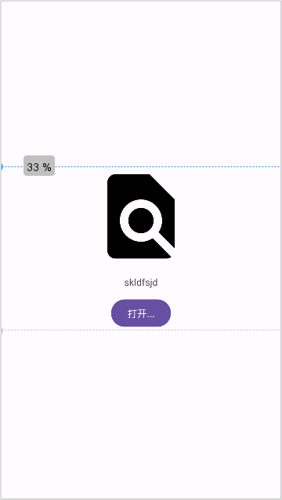

`Guideline` 是用于辅助 `ConstraintLayout` 布局的辅助线。因为 `Guideline` 只是一个辅助线而已，因此设置它的宽高没有意义，通常我们将它们设置为 `wrap_content`。通过 `android:orientation` 属性可以设置辅助线的方向，可以是水平（ `horizontal` ） 或垂直（ `vertical` ）。通过 `app:layout_constraintGuide_percent` 属性设置辅助线的位置，其值为 `0 ~ 1.0`。

```xml
<androidx.constraintlayout.widget.ConstraintLayout xmlns:android="http://schemas.android.com/apk/res/android"
    xmlns:app="http://schemas.android.com/apk/res-auto"
    xmlns:tools="http://schemas.android.com/tools"
    android:id="@+id/no_document_view"
    android:layout_width="match_parent"
    android:layout_height="match_parent"
    >

    <androidx.constraintlayout.widget.Guideline
        android:id="@+id/top_guide"
        android:layout_width="wrap_content"
        android:layout_height="wrap_content"
        android:orientation="horizontal"
        app:layout_constraintGuide_percent=".33" />

    <ImageView
        android:id="@+id/info"
        android:layout_width="0dp"
        android:layout_height="0dp"
        app:layout_constraintEnd_toEndOf="parent"
        app:layout_constraintStart_toStartOf="parent"
        app:layout_constraintTop_toBottomOf="@+id/top_guide"
        app:layout_constraintBottom_toTopOf="@+id/tip"
        android:src="@drawable/ic_pick_file_black_24dp" />

    <TextView
        android:id="@+id/tip"
        android:layout_width="wrap_content"
        android:layout_height="wrap_content"
        android:text="skldfsjd"
        android:layout_marginTop="12dp"
        app:layout_constraintEnd_toEndOf="parent"
        app:layout_constraintStart_toStartOf="parent"
        app:layout_constraintTop_toBottomOf="@+id/info"
        app:layout_constraintBottom_toTopOf="@+id/open"/>

    <Button
        android:id="@+id/open"
        android:layout_width="wrap_content"
        android:layout_height="wrap_content"
        android:text="打开..."
        android:layout_marginTop="12dp"
        app:layout_constraintBottom_toBottomOf="@+id/bottom_guide"
        app:layout_constraintEnd_toEndOf="parent"
        app:layout_constraintStart_toStartOf="parent"
        app:layout_constraintTop_toBottomOf="@+id/tip"/>

    <androidx.constraintlayout.widget.Guideline
        android:id="@+id/bottom_guide"
        android:layout_width="wrap_content"
        android:layout_height="wrap_content"
        android:orientation="horizontal"
        app:layout_constraintGuide_percent=".66" />

</androidx.constraintlayout.widget.ConstraintLayout>
```

运行修改如下：

