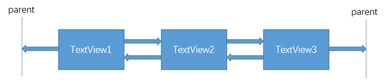
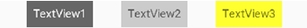
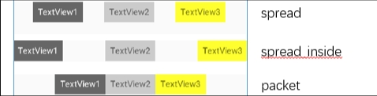

如果两个或两个以上控件通过下图的方式约束在一起，就可以认为它们是一条链（图为横向的链，纵向同理）。



用代码表示：

```xml
    <TextView
        android:id="@+id/TextView1"
        android:layout_width="wrap_content"
        android:layout_height="wrap_content"
        app:layout_constraintLeft_toLeftOf="parent"
        app:layout_constraintRight_toLeftOf="@+id/TextView2" />
 
    <TextView
        android:id="@+id/TextView2"
        android:layout_width="wrap_content"
        android:layout_height="wrap_content"
        app:layout_constraintLeft_toRightOf="@+id/TextView1"
        app:layout_constraintRight_toLeftOf="@+id/TextView3"
        app:layout_constraintRight_toRightOf="parent" />
 
    <TextView
        android:id="@+id/TextView3"
        android:layout_width="wrap_content"
        android:layout_height="wrap_content"
        app:layout_constraintLeft_toRightOf="@+id/TextView2"
        app:layout_constraintRight_toRightOf="parent" />
```

3 个 `TextView` 相互约束，两端两个 `TextView` 分别与 `parent` 约束，称为一条链，效果如下：



一条链的第一个空间是这条链的链头，我们可以在链头中设置 `app:layout_constraintVertical_chainStyle` 来改变整条链的样式，可以设置为下面 3  种样式：

+ `spread`：展开元素（默认）；
+ `spread_inside`：展开元素，但链的两端贴近 `parent`；
+ `packed`：链的元素将被打包在一起。

如下图所示：



上面的例子创建了一个样式链，除了样式链外，还可以创建一个权重链。

可以留意到上面所用到的 3 个 `TextView` 宽度都为 `wrap_content`，如果我们把宽度都设为 `0dp`，这个时候可以在每个 `TextView` 中设置横向权重 `app:layout_constraintHorizontal_weight`（纵向权重同理）来创建一个权重链，如下所示：

```xml
 <TextView
        android:id="@+id/TextView1"
        android:layout_width="0dp"
        android:layout_height="wrap_content"
        app:layout_constraintLeft_toLeftOf="parent"
        app:layout_constraintRight_toLeftOf="@+id/TextView2"
        app:layout_constraintHorizontal_weight="2" />
 
    <TextView
        android:id="@+id/TextView2"
        android:layout_width="0dp"
        android:layout_height="wrap_content"
        app:layout_constraintLeft_toRightOf="@+id/TextView1"
        app:layout_constraintRight_toLeftOf="@+id/TextView3"
        app:layout_constraintRight_toRightOf="parent"
        app:layout_constraintHorizontal_weight="3" />
 
    <TextView
        android:id="@+id/TextView3"
        android:layout_width="0dp"
        android:layout_height="wrap_content"
        app:layout_constraintLeft_toRightOf="@+id/TextView2"
        app:layout_constraintRight_toRightOf="parent"
        app:layout_constraintHorizontal_weight="4" />
```

效果如下：

