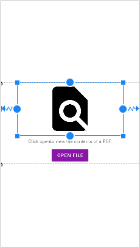

可以通过 `ConstraintLayout` 的 `app:layout_constraintDimensionRatio` 设置控件的宽高比。

> 注意：要使 `app:layout_constraintDimensionRatio` 属性生效，控件的 `android:layout_width` 或 `android:layout_height` 至少有一个是 `0dp`。

`app:layout_constraintDimensionRatio` 属性的类型是字符串，属性值的形式为 `m:n` 。也可以写为 `w,m:n` 或 `h,m:n`，其中 `w` 表示 `m` 代表宽度的比例；`h` 表示 `m` 代表高度的比例。

示例代码：

```xml
<FrameLayout xmlns:android="http://schemas.android.com/apk/res/android"
    xmlns:app="http://schemas.android.com/apk/res-auto"
    xmlns:tools="http://schemas.android.com/tools"
    android:id="@+id/container"
    android:layout_width="match_parent"
    android:layout_height="match_parent">

    <androidx.constraintlayout.widget.ConstraintLayout
        android:id="@+id/no_document_view"
        android:layout_width="match_parent"
        android:layout_height="match_parent"
        tools:context=".MainActivity"
        tools:ignore="MergeRootFrame">

        <androidx.constraintlayout.widget.Guideline
            android:id="@+id/top_guide"
            android:layout_width="wrap_content"
            android:layout_height="wrap_content"
            android:orientation="horizontal"
            app:layout_constraintGuide_percent=".33" />

        <ImageView
            android:id="@+id/open_file_icon"
            android:layout_width="0dp"
            android:layout_height="0dp"
            android:src="@drawable/ic_pick_file_black_24dp"
            app:layout_constraintBottom_toTopOf="@+id/call_to_action"
            app:layout_constraintDimensionRatio="2:1"
            app:layout_constraintLeft_toLeftOf="parent"
            app:layout_constraintRight_toRightOf="parent"
            app:layout_constraintTop_toTopOf="@+id/top_guide"
            tools:ignore="ContentDescription" />

        <TextView
            android:id="@+id/call_to_action"
            android:layout_width="wrap_content"
            android:layout_height="wrap_content"
            android:layout_marginTop="8dp"
            android:layout_marginBottom="8dp"
            android:text="@string/open_call_to_action"
            app:layout_constraintBottom_toTopOf="@+id/open_file"
            app:layout_constraintLeft_toLeftOf="@+id/open_file_icon"
            app:layout_constraintRight_toRightOf="@+id/open_file_icon"
            app:layout_constraintTop_toBottomOf="@+id/open_file_icon" />

        <Button
            android:id="@+id/open_file"
            android:layout_width="wrap_content"
            android:layout_height="wrap_content"
            android:text="@string/open_file_button"
            app:layout_constraintBottom_toBottomOf="@+id/bottom_guide"
            app:layout_constraintLeft_toLeftOf="parent"
            app:layout_constraintRight_toRightOf="parent" />

        <androidx.constraintlayout.widget.Guideline
            android:id="@+id/bottom_guide"
            android:layout_width="wrap_content"
            android:layout_height="wrap_content"
            android:orientation="horizontal"
            app:layout_constraintGuide_percent=".66" />

    </androidx.constraintlayout.widget.ConstraintLayout>

</FrameLayout>
```

运行效果如下：

