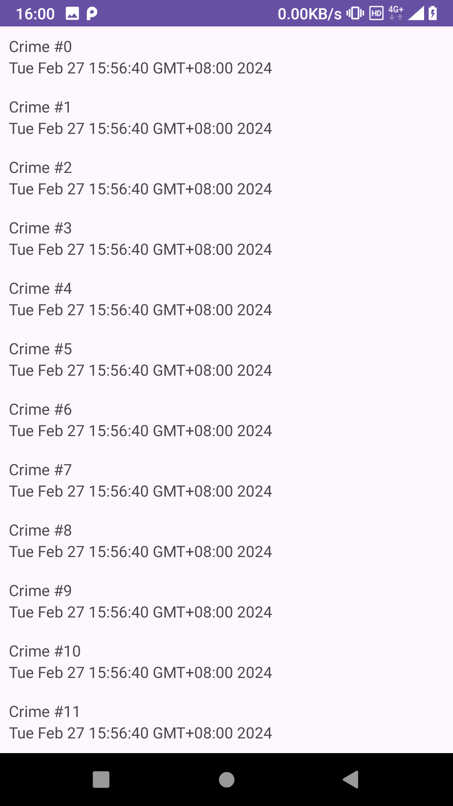

[toc]

### 1. 在布局文件中添加 RecyclerView

**fragment_crime_list.xml**

```xml
<?xml version="1.0" encoding="utf-8"?>
<androidx.recyclerview.widget.RecyclerView
        xmlns:android="http://schemas.android.com/apk/res/android"
        android:id="@+id/crime_recycler_view"
        android:layout_width="match_parent"
        android:layout_height="match_parent"/>
```

### 2. 在 Activity 或 Fragment 中获取 RecyclerView

```kotlin
crimeRecyclerView = view.findViewById(R.id.crime_recycler_view)
```

### 3. 设置 RecyclerView  布局管理器

```kotlin
crimeRecyclerView.layoutManager = LinearLayoutManager(context)
```

### 4. 创建 RecyclerView  的适配器

要创建 `RecyclerView` 的适配器，首先需要创建适配器的视图缓冲类，它继承于 `RecyclerView.ViewHolder()`：

```kotlin
private inner class CrimeHolder(view: View) : RecyclerView.ViewHolder(view), View.OnClickListener {

    private lateinit var crime: Crime

    private val titleTextView: TextView = itemView.findViewById(R.id.crime_title)
    private val dateTextView: TextView = itemView.findViewById(R.id.crime_date)

    init {
        itemView.setOnClickListener(this)
    }

    fun bind(crime: Crime) {
        this.crime = crime
        titleTextView.text = this.crime.title
        dateTextView.text = this.crime.date.toString()
    }

    override fun onClick(v: View?) {
        Toast.makeText(context, "${crime.title} clicked!", Toast.LENGTH_SHORT).show()
    }
}
```

然后创建 `RecyclerView` 的适配器，它继承于 `RecyclerView.Adapter()` ：

```kotlin
private inner class CrimeAdapter(var crimes: List<Crime>) : RecyclerView.Adapter<CrimeHolder>() {
    override fun onCreateViewHolder(parent: ViewGroup, viewType: Int): CrimeHolder {
        val view = layoutInflater.inflate(R.layout.list_item_crime, parent, false)
        return CrimeHolder(view)
    }

    override fun onBindViewHolder(holder: CrimeHolder, position: Int) {
        val crime = crimes[position]
        holder.bind(crime)
    }

    override fun getItemCount(): Int = crimes.size
}
```

### 5. 设置 RecyclerView 适配器

```kotlin
val crimes = crimeListViewModel.crimes
adapter = CrimeAdapter(crimes)
crimeRecyclerView.adapter = adapter
```

### 6. 完整代码

#### 6.1 Crime.kt

```kotlin
package com.bignerdranch.android.criminalintent

import java.util.Date
import java.util.UUID

data class Crime(val id: UUID = UUID.randomUUID(),
    var title: String = "",
    var date: Date = Date(),
    var isSolved: Boolean = false)
```

#### 6.2 CrimeListViewModel.kt

```kotlin
package com.bignerdranch.android.criminalintent

import androidx.lifecycle.ViewModel

class CrimeListViewModel : ViewModel() {

    val crimes = mutableListOf<Crime>()

    init {
        for (i in 0 until 100) {
            val crime = Crime()
            crime.title = "Crime #$i"
            crime.isSolved = i % 2 == 0
            crimes += crime
        }
    }
}
```

#### 6.3 CrimeListFragment.kt

```kotlin
package com.bignerdranch.android.criminalintent

import android.os.Bundle
import android.util.Log
import android.view.LayoutInflater
import android.view.View
import android.view.ViewGroup
import android.widget.TextView
import android.widget.Toast
import androidx.fragment.app.Fragment
import androidx.lifecycle.ViewModelProvider
import androidx.recyclerview.widget.LinearLayoutManager
import androidx.recyclerview.widget.RecyclerView

private const val TAG = "CrimeListFragment"

class CrimeListFragment : Fragment() {

    private lateinit var crimeRecyclerView: RecyclerView
    private var adapter: CrimeAdapter? = null

    private val crimeListViewModel: CrimeListViewModel by lazy {
        ViewModelProvider(this).get(CrimeListViewModel::class.java)
    }

    override fun onCreate(savedInstanceState: Bundle?) {
        super.onCreate(savedInstanceState)
        Log.d(TAG, "Total crimes: ${crimeListViewModel.crimes.size}")
    }

    override fun onCreateView(
        inflater: LayoutInflater,
        container: ViewGroup?,
        savedInstanceState: Bundle?
    ): View? {
        val view = inflater.inflate(R.layout.fragment_crime_list, container, false)

        crimeRecyclerView = view.findViewById(R.id.crime_recycler_view)
        crimeRecyclerView.layoutManager = LinearLayoutManager(context)

        updateUI()

        return view
    }

    private fun updateUI() {
        val crimes = crimeListViewModel.crimes
        adapter = CrimeAdapter(crimes)
        crimeRecyclerView.adapter = adapter
    }

    private inner class CrimeHolder(view: View) : RecyclerView.ViewHolder(view), View.OnClickListener {

        private lateinit var crime: Crime

        private val titleTextView: TextView = itemView.findViewById(R.id.crime_title)
        private val dateTextView: TextView = itemView.findViewById(R.id.crime_date)

        init {
            itemView.setOnClickListener(this)
        }

        fun bind(crime: Crime) {
            this.crime = crime
            titleTextView.text = this.crime.title
            dateTextView.text = this.crime.date.toString()
        }

        override fun onClick(v: View?) {
            Toast.makeText(context, "${crime.title} clicked!", Toast.LENGTH_SHORT).show()
        }
    }

    private inner class CrimeAdapter(var crimes: List<Crime>) : RecyclerView.Adapter<CrimeHolder>() {
        override fun onCreateViewHolder(parent: ViewGroup, viewType: Int): CrimeHolder {
            val view = layoutInflater.inflate(R.layout.list_item_crime, parent, false)
            return CrimeHolder(view)
        }

        override fun onBindViewHolder(holder: CrimeHolder, position: Int) {
            val crime = crimes[position]
            holder.bind(crime)
        }

        override fun getItemCount(): Int = crimes.size
    }

    companion object {
        fun newInstance(): CrimeListFragment {
            return CrimeListFragment()
        }
    }
}
```

#### 6.4 MainActivity.kt

```kotlin
package com.bignerdranch.android.criminalintent

import androidx.appcompat.app.AppCompatActivity
import android.os.Bundle

class MainActivity : AppCompatActivity() {
    override fun onCreate(savedInstanceState: Bundle?) {
        super.onCreate(savedInstanceState)
        setContentView(R.layout.activity_main)

        val currentFragment = supportFragmentManager.findFragmentById(R.id.fragment_container)

        if (currentFragment == null) {
            val fragment = CrimeListFragment.newInstance()
            supportFragmentManager.beginTransaction()
                .add(R.id.fragment_container, fragment)
                .commit()
        }
    }
}
```

#### 6.5 list_item_crime.xml

```xml
<?xml version="1.0" encoding="utf-8"?>
<LinearLayout xmlns:android="http://schemas.android.com/apk/res/android"
    android:orientation="vertical"
    android:layout_width="match_parent"
    android:layout_height="wrap_content"
    android:padding="8dp">

    <TextView
        android:id="@+id/crime_title"
        android:layout_width="match_parent"
        android:layout_height="wrap_content"
        android:text="Crime Title" />

    <TextView
        android:id="@+id/crime_date"
        android:layout_width="match_parent"
        android:layout_height="wrap_content"
        android:text="Crime Date" />

</LinearLayout>
```

#### 6.6 fragment_crime_list.xml

```xml
<?xml version="1.0" encoding="utf-8"?>
<androidx.recyclerview.widget.RecyclerView xmlns:android="http://schemas.android.com/apk/res/android"
    android:id="@+id/crime_recycler_view"
    android:layout_width="match_parent"
    android:layout_height="match_parent" />
```

#### 6.7 activity_main.xml

```xml
<?xml version="1.0" encoding="utf-8"?>
<FrameLayout xmlns:android="http://schemas.android.com/apk/res/android"
    xmlns:tools="http://schemas.android.com/tools"
    android:id="@+id/fragment_container"
    android:layout_width="match_parent"
    android:layout_height="match_parent"
    tools:context=".MainActivity" />
```

运行效果如下：


