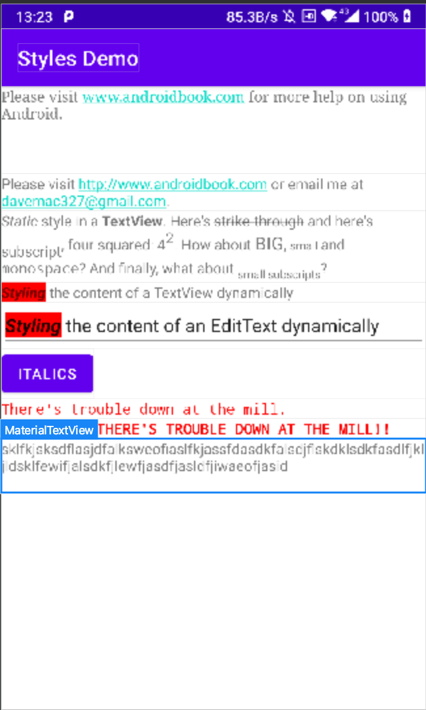

可以通过 `minLines` 属性设置 `TextView` 的最小行数。

```xml
<TextView
        android:layout_width="match_parent"
        android:layout_height="wrap_content"
        android:minLines="3"
        android:text="sklfkjsksdflasjdfalksweofiaslfkjassfdasdkfalsdjflskdklsdkfasdlfjkljldsklfewifjalsdkfjlewfjasdfjasldfjiwaeofjasid"/>

```

即当 `TextView` 设置高度为 `wrap_content`时，`TextView` 的内容没有三行，这时 `TextView` 占据的高度为三行。如下图所示：

