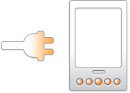
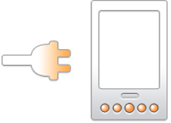

[toc]

### 1. 修改 `frameworks/base/services/core/java/com/android/server/BatteryService.java` 文件

在 `processValuesLocked()` 方法的如下代码：

```java
// Let the battery stats keep track of the current level.
try {
    mBatteryStats.setBatteryState(mHealthInfo.batteryStatus, mHealthInfo.batteryHealth,
                                  mPlugType, mHealthInfo.batteryLevel, mHealthInfo.batteryTemperature,
                                  mHealthInfo.batteryVoltage, mHealthInfo.batteryChargeCounter,
                                  mHealthInfo.batteryFullCharge,
                                  mHealthInfo2p1.batteryChargeTimeToFullNowSeconds);
} catch (RemoteException e) {
    // Should never happen.
}

shutdownIfNoPowerLocked();
shutdownIfOverTempLocked();
```

后面添加如下代码：

```java
if (mHealthInfo.batteryTemperature >= 60 && mHealthInfo.batteryTemperature < mShutdownBatteryTemperature) {
    if (!hasShowThermalOverDialog) {
        hasShowThermalOverDialog = true;
        Intent intent = new Intent("weibu.intent.action.BATTERY_WARNING");
        intent.putExtra("type", 1);
        intent.setPackage("com.weibu.batterywarning");
        mContext.sendBroadcast(intent);
    }
} else if (mHealthInfo.batteryTemperature < 60) {
    if (hasShowThermalOverDialog) {
        hasShowThermalOverDialog = false;
        Intent intent = new Intent("weibu.intent.action.BATTERY_NORMAL");
        intent.putExtra("type", 0);
        intent.setPackage("com.weibu.batterywarning");
        mContext.sendBroadcast(intent);
    }
}
```

### 2. 添加 `BatteryWarning` 应用

在 `packages/` 目录下创建 `weibu` 目录，并将 `BatteryWarning` 应用放到 `weibu` 目录下。

### 3. 将 `BatteryWarning` 应用添加到编译中

在 `device/sprd/mpool/module/app/main.mk` 文件的末尾添加如下代码：

```makefile
PRODUCT_PACKAGES += \
    BatteryWarning
```

### 4. `BatteryWarning` 应用代码

**Android.mk**

```makefile
LOCAL_PATH:= $(call my-dir)
include $(CLEAR_VARS)


LOCAL_MODULE_TAGS := optional

LOCAL_SRC_FILES := $(call all-java-files-under, src)

LOCAL_PACKAGE_NAME := BatteryWarning
LOCAL_PRIVATE_PLATFORM_APIS := true
LOCAL_PROPRIETARY_MODULE := false
LOCAL_CERTIFICATE := platform

include $(BUILD_PACKAGE)

# Use the following include to make our test apk.
include $(call all-makefiles-under,$(LOCAL_PATH))
```

**AndroidManifest.xml**

```xml
<manifest xmlns:android="http://schemas.android.com/apk/res/android"
        package="com.weibu.batterywarning">

       <uses-permission android:name="android.permission.RECEIVE_BOOT_COMPLETED"/>
       <uses-permission android:name="android.permission.START_ACTIVITIES_FROM_BACKGROUND" />

       <application
            android:taskAffinity=""
            android:theme="@android:style/Theme.Material.Settings"
            android:uiOptions="splitActionBarWhenNarrow"
            android:supportsRtl="true" >
           <activity android:name="com.weibu.batterywarning.BatteryWarningActivity"
               android:theme="@*android:style/Theme.Material.Light.Dialog.Alert"
               android:configChanges="orientation|keyboardHidden|screenSize|mcc|mnc"
               android:directBootAware="true"
               android:exported="false">
                <intent-filter>
                    <action android:name="android.intent.action.MAIN" />
                    <category android:name="android.intent.category.DEFAULT" />
                </intent-filter>
            </activity>
            <receiver android:name="com.weibu.batterywarning.BatteryWarningReceiver"
                android:directBootAware="true"
                android:exported="false">
                <intent-filter>
                    <action android:name="android.intent.action.BOOT_COMPLETED" />
                </intent-filter>
                <intent-filter>
                    <action android:name="weibu.intent.action.BATTERY_WARNING" />
                </intent-filter>
                <intent-filter>
                    <action android:name="weibu.intent.action.BATTERY_NORMAL" />
                </intent-filter>
            </receiver>
    </application>
</manifest>
```

**res/layout/battery_warning.xml**

```xml
<?xml version="1.0" encoding="utf-8"?>
<!-- Copyright (C) 2008 The Android Open Source Project

     Licensed under the Apache License, Version 2.0 (the "License");
     you may not use this file except in compliance with the License.
     You may obtain a copy of the License at
  
          http://www.apache.org/licenses/LICENSE-2.0
  
     Unless required by applicable law or agreed to in writing, software
     distributed under the License is distributed on an "AS IS" BASIS,
     WITHOUT WARRANTIES OR CONDITIONS OF ANY KIND, either express or implied.
     See the License for the specific language governing permissions and
     limitations under the License.
-->

<LinearLayout xmlns:android="http://schemas.android.com/apk/res/android"
        android:layout_width="match_parent"
        android:layout_height="match_parent"
        android:orientation="vertical"
        android:padding="4dp"
        android:gravity="center_horizontal">

    <!-- Message to show to use. -->
    <TextView android:id="@+id/text"
        android:layout_width="match_parent"
        android:layout_height="wrap_content"
        android:orientation="horizontal"
        android:paddingTop="4dp" android:paddingBottom="4dp" />

    <!-- Container in which we are going to add and remove views, to demonstrate
     how the layout adjusts based on size. -->
    <LinearLayout android:id="@+id/inner_content"
        android:layout_width="wrap_content"
        android:layout_height="wrap_content"
        android:orientation="horizontal"
        android:paddingTop="4dp" android:paddingBottom="4dp">
    </LinearLayout>

    <!-- Alert dialog style buttons along the bottom. -->
    <LinearLayout style="?android:attr/buttonBarStyle"
        android:layout_width="match_parent"
        android:layout_height="wrap_content"
        android:measureWithLargestChild="true">
        <Button style="?android:attr/buttonBarButtonStyle" android:id="@+id/add"
            android:layout_width="wrap_content"
            android:layout_height="wrap_content"
            android:layout_weight="1" />
        <Button style="?android:attr/buttonBarButtonStyle" android:id="@+id/remove"
            android:layout_width="wrap_content"
            android:layout_height="wrap_content"
            android:layout_weight="1" />
    </LinearLayout>
</LinearLayout>
```

**res/layout/custom_title_1.xml**

```xml
<?xml version="1.0" encoding="utf-8"?>
<LinearLayout xmlns:android="http://schemas.android.com/apk/res/android"
    android:orientation="vertical"
    android:layout_width="match_parent"
    android:layout_height="match_parent">
    <TextView android:id="@+id/left_text"
        android:layout_width="wrap_content"
        android:layout_height="wrap_content"
        android:layout_alignParentLeft="true"/>
</LinearLayout>
```

**res/values/strings.xml**

```xml
<?xml version="1.0" encoding="utf-8"?>
<!--
     Copyright (C) 2007 The Android Open Source Project

     Licensed under the Apache License, Version 2.0 (the "License");
     you may not use this file except in compliance with the License.
     You may obtain a copy of the License at

          http://www.apache.org/licenses/LICENSE-2.0

     Unless required by applicable law or agreed to in writing, software
     distributed under the License is distributed on an "AS IS" BASIS,
     WITHOUT WARRANTIES OR CONDITIONS OF ANY KIND, either express or implied.
     See the License for the specific language governing permissions and
     limitations under the License.
-->
<resources xmlns:xliff="urn:oasis:names:tc:xliff:document:1.2">

    <!-- battery warning string start -->
    <!-- Titles for battery warning dialog -->
    <string name="title_charger_over_voltage">"Over Charger Voltage"</string>
    <string name="title_battery_over_temperature">"Over Battery Temperature"</string>
    <string name="title_over_current_protection">"Over Current Protection"</string>
    <string name="title_battery_over_voltage">"Over Battery Voltage"</string>
    <string name="title_safety_timer_timeout">"Over Charge Time"</string>
    <string name="title_battery_low_temperature">"Low Battery Temperature"</string>
    <string name="title_typeC_detection_water_gas">"Detection of moisture"</string>

<!-- Messages for battery warning dialog -->
    <string name="msg_charger_over_voltage">"Your charger is over voltage, please disconnect the charger!"</string>
    <string name="msg_battery_over_temperature">"Your battery is over temperature, please remove the battery!"</string>
    <string name="msg_over_current_protection">"Your battery is over current-protection, please remove the battery!"</string>
    <string name="msg_battery_over_voltage">"Your battery is over voltage, please remove the battery!"</string>
    <string name="msg_safety_timer_timeout">"Charge time is too long, please disconnect the charger!"</string>
    <string name="msg_battery_low_temperature">"Your battery temperature is too low, please disconnect the charger!"</string>   
    <string name="msg_typeC_detection_water_gas">"Moisture is detected, please plug out USB cable and dry the USB connector"</string>

    <string name="notification_title">"Please check the USB connector"</string>
    <string name="notification_wd_text">"Moisture is detected, please dry the USB connector. It will take some time to dry completely."</string>

    <string name="btn_ok_msg">"Snooze"</string>
    <string name="btn_cancel_msg">"Dismiss"</string>
    <!-- battery warning string end -->
</resources>
```

**res/values-zh-rCN/strings.xml**

```xml
<?xml version="1.0" encoding="utf-8"?>
<!--
     Copyright (C) 2007 The Android Open Source Project

     Licensed under the Apache License, Version 2.0 (the "License");
     you may not use this file except in compliance with the License.
     You may obtain a copy of the License at

          http://www.apache.org/licenses/LICENSE-2.0

     Unless required by applicable law or agreed to in writing, software
     distributed under the License is distributed on an "AS IS" BASIS,
     WITHOUT WARRANTIES OR CONDITIONS OF ANY KIND, either express or implied.
     See the License for the specific language governing permissions and
     limitations under the License.
-->
<resources xmlns:xliff="urn:oasis:names:tc:xliff:document:1.2">

    <string name="title_charger_over_voltage">"充电电压过高"</string>
    <string name="title_battery_over_temperature">"电池温度过高"</string>
    <string name="title_over_current_protection">"超过电流保护"</string>
    <string name="title_battery_over_voltage">"电池电压过高"</string>
    <string name="title_safety_timer_timeout">"充电时间过长"</string>
    <string name="title_battery_low_temperature">"电池温度过低"</string>
    <string name="msg_charger_over_voltage">"您的充电器电压过高，请断开充电器！"</string>
    <string name="msg_battery_over_temperature">"您的电池温度过高，请移除电池！"</string>
    <string name="msg_over_current_protection">"您的电池超过电流保护，请移除电池！"</string>
    <string name="msg_battery_over_voltage">"您的电池电压过高，请移除电池！"</string>
    <string name="msg_safety_timer_timeout">"充电时间过长，请断开充电器！"</string>
    <string name="msg_battery_low_temperature">"您的电池温度过低，请断开充电器!"</string>
    <string name="btn_ok_msg">"稍后提醒"</string>
    <string name="btn_cancel_msg">"忽略"</string>
</resources>
```

**res/values-zh-rTW/strings.xml**

```xml
<?xml version="1.0" encoding="utf-8"?>
<!--
     Copyright (C) 2007 The Android Open Source Project

     Licensed under the Apache License, Version 2.0 (the "License");
     you may not use this file except in compliance with the License.
     You may obtain a copy of the License at

          http://www.apache.org/licenses/LICENSE-2.0

     Unless required by applicable law or agreed to in writing, software
     distributed under the License is distributed on an "AS IS" BASIS,
     WITHOUT WARRANTIES OR CONDITIONS OF ANY KIND, either express or implied.
     See the License for the specific language governing permissions and
     limitations under the License.
-->
<resources xmlns:xliff="urn:oasis:names:tc:xliff:document:1.2">

    <string name="title_charger_over_voltage">"充電器電壓過高"</string>
    <string name="title_battery_over_temperature">"電池溫度過高"</string>
    <string name="title_over_current_protection">"電流保護過度"</string>
    <string name="title_battery_over_voltage">"電池電壓過高"</string>
    <string name="title_safety_timer_timeout">"充電時間過長"</string>
    <string name="msg_charger_over_voltage">"您的充電器電壓過大，請拔開充電器！"</string>
    <string name="msg_battery_over_temperature">"您的電池溫度過高，請移除電池！"</string>
    <string name="msg_over_current_protection">"您的電池電流保護過度，請移除電池！"</string>
    <string name="msg_battery_over_voltage">"您的電池電壓過大，請移除電池！"</string>
    <string name="msg_safety_timer_timeout">"充電時間過長，請拔開充電器！"</string>
    <string name="btn_ok_msg">"稍後提醒"</string>
    <string name="btn_cancel_msg">"忽略"</string>
    <string name="title_battery_low_temperature">"電池溫度偏低"</string>
    <string name="msg_battery_low_temperature">"電池溫度偏低，請斷開充電器！"</string>
</resources>
```

**res/values/styles.xml**

```xml
<?xml version="1.0" encoding="utf-8"?>
<!-- Copyright (C) 2007 The Android Open Source Project

     Licensed under the Apache License, Version 2.0 (the "License");
     you may not use this file except in compliance with the License.
     You may obtain a copy of the License at
  
          http://www.apache.org/licenses/LICENSE-2.0
  
     Unless required by applicable law or agreed to in writing, software
     distributed under the License is distributed on an "AS IS" BASIS,
     WITHOUT WARRANTIES OR CONDITIONS OF ANY KIND, either express or implied.
     See the License for the specific language governing permissions and
     limitations under the License.
-->

<resources>

    <!-- This is a theme that will adjust itself depending on the API version.
         The default definition is the safe one, using a theme that has always
         been defined.  Look at values-11/styles.xml for a variation that is
         selected when the holographic theme is available, or look at
         values-XX/styles.xml for a variation that is selected when the material
         theme is available. -->
    <style name="ThemeCurrentDialog" parent="android:Theme.Dialog" />

</resources>
```

**src/com/weibu/batterywarning/BatteryWarningActivity.java**

```java
package com.weibu.batterywarning;

import android.app.Activity;
import android.content.BroadcastReceiver;
import android.content.Context;
import android.content.Intent;
import android.content.IntentFilter;
import android.content.SharedPreferences;
import android.media.AudioManager;
import android.media.Ringtone;
import android.media.RingtoneManager;
import android.net.Uri;
import android.os.Bundle;
import android.util.Log;
import android.view.View.OnClickListener;
import android.view.View;
import android.view.Window;
import android.widget.Button;
import android.widget.LinearLayout;
import android.widget.ImageView;
import android.widget.TextView;
import android.app.Notification;
import android.app.NotificationChannel;
import android.app.NotificationManager;

public class BatteryWarningActivity extends Activity {
    private static final String TAG = "BatteryWarningActivity";
    public static final String WARNING_NOTIFICATION_CHANNEL_ID = "battery_warning_notif_channel";
    private static final Uri WARNING_SOUND_URI = Uri
            .parse("file:///system/media/audio/ui/VideoRecord.ogg");
    private static final String SHARED_PREFERENCES_NAME = "battery_warning_settings";
    protected static final String KEY_TYPE = "type";
    private static boolean mWaterGas =false;
    private Ringtone mRingtone;
    private int mType;

    private static final int CHARGER_OVER_VOLTAGE_TYPE = 0;
    private static final int BATTERY_OVER_TEMPERATURE_TYPE = 1;
    private static final int CURRENT_OVER_PROTECTION_TYPE = 2;
    private static final int BATTERY_OVER_VOLTAGE_TYPE = 3;
    private static final int SAFETY_OVER_TIMEOUT_TYPE = 4;
    private static final int BATTERY_LOW_TEMPERATURE_TYPE = 5;
    private static final int TYPEC_DETECTION_WATER_GAS_TYPE = 6;

    static final int[] sWarningTitle = new int[] {
            R.string.title_charger_over_voltage,
            R.string.title_battery_over_temperature,
            R.string.title_over_current_protection,
            R.string.title_battery_over_voltage,
            R.string.title_safety_timer_timeout,
            R.string.title_battery_low_temperature,
            R.string.title_typeC_detection_water_gas
            };
    private static final int[] sWarningMsg = new int[] {
            R.string.msg_charger_over_voltage,
            R.string.msg_battery_over_temperature,
            R.string.msg_over_current_protection,
            R.string.msg_battery_over_voltage,
            R.string.msg_safety_timer_timeout,
            R.string.msg_battery_low_temperature,
            R.string.msg_typeC_detection_water_gas };

    private final BroadcastReceiver mReceiver = new BroadcastReceiver() {
        @Override
        public void onReceive(Context context, Intent intent) {
            String action = intent.getAction();
            if (Intent.ACTION_POWER_DISCONNECTED.equals(action)) {
                if (mType == CHARGER_OVER_VOLTAGE_TYPE
                        || mType == SAFETY_OVER_TIMEOUT_TYPE || mType == BATTERY_LOW_TEMPERATURE_TYPE) {
                    Log.d(TAG, "receive ACTION_POWER_DISCONNECTED broadcast, finish");
                    finish();
                }
            }
        }
    };


    public static void initWarningNotificationChannel(Context context) {
       NotificationManager notificationManager =
            (NotificationManager) context.getSystemService(Context.NOTIFICATION_SERVICE);
        // BatteryWarning Notification Channel
        CharSequence name = "Battery Warning";
        NotificationChannel mChannelBatWarn = new NotificationChannel(
                            WARNING_NOTIFICATION_CHANNEL_ID,
                            name,
                            NotificationManager.IMPORTANCE_DEFAULT);
        notificationManager.createNotificationChannel(mChannelBatWarn);
        Log.d(TAG, "initWarningNotificationChannel  " + mChannelBatWarn);
    }

    public static void deleteWarningNotificationChannel(Context context, String channelId) {
        Log.d(TAG, "deleteWarningNotificationChannel  " + channelId);
        NotificationManager notificationManager = (NotificationManager) context.
                                getSystemService(Context.NOTIFICATION_SERVICE);
        notificationManager.deleteNotificationChannel(channelId);
    }

    public void showBatteryWarningNotification(Context context) {
        String title="";
        String content="";
        title = getString(R.string.notification_title);
        content= getString(R.string.notification_wd_text);
        NotificationManager notificationManager = (NotificationManager) context.
                                getSystemService(Context.NOTIFICATION_SERVICE);
        Notification notif = new Notification.Builder(context, WARNING_NOTIFICATION_CHANNEL_ID)
            .setContentTitle(title)
            .setContentText(content)
            .setSmallIcon(android.R.drawable.ic_dialog_info)
            .setSound(null)
            .setOngoing(true)
            .build();
        notificationManager.notify(0, notif);
    }

    @Override
    protected void onCreate(Bundle savedInstanceState) {
        super.onCreate(savedInstanceState);
        requestWindowFeature(Window.FEATURE_CUSTOM_TITLE);
        Context context;
        context=BatteryWarningActivity.this;//this.getApplicationContext();
        setContentView(R.layout.battery_warning);
        getWindow().setFeatureInt(Window.FEATURE_CUSTOM_TITLE,
                R.layout.custom_title_1);

        Intent intent = getIntent();
        mType = intent.getIntExtra(KEY_TYPE, -1);
        TextView textView = (TextView) findViewById(R.id.left_text);
        Log.d(TAG, "onCreate, mType is " + mType);

        if (mType >= CHARGER_OVER_VOLTAGE_TYPE  && mType <= TYPEC_DETECTION_WATER_GAS_TYPE) {
            textView.setText(getString(sWarningTitle[mType]));
            if(mType==TYPEC_DETECTION_WATER_GAS_TYPE)
            {
                initWarningNotificationChannel(context);
                showBatteryWarningNotification(context);
                mWaterGas =true;
            } else {
                deleteWarningNotificationChannel(context,WARNING_NOTIFICATION_CHANNEL_ID);
                mWaterGas = false;
            }
            showWarningDialog(mType);
            registerReceiver(mReceiver, new IntentFilter(
                    Intent.ACTION_POWER_DISCONNECTED));
        } else {
              if(mWaterGas) {
                deleteWarningNotificationChannel(context,WARNING_NOTIFICATION_CHANNEL_ID);
                mWaterGas = false;
              }
              finish();
        }
    }

    protected void onDestroy() {
        super.onDestroy();
        Log.d(TAG, "onDestroy, stopRingtone");
        stopRingtone();
        if (mType >= CHARGER_OVER_VOLTAGE_TYPE  && mType <= TYPEC_DETECTION_WATER_GAS_TYPE) {
            unregisterReceiver(mReceiver);
        }
    }

    private void showWarningDialog(int type) {
        TextView textView = (TextView) findViewById(R.id.text);
        textView.setText(getString(sWarningMsg[mType]));

        LinearLayout layout = (LinearLayout)findViewById(R.id.inner_content);
        if(type!= TYPEC_DETECTION_WATER_GAS_TYPE) {
           ImageView iv = new ImageView(BatteryWarningActivity.this);
           iv.setImageDrawable(getResources().getDrawable(R.drawable.battery_low_battery));
           iv.setPadding(4, 4, 4, 4);
           layout.addView(iv);
        }
        Button button = (Button)findViewById(R.id.add);
        button.setText(getString(R.string.btn_cancel_msg));
        button.setOnClickListener(mDismissContentListener);
        button = (Button)findViewById(R.id.remove);
        button.setText(getString(R.string.btn_ok_msg));
        button.setOnClickListener(mSnoozeContentListener);

        playAlertSound(WARNING_SOUND_URI);
    }

    private OnClickListener mDismissContentListener = new OnClickListener() {
        public void onClick(View v) {
            stopRingtone();
            SharedPreferences.Editor editor = getSharedPreferences().edit();
            editor.putBoolean(Integer.toString(mType), false);
            editor.apply();
            Log.d(TAG, "set type " + mType + " false");
            finish();
        }
    };

    private OnClickListener mSnoozeContentListener = new OnClickListener() {
        public void onClick(View v) {
            stopRingtone();
            finish();
        }
    };

    /**
     *
     * @param context
     *            The Context that had been passed to
     *            {@link #warningMessageDialog(Context, Uri)}
     * @param defaultUri
     */
    private void playAlertSound(Uri defaultUri) {

        if (defaultUri != null) {
            mRingtone = RingtoneManager.getRingtone(this, defaultUri);
            if (mRingtone != null) {
                mRingtone.setStreamType(AudioManager.STREAM_SYSTEM);
                mRingtone.play();
            }
        }
    }

    private void stopRingtone() {
        if (mRingtone != null) {
            mRingtone.stop();
            mRingtone = null;
        }
    }

    private SharedPreferences getSharedPreferences() {
        return getSharedPreferences(SHARED_PREFERENCES_NAME, Context.MODE_PRIVATE);
    }
}
```

**src/com/weibu/batterywarning/BatteryWarningReceiver.java**

```java
package com.weibu.batterywarning;

import android.content.BroadcastReceiver;
import android.content.Context;
import android.content.Intent;
import android.content.SharedPreferences;
import android.util.Log;

public class BatteryWarningReceiver extends BroadcastReceiver {
     // private static final String ACTION_IPO_BOOT = "android.intent.action.ACTION_BOOT_IPO";
    private static final String ACTION_BATTERY_WARNING = "weibu.intent.action.BATTERY_WARNING";
    private static final String ACTION_BATTERY_NORMAL = "weibu.intent.action.BATTERY_NORMAL";
    private static final String TAG = "BatteryWarningReceiver";
    private static final String SHARED_PREFERENCES_NAME = "battery_warning_settings";
    private Context mContext;

    @Override
    public void onReceive(Context context, Intent intent) {
        mContext = context;
        String action = intent.getAction();
        Log.d(TAG, "action = " + action);
        if (Intent.ACTION_BOOT_COMPLETED.equals(action)) {
            Log.d(TAG, action + " clear battery_warning_settings shared preference");
            SharedPreferences.Editor editor = getSharedPreferences().edit();
            editor.clear();
            editor.apply();
        } else if (ACTION_BATTERY_WARNING.equals(action)) {
            Log.d(TAG, action + " start activity according to shared preference");
            int type = intent.getIntExtra("type", -1);
            Log.d(TAG, "type = " + type);
            if (type < 0 || type >= BatteryWarningActivity.sWarningTitle.length) {
                return;
            }
            boolean showDialogFlag = getSharedPreferences().getBoolean(
                    Integer.toString(type), true);
            Log.d(TAG, "type = " + type + "showDialogFlag = " + showDialogFlag);
            if (showDialogFlag) {
                Intent activityIntent = new Intent();
                activityIntent.setFlags(Intent.FLAG_ACTIVITY_NEW_TASK
                        | Intent.FLAG_ACTIVITY_CLEAR_TOP
                        | Intent.FLAG_ACTIVITY_EXCLUDE_FROM_RECENTS);
                activityIntent.setClass(mContext, BatteryWarningActivity.class);
                activityIntent.putExtra(BatteryWarningActivity.KEY_TYPE, type);
                mContext.startActivity(activityIntent);
            }
        } else if (ACTION_BATTERY_NORMAL.equals(action)) {
               int type = intent.getIntExtra("type", -1);
               int type1;
                if(type==0)
                {
                    type1=-1;
                    Intent activityIntent = new Intent();
                    activityIntent.setFlags(Intent.FLAG_ACTIVITY_NEW_TASK
                          | Intent.FLAG_ACTIVITY_CLEAR_TOP
                          | Intent.FLAG_ACTIVITY_EXCLUDE_FROM_RECENTS);
                    activityIntent.setClass(mContext, BatteryWarningActivity.class);
                    activityIntent.putExtra(BatteryWarningActivity.KEY_TYPE, type1);
                    mContext.startActivity(activityIntent);
                }
        }
    }

    private SharedPreferences getSharedPreferences() {
        return mContext.getSharedPreferences(SHARED_PREFERENCES_NAME, Context.MODE_PRIVATE);
    }
}
```

      

