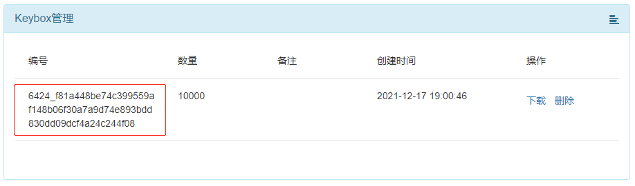

1. 需要使用专用的 IMEI 号烧录工具 `SN_Writer_Tool_exe_v10.2104.0.0-4363`。

2. 找到烧录工具下的 `tee_stuff\kph_in\kph_env.ini` 文件。

3. 修改 `kph_env.ini` 文件中的 `keybox_uuid` 字段。

   ```ini
   [vturkey]
   url=http://116.62.230.138/vturkey
   keybox_uuid=6286_8f38b294647ea8e1f7c9f917899d81d000e1797e332d3a7ed2cb6e49c3e98491
   ```

   > 注意：
   > `keybox_uuid`  的值为甁钵网站该项目下的 Keybox 管理列表中的编号。
   >
   > 

4. 然后运行写号工具按照正常写号步骤操作即可。

