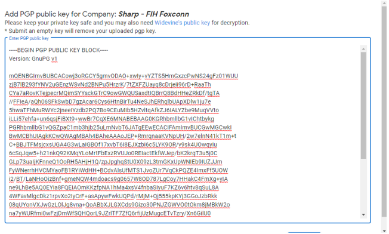

[toc]

### 1. 生成秘钥
执行 `$ gpg --gen-key` 命令。
例如：

```shell
$ gpg --gen-key (執行)
gpg (GnuPG) 1.4.20; Copyright (C) 2015 Free Software Foundation, Inc.
This is free software: you are free to change and redistribute it.
There is NO WARRANTY, to the extent permitted by law.
gpg: keyring `/home/gms/.gnupg/secring.gpg' created
gpg: keyring `/home/gms/.gnupg/pubring.gpg' created
Please select what kind of key you want:
(1) RSA and RSA (default)
(2) DSA and Elgamal
(3) DSA (sign only)
(4) RSA (sign only)
Your selection? 1 (选默认)
RSA keys may be between 1024 and 4096 bits long.
What keysize do you want? (2048) (选默认)
Requested keysize is 2048 bits
Please specify how long the key should be valid.
0 = key does not expire
<n> = key expires in n days
<n>w = key expires in n weeks
<n>m = key expires in n months
<n>y = key expires in n years
Key is valid for? (0) (选默认)
Key does not expire at all
Is this correct? (y/N) y (正确按 y)
You need a user ID to identify your key; the software constructs the user ID
from the Real Name, Comment and Email Address in this form:
"Heinrich Heine (Der Dichter) <heinrichh@duesseldorf.de>"
Real name: fihgms (输入名字)
Email address: fihgms@fih-foxconn.com (输入邮箱)
Comment: gms (输入代码)
You selected this USER-ID:
"fihgms (gms) <fihgms@fih-foxconn.com>" (记住自己的 USER_NAME, 有包含
引号, 后面生成 key 需要用到)
Change (N)ame, (C)omment, (E)mail or (O)kay/(Q)uit? O (正确按 O)
You need a Passphrase to protect your secret key. (输入密码, ex: 123456, 并记下自己的密码, 后面解密需要用到)
We need to generate a lot of random bytes. It is a good idea to perform
some other action (type on the keyboard, move the mouse, utilize the
disks) during the prime generation; this gives the random number
generator a better chance to gain enough entropy.
Not enough random bytes available. Please do some other work to give
the OS a chance to collect more entropy! (Need 189 more bytes)
(这里可能会卡住，可以通过四处移动鼠标、浏览互联网、玩游戏、让电脑生成随机字节)
.......+++++
.+++++
We need to generate a lot of random bytes. It is a good idea to perform
some other action (type on the keyboard, move the mouse, utilize the
disks) during the prime generation; this gives the random number
generator a better chance to gain enough entropy.
Not enough random bytes available. Please do some other work to give
the OS a chance to collect more entropy! (Need 128 more bytes)
.....+++++
gpg: /home/gms/.gnupg/trustdb.gpg: trustdb created
gpg: key A769A295 marked as ultimately trusted
public and secret key created and signed.
gpg: checking the trustdb
gpg: 3 marginal(s) needed, 1 complete(s) needed, PGP trust model
gpg: depth: 0 valid: 1 signed: 0 trust: 0-, 0q, 0n, 0m, 0f, 1u
pub 2048R/A769A295 2022-03-08
Key fingerprint = 46F1 98C7 10F3 8A03 6A0D 3237 FF91 9ABA A769 A295
uid fihgms (gms) <fihgms@fih-foxconn.com>
sub 2048R/12A89731 2022-03-08
```

### 2. 导出 public key
可以使用如下命令导出 `public key`：

```shell
$ gpg --export -a USER_NAME > public.key
```

导出自己的 `public key`
`USER_NAME` 是自己的 `USER_NAME`
前面有提到:

```shell
You selected this USER-ID:
"fihgms (gms) <fihgms@fih-foxconn.com>" (记住自己的 USER_NAME, 有包含
引号, 后面生成 key 需要用到)
```

例如：

```shell
$ gpg --export -a "fihgms (gms) <fihgms@fih-foxconn.com>" > public.key
```

### 3. 保存 public key

将 `public key` 内容粘贴到 `APA`，并且存档。
例如：



### 4. 下载加密后的 keybox（.pgp 文件）
例如：

```
2022-03-08_03-15-20.463_UTC.1646709322275.output.gz.pgp
```

### 5. 解密 pgp 文件

#### 5.1 导出 private key （已经有忽略该步骤）

使用如下命令导出自己的 `private key`：

```shell
$ gpg --export-secret-key USER_NAME > private.key
```

`USER_NAME` 是自己的 `USER_NAME`
例如：

```shell
$ gpg --export-secret-key "fihgms (gms) <fihgms@fih-foxconn.com>" > private.key
```

#### 5.2 解密 pgp 文件

通过 `private key` 解密文件：

```shell
$ gpg --allow-secret-key-import --import private.key
$ gpg -d -r USER_NAME keybox.output.gz.pgp > keybox.output.gz
```

`USER_NAME` 是自己的 `USER_NAME`
`keybox.output.gz.pgp` 是加密過後的 `keybox` (`.pgp` 檔案)
例如：

```shell
$ gpg --allow-secret-key-import --import private.key
$ gpg -d -r "fihgms (gms) <fihgms@fih-foxconn.com>" 2022-03-08_03-15-
20.463_UTC.1646709322275.output.gz.pgp > keybox.output.gz
```

#### 5.3 输入解密密码

解密过程中需要输入密码。

输入前面生成秘钥时使用的密码，例如：`123456`。
#### 5.4 得到 keybox
`keybox.output.gz` 即是解密后的 `keybox`