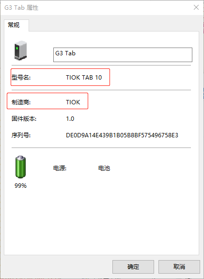

[toc]

要修改的位置：



### 1. MTK

#### 1.1 MT8766

##### 1.1.1 Android T

修改 `sys/frameworks/av/media/mtp/MtpServer.cpp` 文件中 `doGetDeviceInfo()` 方法的如下代码：

```diff
@@ -533,8 +533,14 @@ MtpResponseCode MtpServer::doGetDeviceInfo() {
     mData.putAUInt16(captureFormats); // Capture Formats
     mData.putAUInt16(playbackFormats);  // Playback Formats
 
+    // Modify MTP device model and manufacturer property by qty {{&&
+    /*
     mData.putString(mDeviceInfoManufacturer); // Manufacturer
     mData.putString(mDeviceInfoModel); // Model
+    */
+    mData.putString("TIOK"); // Manufacturer
+    mData.putString("TIOK TAB 10"); // Model
+    // &&}}
     mData.putString(mDeviceInfoDeviceVersion); // Device Version
     mData.putString(mDeviceInfoSerialNumber); // Serial Number
 
```

