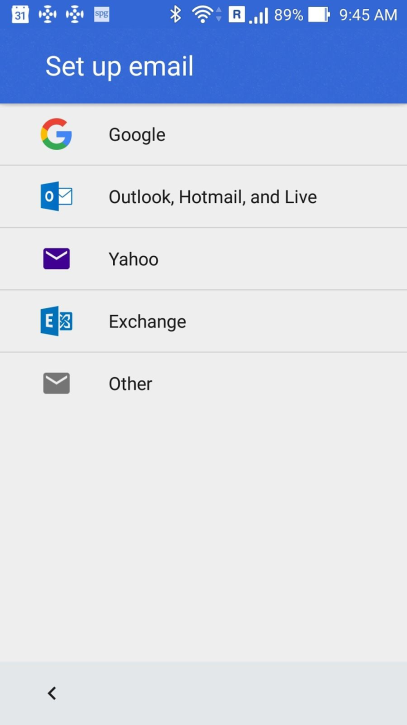

[toc]

> 提示：无法对谷歌邮箱账号进行邮件签名，只对第三方邮箱的邮件签名。

### 1. Quick Introduction to the Email PartnerProvider App  

The Email PartnerProvider app allows OEMs to add additional service providers, including custom settings such as logos and signatures, to the default list provided by the Gmail app. This document describes the integration points.

> **Note: **There are no changes in the Android 7.x and Android 8.x releases.

A reference version of the Email PartnerProvider app is given to OEMs to allow them to specify different providers for Gmail to query when a user creates an account. The app has the following main functions (all functions are optional and are not dependent on each other):

+ Provide the list of email settings for the Gmail app to use:

  + The following attributes can be set for each provider:

    + `id​`: (required) Must be unique.

    + `domain​`: (required) Domain of the hosting company. It will be used tomatch user's email address to this provider.

    + `signature​`: (optional) Signature to be set to the account if given provider is used. Can be configured based on locale or SIM’s MCC and/or MNC (see below)

    + Inner elements:

      + `incoming​`: (required) The configuration for incoming settings.

      + `outgoing​`: (required) The configuration for outgoing settings.

  + Sample:

    ```xml
    <provider id="zoho" domain="zoho.com" signature="@string/zoho_signature">
        <incoming … />
        <outgoing … />
    </provider>
    ```

+ Provide additional entries for our visual add account flow:

  + Each entry consists of an icon (optional) and a string (shown in the UI), and is not tied to any particular provider. See below for an example of the Gmail add account flow screen in which this item will be placed.

  + Sample:

    ```xml
    <entry label="@string/zoho_label" logo="@drawable/zoho_logo"/>
    ```

+ Provide a global signature for newly added accounts:

  + String resource with name ​`global_signature`​ is used.

  + If account was added with ​`provider`​ mentioned above, then the ​`signature` specified in the provider will be used. If provider didn’t specify the signature then `global_signature` will be used as fallback.

  + Sample:
    ```xml
    <string name="global_signature">Sent from Androiddevice</string>
    ```

Detailed explanation about each tag and attribute is specified as the comment inside the resource file. The type of all attributes is string or reference to String resource (except logo, which is reference to drawable resource). When an attribute is used as a reference to String resource, providing different values is possible via Android resource qualifiers (see ​Providing Alternative Resources​). In summary, different values can be provided for different locales, MCC, MNC, Android OS version, screen sizes, density, orientation, and other qualifiers. The most useful qualifiers for this app are probably locale, MCC and MNC.



The sample code provided is almost complete. The ​ContentProvider​ that Gmail communicates to is implemented and shouldn’t be changed. The only things that OEMs should change are resources in the ​res​ directory, where providers and additional setup entries are defined.

These conditions must be met for the Gmail app to use the PartnerProvider app:

1. The PartnerProvider app package must be:
   `com.android.email.partnerprovider`

2. The PartnerProvider app must be installed in the device’s system image.

3. Gmail must be installed as a system app.

4. All ​`ContentProvider`​ queries should return in 2-3 seconds. which should be enough time, unless Java code is modified and additional work is added, e.g. online queries.

5. Gmail will also check the content of the resulting cursor and discard some or all entries if something looks odd (e.g. missing fields, invalid values, etc.).

### 2. 修改签名

修改 `EmailPartnerProvider/res/values/strings.xml` 文件中的如下代码（如果没有请添加）：

```xml
<?xml version="1.0" encoding="utf-8"?>
<resources>
  <string name="global_signature">Sent from my Sky Devices Phone</string>
</resources>
```

### 3. EmailPartnerProvider 源代码

#### 3.1 EmailPartnerProvider 源码目录结构

```
EmailPartnerProvider
|__ src
|	|__ com
|		|__ android
|			|__ email
|				|__ partnerprovider
|					|__ PartnerProvider.java
|__ res
|	|__ values
|	|	|__ ids.xml
|	|	|__ strings.xml
|	|__ xml
|		|__ account_setup_entry.xml
|		|__ providers.xml
|__ Android.bp
|__ AndroidManifest.xml
|__ README.txt
```

#### 3.2 源代码

##### 3.2.1 PartnerProvider.java

```java
package com.android.email.partnerprovider;

import android.content.ContentProvider;
import android.content.ContentValues;
import android.content.UriMatcher;
import android.content.res.XmlResourceParser;
import android.database.Cursor;
import android.database.MatrixCursor;
import android.graphics.Bitmap;
import android.graphics.Bitmap.CompressFormat;
import android.graphics.BitmapFactory;
import android.net.Uri;
import android.text.TextUtils;
import android.util.Log;
import java.io.ByteArrayOutputStream;
import java.io.IOException;
import java.util.ArrayList;
import java.util.Arrays;
import java.util.Collections;
import java.util.List;
import org.xmlpull.v1.XmlPullParserException;

/**
 * Provides the additional email configurations to interested apps. It also provides additional
 * entry for account setup flow.
 */
public class PartnerProvider extends ContentProvider {
  private static final String TAG = "PartnerMailProvider";

  static final String AUTHORITY = "com.android.email.partnerprovider";

  static final String PROVIDERS_PATH = "v1/providers";
  static final String ACCOUNT_SETUP_ENTRY_PATH = "v1/account_setup_entry";
  static final String GLOBAL_SIGNATURE_PATH = "v1/global_signature";

  private static final int NO_MATCH = 0;
  private static final int MATCH_PROVIDERS = 1;
  private static final int MATCH_ACCOUNT_SETUP_ENTRY = 2;
  private static final int MATCH_GLOBAL_SIGNATURE = 3;

  private static final UriMatcher uriMatcher = new UriMatcher(NO_MATCH);
  static {
    uriMatcher.addURI(AUTHORITY, PROVIDERS_PATH, MATCH_PROVIDERS);
    uriMatcher.addURI(AUTHORITY, ACCOUNT_SETUP_ENTRY_PATH, MATCH_ACCOUNT_SETUP_ENTRY);
    uriMatcher.addURI(AUTHORITY, GLOBAL_SIGNATURE_PATH, MATCH_GLOBAL_SIGNATURE);
  }

  private static class Provider {
    private String id;
    private String label;
    private String domain;
    private String signature;
    private String incomingUriTemplate;
    private String incomingUsernameTemplate;
    private String outgoingUriTemplate;
    private String outgoingUsernameTemplate;

    private static final String[] COLUMNS = {
        "id",
        "label",
        "domain",
        "signature",
        "inUriTemplate",
        "inUserTemplate",
        "outUriTemplate",
        "outUserTemplate",
    };

    // xml tags
    private static final String PROVIDER_XML_TAG = "provider";
    private static final String PROVIDERS_XML_TAG = "providers";
    private static final String INCOMING_XML_TAG = "incoming";
    private static final String OUTGOING_XML_TAG = "outgoing";
    // xml attributes
    private static final String ID_XML_ATTRIBUTE = "id";
    private static final String LABEL_XML_ATTRIBUTE = "label";
    private static final String DOMAIN_XML_ATTRIBUTE = "domain";
    private static final String SIGNATURE_XML_ATTRIBUTE = "signature";
    private static final String URI_XML_ATTRIBUTE = "uri";
    private static final String USERNAME_XML_ATTRIBUTE = "username";
  }

  private static class AccountSetupEntry {
    private String label;
    private Bitmap logo;

    private static final String[] COLUMNS = {
        "label",
        "logo",
    };

    // xml tags
    private static final String ENTRY_XML_TAG = "entry";
    // xml attributes
    private static final String LABEL_XML_ATTRIBUTE = "label";
    private static final String LOGO_XML_ATTRIBUTE = "logo";
  }

  private static final String[] GLOBAL_SIGNATURE_COLUMNS = {
      "signature",
  };

  @Override
  public boolean onCreate() {
    return true;
  }

  @Override
  public Cursor query(Uri uri, String[] projection, String selection, String[] selectionArgs,
      String sortOrder) {
    if (projection != null || selection != null || selectionArgs != null || sortOrder != null) {
      throw new IllegalArgumentException();
    }

    MatrixCursor cursor;
    switch (uriMatcher.match(uri)) {
      case MATCH_PROVIDERS:
        cursor = new MatrixCursor(Provider.COLUMNS);

        List<Provider> providers = loadProviders();
        for (Provider provider : providers) {
          cursor.addRow(Arrays.asList(
              provider.id,
              provider.label,
              provider.domain,
              provider.signature,
              provider.incomingUriTemplate,
              provider.incomingUsernameTemplate,
              provider.outgoingUriTemplate,
              provider.outgoingUsernameTemplate));
        }
        return cursor;
      case MATCH_ACCOUNT_SETUP_ENTRY:
        cursor = new MatrixCursor(AccountSetupEntry.COLUMNS);
        List<AccountSetupEntry> entries = loadAccountSetupEntries();
        for (AccountSetupEntry entry : entries) {
          if (!TextUtils.isEmpty(entry.label)) {
            byte[] logoBytes = null;
            if (entry.logo != null) {
              ByteArrayOutputStream logoByteStream = new ByteArrayOutputStream();
              entry.logo.compress(CompressFormat.PNG, 100 /* quality */, logoByteStream);
              logoBytes = logoByteStream.toByteArray();
            }
            cursor.addRow(new Object[]{entry.label, logoBytes});
          }
        }
        return cursor;
      case MATCH_GLOBAL_SIGNATURE:
        cursor = new MatrixCursor(GLOBAL_SIGNATURE_COLUMNS);
        String globalSignature = getContext().getString(R.string.global_signature);
        if (!TextUtils.isEmpty(globalSignature)) {
          cursor.addRow(new Object[] {globalSignature});
        }
        return cursor;
      default:
        Log.e(TAG, "Unknown uri: " + uri);
        return null;
    }
  }

  @Override
  public String getType(Uri uri) {
    return null;
  }

  @Override
  public Uri insert(Uri uri, ContentValues values) {
    throw new UnsupportedOperationException();
  }

  @Override
  public int delete(Uri uri, String selection, String[] selectionArgs) {
    throw new UnsupportedOperationException();
  }

  @Override
  public int update(Uri uri, ContentValues values, String selection, String[] selectionArgs) {
    throw new UnsupportedOperationException();
  }

  private List<Provider> loadProviders() {
    try {
      XmlResourceParser xml = getContext().getResources().getXml(R.xml.providers);
      int xmlEventType;
      while ((xmlEventType = xml.next()) != XmlResourceParser.END_DOCUMENT) {
        if (xmlEventType == XmlResourceParser.START_TAG
            && Provider.PROVIDERS_XML_TAG.equals(xml.getName())) {
          return parseProviders(xml);
        }
      }
      return new ArrayList<>();
    } catch (Exception e) {
      Log.e(TAG, "Error loading providers.", e);
      return Collections.emptyList();
    }
  }

  private List<Provider> parseProviders(XmlResourceParser xml)
      throws IOException, XmlPullParserException {
    List<Provider> providers = new ArrayList<>();
    int xmlEventType;
    while ((xmlEventType = xml.next()) != XmlResourceParser.END_DOCUMENT) {
      switch (xmlEventType) {
        case XmlResourceParser.START_TAG:
          if (Provider.PROVIDER_XML_TAG.equals(xml.getName())) {
            providers.add(parseProvider(xml));
          } else {
            Log.w(TAG, "Unexpected start tag inside providers. Tag name: " + xml.getName());
          }
          break;
        case XmlResourceParser.END_TAG:
          if (Provider.PROVIDERS_XML_TAG.equals(xml.getName())) {
            return providers;
          }
          break;
        default:
          break;
      }
    }
    throw new IllegalStateException("Unexpected end of document inside providers");
  }

  private Provider parseProvider(XmlResourceParser xml) throws IOException, XmlPullParserException {
    Provider provider = new Provider();
    provider.id = getAttributeValue(xml, Provider.ID_XML_ATTRIBUTE);
    provider.label = getAttributeValue(xml, Provider.LABEL_XML_ATTRIBUTE);
    provider.domain = getAttributeValue(xml, Provider.DOMAIN_XML_ATTRIBUTE).toLowerCase();
    provider.signature = getAttributeValue(xml, Provider.SIGNATURE_XML_ATTRIBUTE);

    int xmlEventType;
    while ((xmlEventType = xml.next()) != XmlResourceParser.END_DOCUMENT) {
      switch (xmlEventType) {
        case XmlResourceParser.START_TAG:
          String tagName = xml.getName();
          String uriTemplate = getAttributeValue(xml, Provider.URI_XML_ATTRIBUTE);
          String usernameTemplate = getAttributeValue(xml, Provider.USERNAME_XML_ATTRIBUTE);
          if (Provider.INCOMING_XML_TAG.equals(tagName)) {
            provider.incomingUriTemplate = uriTemplate;
            provider.incomingUsernameTemplate = usernameTemplate;
          } else if (Provider.OUTGOING_XML_TAG.equals(tagName)) {
            provider.outgoingUriTemplate = uriTemplate;
            provider.outgoingUsernameTemplate = usernameTemplate;
          } else {
            Log.w(TAG, "Unexpected start tag inside provider. Tag name: " + tagName);
          }
          break;
        case XmlResourceParser.END_TAG:
          if (Provider.PROVIDER_XML_TAG.equals(xml.getName())) {
            return provider;
          }
          break;
        default:
          break;
      }
    }
    throw new IllegalStateException("Unexpected end of document inside provider");
  }

  private List<AccountSetupEntry> loadAccountSetupEntries() {
    try {
      List<AccountSetupEntry> entries = new ArrayList<>();
      XmlResourceParser xml = getContext().getResources().getXml(R.xml.account_setup_entry);
      int xmlEventType;
      while ((xmlEventType = xml.next()) != XmlResourceParser.END_DOCUMENT) {
        if (xmlEventType == XmlResourceParser.START_TAG
            && AccountSetupEntry.ENTRY_XML_TAG.equals(xml.getName())) {
          AccountSetupEntry entry = new AccountSetupEntry();
          entry.label = getAttributeValue(xml, AccountSetupEntry.LABEL_XML_ATTRIBUTE);
          int logoResourceId =
              xml.getAttributeResourceValue(null, AccountSetupEntry.LOGO_XML_ATTRIBUTE, 0);
          if (logoResourceId != 0) {
            entry.logo = BitmapFactory.decodeResource(getContext().getResources(), logoResourceId);
          }
          entries.add(entry);
        }
      }
      return entries;
    } catch (Exception e) {
      Log.e(TAG, "Error loading providers.", e);
      return null;
    }
  }

  private String getAttributeValue(XmlResourceParser xml, String attribute) {
    int resourceId = xml.getAttributeResourceValue(null, attribute, 0);
    if (resourceId != 0) {
      return getContext().getString(resourceId);
    }
    return xml.getAttributeValue(null, attribute);
  }
}
```

##### 3.2.2 ids.xml

```xml
<?xml version="1.0" encoding="utf-8"?>
<resources>
    <item type="string" name="global_signature" />
</resources>
```

##### 3.2.3 strings.xml

```xml
<?xml version="1.0" encoding="utf-8"?>
<resources>
  <string name="global_signature">Sent from my Sky Devices Phone</string>
</resources>
```

##### 3.2.4 account_setup_entry.xml

```xml
<?xml version="1.0" encoding="utf-8"?>
<!--
  Root element of this file should be "entries" element and it can contain arbitrary number of
  "entry" elements. Each "entry" element (if label is defined and non-empty) represents an entry
  that will shown during "Add Account" flow in email app.
  Allowed attributes of "entry" element:
    label: string or string resource
      Indicates one or a few email providers that users are most likely to recognize. The text will
      be used for an entry during account setup flow. No entry is present if the attribute is not
      defined or an empty string. This entry should be specific to each OEM, and it shouldn't be
      the global entries (Google, Microsoft, Yahoo, etc.) nor locale-specific entries (Yandex in
      Russia, GMX in Germany, etc.)
    logo: drawable resource
      Corresponds to the provider specified with the "label" attribute. If the attribute is not set
      then a generic email icon will be used.
-->
<entries/>
```

##### 3.2.5 providers.xml

```xml
<?xml version="1.0" encoding="utf-8"?>
<!--
  This file is used to specify providers for whom we know default settings, and those that users
  are likely to use, so the user can set up their account by simply entering their email address
  and password.

  When a user starts this process, the email address is parsed, the domain is broken out and used
  to search for a provider. Similar file in the email app is consulted first, and if no provider is
  found then entries from this app are checked. If provider is found then provider's settings are used
  to attempt to connect to the server.

  ==== XML SCHEME ====

  Root element should be "providers". It shouldn't have any attributes and all children nodes
  should be "provider" elements.

  Each "provider" element contains information about setting up the email account.
  Attributes:
    - id: (required) Must be unique.
    - label: (required) Will be shown to the user when there are multiple options provided for a
            single domain (not currently supported).
    - domain: (required) Domain of the hosting company. See below for details.
    - signature: (optional) Signature to be set to the account if given provider is used.
  Inner elements:
    - incoming: (required) Specify the configuration for incoming settings.
    - outgoing: (required) Specify the configuration for outgoing settings.

    The "incoming" and "outgoing" elements have the same scheme. They don't have inner elements but
    they have two required attributes: "uri" and "username". See below for details.

  Each attribute is either a constant string (recommended for id, domain) or reference to string
  resource. Attributes used as string resource can be overriden for different configurations, like
  different locale, different Mobile Country Codes (mcc), Mobile Network Code (mnc), etc. See
  https://developer.android.com/guide/topics/resources/providing-resources.html#AlternativeResources
  for more details.

  ==== FORMAT OF ENTRIES ====

  The ID must be completely unique. In the future, the label will be shown to the user when there
  are multiple options provided for a single domain (not currently supported).

  A provider contains the settings for setting up an email account that ends with the given domain.
  Domains should be unique within this file (see below for domain format). If multiple entries
  match the domain, the first one will be used.

  Each provider should have one incoming section and one outgoing section.

  Valid incoming uri schemes are:
    gLegacyImap+tls+   IMAP with required TLS transport security.
                         If TLS is not available the connection fails.
                         Default port: 143
    gLegacyImap+ssl+   IMAP with required SSL transport security.
                         If SSL is not available the connection fails.
                         Default port: 993

    gPop3+tls+    POP3 with required TLS transport security.
                    If TLS is not available the connection fails.
                    Default port: 110
    gPop3+ssl+    POP3 with required SSL transport security.
                    If SSL is not available the connection fails.
                    Default port: 995

  Valid outgoing uri schemes are:
    smtp+tls+    SMTP with required TLS transport security.
                   If TLS is not available the connection fails.
                   Default port: 587
    smtp+ssl+    SMTP with required SSL transport security.
                   If SSL is not available the connection fails.
                   Default port: 465

  The URIs must contain all of the information to make a connection, including a port if the
  service uses a non-default port (e.g. smtp+ssl+//foo.bar:123). The default ports are listed
  above.

  ==== DOMAIN PATTERNS ====

  A hosting company will often have multiple mail server addresses, used for load balancing or
  based upon geographical boundaries. In these cases, it would be unwieldy to maintain a list of
  many providers that all point to essentially the same mail server. To alleviate this, domains
  may contain pattern matching characters that can be used to match user entered domains without
  knowing the exact domain.

  An asterisk (*) is used to match that part of a domain name that is demarcated by a period (dot);
  no other characters may appear on either side of an asterisk. Therefore, "foo.*.com" and "bar.*"
  are valid, whereas "a*.com" and "foo.c*" are not. An asterisk is also not greedy; it only matches
  a single part of a domain name. Therefore, "foo.bar.bletch" is NOT matched by "foo.*"; it is,
  however, matched by "foo.*.*" or "foo.bar.*". To prevent matching too many domains, the pattern
  can't start with asteriks (e.g. "*.com" or "*.co.uk").

  The question mark (?) wildcard character matches any single character. This is very useful when
  the number of characters is known (such as the country code in the domain).

  ==== TEMPLATES ====

  Both the username and uri attributes (for both incoming and outgoing elements) are templates.

  The username attribute is used to supply a template for the username that will be presented to
  the server. This username is built from a set of variables that are substituted with parts of the
  user specified email address.

  Valid substitution values for all templates are:
      $email  - the email address the user entered
      $user   - the string before the @ sign in the email address the user entered
      $domain - the string after the @ sign in the email address the user entered

  ==== SAMPLES ====

  // Sample with hardcoded label, unique domain, no signature and user is authenticated with email
  // address.
  // For incoming settings IMAP with SSL transport security should be used (on port 143).
  // For outgoing settings SMTP with TLS transport security should be used (on default port 587).
  // For both incoming and outgoing connections full address is used to authenticate the user.
  <provider id="sample1" label="Sample Provider 1" domain="domain1.com">
    <incoming uri="gLegacyImap+ssl+://domain1.com:143" username="$email" />
    <outgoing uri="smtp+tls+://domain1.com" username="$email" />
  </provider>

  // Sample with the label and signature that are extracted from resources.
  // Top level domain is not fixed, meaning all domains "@domain2.com", "@domain2.de" and similar
  // are allowed. For both incoming and outgoing connections only user part of the address is used
  // to authenticate the user (the part before '@').
  <provider id="sample2" label="@string/sample2_label" domain="domain2.*" signature="@string/sample2_signature">
    <incoming uri="gPop3+ssl+://domain2.com" username="$user" />
    <outgoing uri="smtp+tls+://domain2.com" username="$user" />
  </provider>
-->
<providers>
</providers>
```

##### 3.2.6 Android.bp

```bp
//
// Copyright (C) 2012 The Android Open Source Project
//
// Licensed under the Apache License, Version 2.0 (the "License");
// you may not use this file except in compliance with the License.
// You may obtain a copy of the License at
//
//      http://www.apache.org/licenses/LICENSE-2.0
//
// Unless required by applicable law or agreed to in writing, software
// distributed under the License is distributed on an "AS IS" BASIS,
// WITHOUT WARRANTIES OR CONDITIONS OF ANY KIND, either express or implied.
// See the License for the specific language governing permissions and
// limitations under the License.
//

android_app {
    name: "EmailPartnerProvider",
    srcs: ["src/**/*.java"],
    sdk_version: "current",
}
```

##### 3.2.7 AndroidManifest.xml

```xml
<manifest xmlns:android="http://schemas.android.com/apk/res/android"
  package="com.android.email.partnerprovider">

  <uses-sdk
    android:minSdkVersion="17"
    android:targetSdkVersion="23" />

  <permission
    android:name="com.android.email.partnerprovider.PARTNER_PROVIDER"
    android:protectionLevel="normal" />

  <application
    android:allowBackup="false">

    <provider
      android:name="PartnerProvider"
      android:authorities="com.android.email.partnerprovider"
      android:exported="true"
      android:permission="com.android.email.partnerprovider.PARTNER_PROVIDER" />
  </application>

</manifest>
```

##### 3.2.8 README.txt

```txt
Email PartnerProvider is a standalone app. Android OEMs can build this app and
place it in their system image so the Gmail app can query it to retrieve email
provider configurations, represented as an additional entries in the
"Add account" flow. A configuration may include server hostname and port,
signature, branded logo, etc.

There are 2 resource directories. They should not be used together:
 - Resources in "res" are empty, but documented in detail, and should be used
   for the real app.
 - Resources in "res_sample" provide a sample and should be checked first to get
   an overview of how a real resource file should be populated. Sample resources
   could be used for experimenting and trying different things.

To build the app in the simplest form, follow these steps:
 1. Install Android Studio.
 2. Create a new project in Android Studio based on the "build.gradle" file.
 3. There will be 2 product variants, which are based on different resource
    directories.
 4. Add proper versioning and signing to the "build.gradle" file.
```

