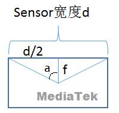

[toc]

### 1. MTK 平台

#### 1.1 MTK8766

##### 1.1.1 Android R

**问题：**

Android_P开始，非Low RAM的新设备，Camera必须支持HAL3版本或者更高的版本；在GMS认证中会对Camera的metadata配置进行检查，而我们CTSV中的FOV值也是在metadata配置中修改（以后摄gc5035为例）。

**分析：**

在对应Camera 的config_static_metadata.sensor.gc5035mipiraw.h文件中查看MTK_SENSOR_INFO_PHYSICAL_SIZE值，如下：

```
vendor/mediatek/proprietary/custom/mt8163/hal/imgsensor_metadata/gc5035mipi_raw/config_static_metadata.sensor.gc5035mipiraw.h
```

关键代码如下：

```c
CONFIG_METADATA_BEGIN(MTK_SENSOR_INFO_PHYSICAL_SIZE) // mm
   CONFIG_ENTRY_VALUE(3.20f, MFLOAT)
   CONFIG_ENTRY_VALUE(2.40f, MFLOAT)
CONFIG_METADATA_END()
```

FOV值的原理图如下：



即d值为3.20

我们要计算图中的f值， 其中 a 为 fov/2， fov值取对准左右两边黑线时的 Display FOV 值；

则 f=d/(2*tan(fov/2))

最后，我们将计算得到的 f 值修改到 `config_static_metadata.lens.gc5035mipiraw.h` 中的 MTK_LENS_INFO_AVAILABLE_FOCAL_LENGTHS 以及 `config_request_metadata__.h` 中的 MTK_LENS_FOCAL_LENGTH 这两个值要同步修改，若这两个值不一致，cts-on-gsi 的 CtsCameraTestCases 会出现 testJpegExif 和 testVideoSnapshot 两个 fail 项。

**解决方案：**

修改对应 Camera 的 `config_static_metadata.lens.gc5035mipiraw.h` 和 `config_request_metadata__.h` 文件，示例如下：

**vendor/mediatek/proprietary/custom/mt8163/hal/imgsensor_metadata/gc5035mipi_raw/config_static_metadata.lens.gc5035mipiraw.h**

 ```c
 //==========================================================================
 
    CONFIG_METADATA_BEGIN(MTK_LENS_INFO_AVAILABLE_FOCAL_LENGTHS)
 
 \-    CONFIG_ENTRY_VALUE(2.50f, MFLOAT)
 
 \+    CONFIG_ENTRY_VALUE(3.55f, MFLOAT)
 
    CONFIG_METADATA_END()
 
  
 
 vendor/mediatek/proprietary/custom/mt8163/hal/imgsensor_metadata/gc5035mipi_raw/config_request_metadata__.h
 
    //==========================================================================
 
    CONFIG_METADATA_BEGIN(MTK_LENS_FOCAL_LENGTH)//not null
 
 \-    CONFIG_ENTRY_VALUE(2.50f, MFLOAT)
 
 \+    CONFIG_ENTRY_VALUE(3.55f, MFLOAT)
 
    CONFIG_METADATA_END()
 ```


   