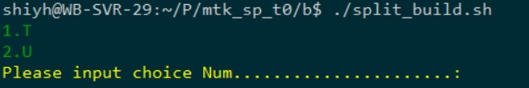
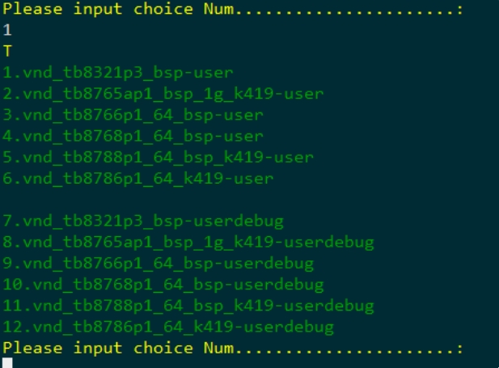
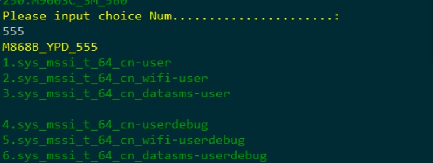
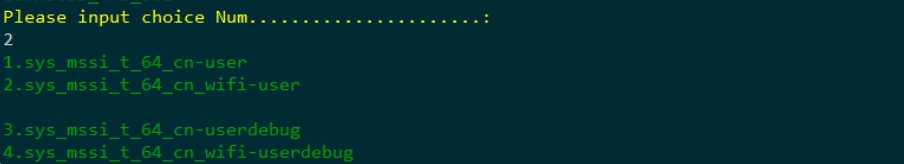
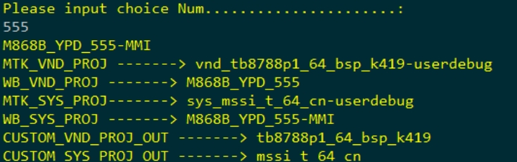
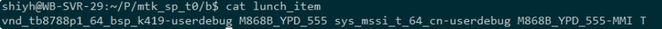

[toc]

### 1、拉取代码

```shell
git clone --recurse-submodules git@192.168.0.24:mtk/mtk_sp_t0.git
cd mtk_sp_t0
git submodule foreach git checkout master
```

整个代码有4个仓库

+ mtk_sp_t0/.git 主仓库，只管理编译脚本等⽂件

+ mtk_sp_t0/vnd/.git vendor⼦仓库，就是我们维护的仓库 对应地址
  git@192.168.0.24:mtk/mt8766_s.git

+ mtk_sp_t0/sys/.git mssi ⼦仓库 ，就是最新释放的system仓库 对应地址
  git@192.168.0.24:mtk/mtk_t_mssi.git

+ mtk_sp_t0/u_sys/.git u版本mssi ⼦仓库 ，就是最新释放的system仓库 对应地址
  git@192.168.0.24:mtk/mtk_u_mssi.git

在现有的 mtk_sp_t0 项⽬中直接在 vnd sys ⽬录下⾯拉取 u_mssi 及更新编译脚本即可编译 14 版本

```shell
cd mtk_sp_t0;
git clone git@192.168.0.24:mtk/mtk_u_mssi.git u_sys  
```

### 2、更新代码

```shell
cd mtk_sp_t0; git pull 更新主仓库脚本类
cd mtk_sp_t0/vnd;git pull 更新vendor仓库
cd mtk_sp_t0/sys;git pull 更新mssi仓库
cd mtk_sp_t0/u_sys;git pull 更新u版本mssi仓库
```

每个仓库提交互相不影响  

### 3. Split Build 1.0 编译

Split Build 1.0( MT8321 MT8765 MT8766 MT8768 MT8183 MT8788 适⽤)  

#### 3.1 原始数据

##### 3.1.1 编译kernel 及 vnd  

```shell
cd vnd ; source build/envsetup.sh && export OUT_DIR=out && lunch vnd_tb8766p1_64_bspuserdebug M866YA_WB_420 && make krn_images vnd_images
```

Vendor WB_PROJECT 对应 vnd/weibu/tb8766p1_64_bsp/M866YA_WB_420，如果不存在则报错 

##### 3.1.2 编译mssi (T和U版本适⽤)  

```shell
cd sys ; source build/envsetup.sh && export OUT_DIR=out && lunch sys_mssi_t_64_cnuserdebug M866YA_WB_420-MMI && make -j24 sys_images
```

MSSI WB_PROJECT 对应 vnd/weibu/mssi_t_64_cn/M866YA_WB_420-MMI，如果不存在则使⽤ vnd/weibu/mssi_t_64_cn/COMMON 配置  

##### 3.1.3 合成固件  

```shell
cd mtk_sp_t0 ; python vnd/vendor/mediatek/proprietary/scripts/releasetools/split_build.py --system-dir sys/out/target/product/mssi_t_64_cn/images --vendor-dir vnd/out/target/product/tb8768p1_64_bsp/images --kernel-dir vnd/out_krn/target/product/tb8768p1_64_bsp/images --output-dir ./merged
```

#### 3.2 脚本编译  

##### 3.2.1 Android_Version

运⾏ `./split_build.sh` ，弹出选择 Android Mssi 版本  



##### 3.2.2 MTK_PROJECT  

弹出的菜单中选择对应的 MTK_PROJECT  



##### 3.2.3 Vendor WEIBU_PROJECT  

继续选择对应的WEIBU_PROJECT，输⼊对应的禅道任务号即可  



##### 3.2.4 MSSI project  

根据章节固定组合中选择对应的MSSI project  



##### 3.2.5 MSSI WEIBU_PROJECT  

选择对应的MSSI下的WEIBU_PROJECT，输⼊对应的禅道任务号即可  



##### 3.2.6 lunch_item  

选择以上配置后会⽣成 lunch_item，cat⽂件发现保存了我们以上5步选择的配置，下次编译就不需要重新在⼿动选择，脚本默认会从这个⽂件中取出配置直接编译, 如果要更改编译项⽬，需要⼿动删除 lunch_item⽂件后再⼿动选择配置项 。



##### 3.2.7 开始编译

./split_build.sh 不加参数全部编译编译顺序 vnd_images krn_images sys_images 编译完后打包在跟脚本同⼀级⽬录merged  

##### 3.2.8 打包

```shell
$ ./split_build.sh pac
```

打包发布固件, 会从 sys/out/target/product/mssi_t_64_cn/system/build.prop 中取
ro.build.display.id 及 ro.build.display.inner.id 打包成发布固件格式  

##### 3.2.9 模块编译

```shell
./split_build.sh sys 编译sys_images 编译完后不打包
./split_build.sh vnd 编译vnd_images 编译完后不打包
./split_build.sh krn 编译 krn_images 编译完后不打包
./split_build.sh krn vnd 编译 krn_images vnd_images编译完后不打包
./split_build.sh mer 合成烧录固件到merged
./split_build.sh pac 打包发布固件
```

### 4. Split Build 2.0编译  

Split Build 2.0 ( MT8781 适⽤)  

### 5. 固定组合  

| Vendor project        | MSSI project             |                   |
| --------------------- | ------------------------ | ----------------- |
| tb8321p3_bsp          | mssi_t_32_ago_ww_armv7   | go 32bit          |
| tb8765ap1_bsp_1g_k419 | mssi_t_32_ago_ww         | go 32bit          |
| tb8765ap1_bsp_1g_k419 | mssi_t_32_ww             | ⾮go 32bit        |
| tb8766p1_64_bsp       | mssi_t_64_cn             | ⾮go 64bit        |
| tb8766p1_bsp_1g       | mssi_t_32_ago_ww         | go 32bit          |
| tb8768p1_64_bsp       | mssi_t_64_cn             | ⾮go 64bit        |
| tb8768p1_bsp          | mssi_t_32_ago_h_ww       | go 32bit          |
| tb8781p1_64           | mssi_t_64_cn_armv82      | ⾮go 64bit        |
| tb8781p1_64_wifi      | mssi_t_64_cn_armv82_wifi | ⾮go 单wifi       |
| tb8788p1_64_bsp_k419  | mssi_t_64_cn             | ⾮go 64bit        |
| tb8788p1_64_wifi_k419 | mssi_t_64_cn_wifi        | ⾮go 64bit 单wifi |
| tb8791p1_64           | mssi_t_64_cn_armv82      | ⾮go 64bit        |
| tb8791p1_64_wifi      | mssi_t_64_cn_armv82_wifi | ⾮go 64bit 单wifi |

### 6. MSSI配置Override  

以 lunch sys_mssi_t_64_cn-userdebug M866YA_WB_420-MMI 举例  

**1. device/mediatek/system/mssi_t_64_cn/SystemConfig.mk **

配置原始⽂件,Android T 后原始⽂件不去改动，解决每次更新代码后冲突的问题  

**2. weibu/common/SystemConfig.mk  **

公版所有的修改，编译后第⼀次覆盖，⼀般修改所有项⽬的共同配置⽐如
MID_CSCI_SUPPORT = yes
BUILD_GMS = yes
所有项⽬默认都开的  

**3. weibu/mssi_t_64_cn/COMMON/config/SystemConfig.mk  **

mssi_t_64_cn 公版的修改，编译后第⼆次覆盖  

**4. weibu/mssi_t_64_cn/M866YA_WB_420-MMI/config/SystemConfig.mk**

WB_PROJECT定制的修改，编译后第三次覆盖  

从上到下优先级从低到⾼ 4 > 3 > 2 > 1,所有的修改都 override 到原始 1 的⽂件  

### 7. 其他修改

#### 7.1 WEIBU_BUILD_NUMBER修改  

统⼀修改路径: build/make/core/weibu_config.mk ,不影响原有Andoid S路径 device/mediatek/system/common/BoardConfig.mk
WEIBU_BUILD_NUMBER ?= $(shell date +%s)  