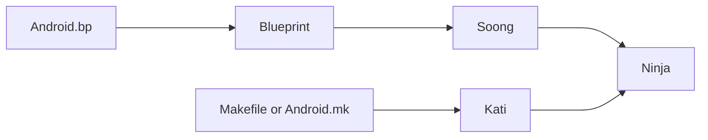

随着 Android 版本的更迭，尤其是 Androd 10 和 Android 11 源码的编译，单编模块的时间也特别慢，每次都需要半个小时甚至更长，因为每次单编都会重新加载所有 `mk` 文件，再生成 `ninja` 编译，此过程很慢，实际编译过程很快。
因此我们可以使用 `google` 提供的一种快速编译方式：`ninja`，使用 `ninja` 编译的话基本上十几秒就能快速编完一个模块，`ninja` 编译只适用于修改项目的代码，如果涉及到文件的增减就必须用 `mm/make` 重新编译了。

**使用方法：**

```shell
./prebuilts/build-tools/linux-x86/bin/ninja -f out/combined-xxx.ninja
```

该命令相当于 `make`，xxx 为对应的 `lunch` 项

**示例**

编译 `Settings`：

```shell
./prebuilts/build-tools/linux-x86/bin/ninja -f out/combined-xxx.ninja Settings -j32
```

编译 `selinux`：

```shell
./prebuilts/build-tools/linux-x86/bin/ninja -f out/combined-xxx.ninja selinux_policy -j32
```

编译 `Framework`：

```shell
./prebuilts/build-tools/linux-x86/bin/ninja -f out/combined-xxx.ninja framework -j32
```

全编译：

```shell
./prebuilts/build-tools/linux-x86/bin/ninja -f out/combined-xxx.ninja -j32 2>&1 |tee ninja_build.log
```

> 注意：使用 ninja 快速编译前需要先 source、lunch 工程：
>
> ```shell
> source build/envsetup.sh && export OUT_DIR=out && lunch sys_mssi_t_64_cn-userdebug M869YCR100_YM_546-MMI
> ```


**相关拓展**

Android.mk、Ninja、Soong、Blueprint、kati、Android.bp的概念之间的联系为：

