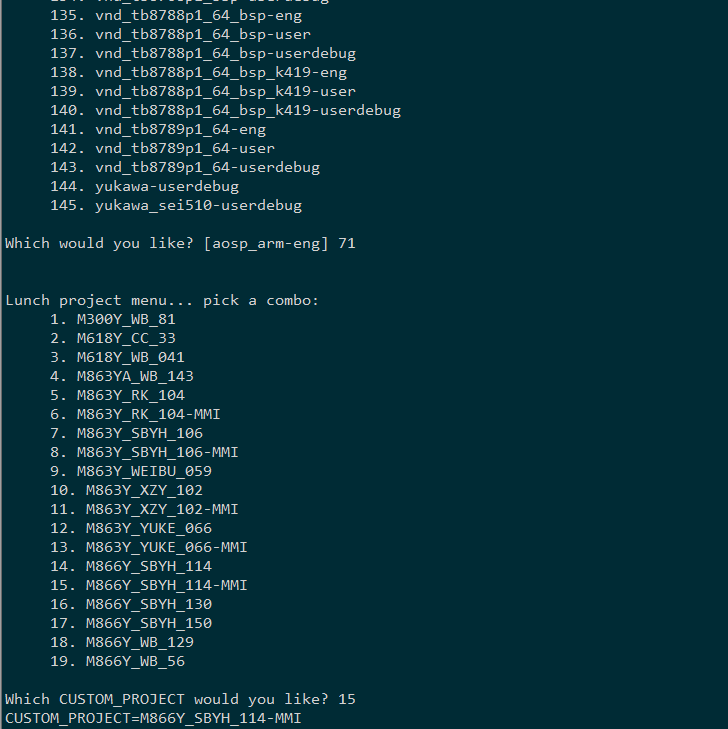

[toc]

# **MTK平台代码架构**

# **MTK平台代码架构**

## **一、概述**

针对目前微步的实际情况及方案公司多机型的背景下，为了更好的区分每个机型的差异，及减少工程的创建，更少的分支维护量，下面是一个针对MTK代码修改的方案，所有公版及客制化目录在一个分支上处理,DRIVER与MMI需求分离，互不影响。

我们先从一个完整编译流程来看跟原始编译方式的区别

​            1.     source build/envsetup.sh

​            1.     lunch 后选择 lunch full_tb8766p1_64_bsp-userdebug对应项目71

​            1.     随后会弹出对应的机型选择项，如下图

如上图我们选择 15 对应 M866Y_SBYH_114-MMI 会设置两个宏

CUSTOM_PCB=M866Y_SBYH_114 CUSTOM_PROJECT=M866Y_SBYH_114-MMI

如果此时我们选 14 ，则会设置两个宏

CUSTOM_PCB=M866Y_SBYH_114 CUSTOM_PROJECT=M866Y_SBYH_114 

下面是两个个重要的概念: DRIVER目录与 MMI目录的说明

CUSTOM_PCB 对应DRIVER目录：主要是机型的driver only修改，驱动工程师维护的目录，不包含任何客制化修改

CUSTOM_PROJECT 对应MMI目录：主要是客户定制化需求的修改，系统工程师主要维护的目录

DRIVER目录和MMI目录命名需要中横杠符号" - "区分，不然无法分割出CUSTOM_PCB和CUSTOM_PROJECT两个宏

开始编译后，会执行weibu/tools/weibu_build.pl脚本，根据设置的CUSTOM_PCB和CUSTOM_PROJECT来决定编译拷贝的目录，具体逻辑在第三节说明

 

​            1.     接着直接make编译，该架构保持原有的full编译方式不变

相关代码路径：

build/make/envsetup.sh

build/soong/ui/build/ninja.go

build/soong/ui/build/dumpvars.go

## **二、架构差异化**

我们逐一讲解其他机制，下面我们以tb8766p1_64_bsp项目创建M866Y_SBYH_114-MMI机型来做演示,第一节中lunch了M863Y_YUKE_627-MMI，配置会涉及到下面两个目录

DRIVER目录配置 ： weibu/tb8766p1_64_bsp/M866Y_SBYH_114/config

MMI 目录配置 ： weibu/tb8766p1_64_bsp/M866Y_SBYH_114-MMI/config

我们查看下相关的文件:

weibu/tb8766p1_64_bsp/M866Y_SBYH_114/下 有alps和config目录还有一个cust_blder.mak文件alps：编译时会覆自动盖到代码区的override文件

config：编译时会把差异化带入编译流程的配置文件

cust_blder.mak：config目录中如果存在custom_MemoryDevice.h DDR配置文件必须从preloader目录拷贝过来，不然编译报错

weibu/tb8766p1_64_bsp/M866Y_SBYH_114-MMI 中只有一个config目录alps: 因为还没有做客制化，所有没有包含此目录

config：编译时会把差异化带入编译流程的配置文件 

cust_blder.mak：MMI目录不需要此文件

下面我们看下config目录中的具体配置文件

### **1.GPIO配置文件 codegen.dws**

原始的修改路径：

preloader：vendor/mediatek/proprietary/bootable/bootloader/preloader/custom/tb8766p1_64_bsp/dct/dct/codegen.dws

lk：vendor/mediatek/proprietary/bootable/bootloader/lk/target/tb8766p1_64_bsp/dct/dct/codegen.dws

kernel：kernel-4.19/drivers/misc/mediatek/dws/mt6761/tb8766p1_64_bsp.dws

新架构的路径：

weibu/tb8766p1_64_bsp/M866Y_SBYH_114/config/codegen.dws

新架构只需要修改DRIVER目录下的codegen.dws即可，如果DRIVER目录下面存在codegen.dws文件则编译指向这里，r如果没有codegen.dws文件则指向原始的3个路径

优先级: DRIVER目录 > 原始路径 (MMI目录不包含此文件，此文件只在DRIVER目录存在)

相关代码路径：

vendor/mediatek/proprietary/bootable/bootloader/preloader/tools/drvgen/drvgen.mk

vendor/mediatek/proprietary/bootable/bootloader/lk/scripts/drvgen/drvgen.mk

device/mediatek/build/core/build_dtboimage.mk

### **2.DDR配置文件 custom_MemoryDevice.h** 

原始的修改路径：

vendor/mediatek/proprietary/bootable/bootloader/preloader/custom/tb8766p1_64_bsp/inc/custom_MemoryDevice.h

新架构的路径：

weibu/tb8766p1_64_bsp/M866Y_SBYH_114/config/custom_MemoryDevice.h

优先级: DRIVER目录 > 原始路径 (MMI目录不包含此文件，此文件只在DRIVER目录存在)

新架构只需要修改DRIVER目录下的custom_MemoryDevice.h即可，如果DRIVER目录下面存在custom_MemoryDevice.h文件则编译指向这里，没有custom_MemoryDevice.h文件则指向原始路径

相关代码路径

vendor/mediatek/proprietary/bootable/bootloader/preloader/tools/emigen/emigen.mk

### **3.preloader config文件 tb8766p1_64_bsp.mk**

原始的修改路径：

vendor/mediatek/proprietary/bootable/bootloader/preloader/custom/tb8766p1_64_bsp/tb8766p1_64_bsp.mk

新架构的路径：

weibu/tb8766p1_64_bsp/M866Y_SBYH_114/config/tb8766p1_64_bsp_pl.mk

优先级: MMI目录 > DERIVER目录 > 原始路径

新架构修改对应DRIVER目录下的tb8766p1_64_bsp_pl.mk，这里是把与原始路径文件中差异的宏提取到这个文件即可

例如：

M866Y_SBYH_114板型需要修改限制最大内存，只需要在weibu/tb8766p1_64_bsp/M863Y_YUKE_627/tb8766p1_64_bsp_pl.mk文件中加入一行跟原始配置不一样的就可以，配置会在make开始后修改到原始路径

相关代码路径：

vendor/mediatek/proprietary/bootable/bootloader/preloader/Makefile

vendor/mediatek/proprietary/bootable/bootloader/preloader/platform/mt6761/makefile.mak

### **4.lk config文件 tb8766p1_64_bsp.mk**

原始的修改路径：

vendor/mediatek/proprietary/bootable/bootloader/lk/project/tb8766p1_64_bsp.mk

新架构的路径：

weibu/tb8766p1_64_bsp/M866Y_SBYH_114/config/tb8766p1_64_bsp_lk.mk

优先级: MMI目录 > DRIVER目录 > 原始路径

新架构只需要修改对应机型目录下的tb8766p1_64_bsp_lk.mk即可，这里是把跟原始路径文件中差异的宏修改到这个文件即可

例如：

相关代码路径：

vendor/mediatek/proprietary/bootable/bootloader/lk/makefile

### **5.kernel config文件 tb8766p1_64_bsp_defconfig tb8766p1_64_bsp_debug_defconfig**

原始的修改路径：

kernel-4.19/arch/arm/configs/tb8766p1_64_bsp_defconfig

kernel-4.19/arch/arm/configs/tb8766p1_64_bsp_debug_defconfig

新架构的路径：

weibu/tb8766p1_64_bsp/M866Y_SBYH_114/config/tb8766p1_64_bsp_defconfig

优先级: MMI目录 > DRIVER目录 > 原始路径

新架构只需要修改对应机型目录下的tb8766p1_64_bsp_defconfig即可，不用区分是否为debug版本，这里是把跟原始路径文件中差异的宏修改到这个文件即可

例如：

相关代码路径：

device/mediatek/system/common/device.mk

build/make/tools/merge_mid.sh

### **6.ProjectConfig 文件 ProjectConfig.mk**

原始的修改路径：

device/mediateksample/tb8766p1_64_bsp/ProjectConfig.mk

新架构的路径：

weibu/tb8766p1_64_bsp/M866Y_SBYH_114/config/ProjectConfig.mk

优先级: MMI目录 > DRIVER目录 > 原始路径

新架构只需要修改对应机型目录下的ProjectConfig.mk即可，这里是把跟原始路径文件中差异的宏修改到这个文件即可

例如：

相关代码路径：

device/mediatek/build/core/soong_config.mk

device/mediatek/system/common/device.mk

### **7.DTS文件 tb8766p1_64_bsp.dts**

原始的修改路径：

kernel-4.19/arch/arm64/boot/dts/tb8766p1_64_bsp.dts

kernel-4.19/arch/arm64/boot/dts/cust_mt6761_msdc.dtsi

kernel-4.19/arch/arm64/boot/dts/cust_mt6761_camera.dtsi

kernel-4.19/arch/arm64/boot/dts/mt6357.dtsi

kernel-4.19/arch/arm64/boot/dts/mt6761.dtsi

kernel-4.19/arch/arm64/boot/dts/bat_setting

新架构的路径：

kernel-4.19/arch/arm64/boot/dts/mediatek/M866Y_SBYH_114/tb8766p1_64_bsp.dts

kernel-4.19/arch/arm64/boot/dts/mediatek/M866Y_SBYH_114/cust_mt6761_msdc.dtsi

kernel-4.19/arch/arm64/boot/dts/mediatek/M866Y_SBYH_114/cust_mt6761_camera.dtsi

kernel-4.19/arch/arm64/boot/dts/mediatek/M866Y_SBYH_114/mt6357.dtsi

kernel-4.19/arch/arm64/boot/dts/mediatek/M866Y_SBYH_114/mt6761.dtsi

kernel-4.19/arch/arm64/boot/dts/mediatek/M866Y_SBYH_114/bat_setting

tb8766p1_64_bsp.dts

需要在weibu/tb8766p1_64_bsp/M866Y_SBYH_114/ProjectConfig.mk 文件中定义

MTK_PROJECT_DTB_NAMES = mediatek/M866Y_SBYH_114/tb8766p1_64_bsp后才能指向kernel-4.19/arch/arm/boot/dts/M866Y_SBYH_114/tb8766p1_64_bsp.dts

cust_mt6761_msdc.dtsi

需要在kernel-4.19/arch/arm/boot/dts/mediatek/M866Y_SBYH_114/mt6761 .dts中

\#include "mediatek/cust_mt6761_msdc.dtsi" 修改为

\#include "mediatek/M866Y_SBYH_114/cust_mt6761_msdc.dtsi"

cust_mt6761_camera.dtsi

需要在kernel-4.19/arch/arm64/boot/dts/mediatek/M866Y_SBYH_114/tb8766p1_64_bsp.dts中

\#include "mediatek/cust_tb8766_camera.dtsi" 修改为

\#include "mediatek/M866Y_SBYH_114/cust_tb8766_camera.dtsi"

mt6357.dtsi

需要在kernel-4.19/arch/arm/boot/dts/mediatek/M866Y_SBYH_114/mt6761 .dts中

\#include "#include "mediatek/mt6357.dtsi"" 修改为

\#include "mediatek/M866Y_SBYH_114/mt6357.dtsi"

mt6761.dts

需要在weibu/tb8766p1_64_bsp/M866Y_SBYH_114/ProjectConfig.mk 文件中定义

MTK_PLATFORM_DTB_NAME = mediatek/M866Y_SBYH_114/mt6761 后才能指向kernel-4.19/arch/arm/boot/dts/mediatek/M866Y_SBYH_114/mt6761 .dts

优先级: dts工程目录 > 原始路径

### **8.系统属性文件 build.prop**

新架构的路径：

weibu/tb8766p1_64_bsp/M866Y_SBYH_114/config/system.prop

weibu/tb8766p1_64_bsp/M866Y_SBYH_114/config/vendor.prop

差异化覆盖属性到

out/target/product/tb8766p1_64_bsp/system/build.prop

out/target/product/tb8766p1_64_bsp/vendor/vendor.prop

优先级: MMI目录 > DRIVER目录 > 原始路径

例如：

相关代码路径：

build/make/tools/merge_mid.sh

build/make/core/main.mk

### **9.晶体配置文件 WMT_SOC.cfg**

原始的修改路径：

device/mediateksample/tb8766p1_64_bsp/WMT_SOC.cfg

新架构的路径：

weibu/tb8766p1_64_bsp/M866Y_SBYH_114/config/WMT_SOC.cfg

优先级: DRIVER目录 > 原始路径 (MMI目录不包含此文件，此文件只在DRIVER目录存在)

相关代码路径：

device/mediatek/vendor/common/connectivity/product_package/product_package.mk

### **10.音频参数audio_param**

原始的修改路径：

device/mediatek/vendor/common/audio_param

新架构的路径：

weibu/tb8766p1_64_bsp/M866Y_SBYH_114/config/audio_param

优先级: DRIVER目录 > 原始路径 (MMI目录不包含此文件，此文件只在DRIVER目录存在)

相关代码路径：

device/mediatek/vendor/common/device.mk

### **11.thermal策略文件thermal.conf**

原始的修改路径：

device/mediatek/mt6761/thermal.conf

新架构的路径：

weibu/tb8766p1_64_bsp/M866Y_SBYH_114/config/thermal.conf

优先级: DRIVER目录 > 原始路径 (MMI目录不包含此文件，此文件只在DRIVER目录存在)

相关代码路径：

# **device/mediatek/vendor/common/device.mk**

## **三、拷贝机制**

原理：

拷贝脚本路径：weibu\tools\weibu_build.pl

脚本在执行编译make的时候就被执行，会根据lunch的结果设置CUSTOM_PCB及CUSTOM_PROJECT两个变量来决定拷贝动作

拷贝分为两次拷贝，先拷贝DRIVER目录下的alps，再拷贝MMI目录下的alps，所以如果DRIVER目录MMI目录有相同路径的文件，拷贝后会以MMI目录下优先级最高

优先级: MMI目录 > DRIVER目录 > 原始路径

例如：

选择的是M866Y_SBYH_114-MMI, 则拷贝动作如下

cp -rf weibu/tb8766p1_64_bsp/M866Y_SBYH_114/alps/* /work01/mt8766_s/alps

cp -rf weibu/tb8766p1_64_bsp/M866Y_SBYH_114-MMI/alps/* /work01/mt8766_s/alps

如果选择的是M866Y_SBYH_114，则拷贝动作如下

cp -rf weibu/tb8766p1_64_bsp/M866Y_SBYH_114/alps/* /work01/mt8766_s/alps

## **四、GMS版本**

为了解决同一个分支上，不同的客户可能GMS包版本不同，SMR软件会更新跟随大版本更新GMS版本问题，引起客户投诉，下面设计了一套方案

基本原理:

删除了原有的路径vendor/partner_gms, 在顶层代码目录下创建gms目录，gms目录下存放不同版本的gms包，根据SystemConfig.mk定义GMS_VERSION_ID宏来选择不同的gms包编译进系统，编译开始的时后根据GMS_VERSION_ID的值创建对应的软连接vendor/partner_gms指向gms目录下对应的gms包目录

比如GMS_VERSION_ID=13_202304，查看vendor/partner_gms指向

修改为:

代码路径下

gms/13_202301 13_202301为1月份的GMS包

gms/13_202304 13_202304为4月份的GMS包

sys/device/mediatek/system/mssi_t_64_cn_armv82/SystemConfig.mk中定义

GMS_VERSION_ID=13_202304  这个值对应gms目录下文件夹名称

客制化可以根据GMS_VERSION_ID来选择覆盖，例如

sys/weibu/mssi_t_64_cn_armv82/M100TB_DG_P3PRO_527/config/SystemConfig.mk中

GMS_VERSION_ID=13_202301 

则会编译1月份的gms包

添加新版本GMS包需要注意的地方：

1）添加新版本的GMS包，例如添加2023年5月份的GMS包，按如下步骤修改

 a.新建gms/13_202305目录

 b.复制gms内容到gms/13_202305目录下

 c.修改gms/13_202305/gms.mk及 gms/13_202305/products下所有的mk文件中包含路径的字符

 所有vendor/partner_gms字符修改为 gms/13_202305

 d. （按需修改）sys/device/mediatek/system/mssi_t_64_cn_armv82/SystemConfig.mk 中修改

GMS_VERSION_ID=13_202305

 客制工程师需要注意的地方

1.按照新的方法选择GMS版本后，比如现在GMS包版本为GMS_VERSION_ID=13_202304

 假设有客户需求需要修改 vendor/partner_gms/apps/GmsSampleIntegration/res_dhs_full/xml/partner_default_layout.xml 文件

我们修改这个文件后，git status查看实际的修改文件 

实际为gms/13_202304/apps/GmsSampleIntegration/res_dhs_full/xml/partner_default_layout.xml 文件被修改，就是实际对应gms版本包内部的文件被修改，提取修改到差异化目录下面建议还是以

vendor/partner_gms/apps/GmsSampleIntegration/res_dhs_full/xml/partner_default_layout.xml 这个路径存放，如果以gms/13_202304/apps/GmsSampleIntegration/res_dhs_full/xml/partner_default_layout.xml 存放会有以下隐晦

a.假如GMS_VERSION_ID=13_202304修改为了GMS_VERSION_ID=13_202305，之前在gms/13_202304/所有的客制化修改将会失效，需要重新修改到gms/13_202305目录中