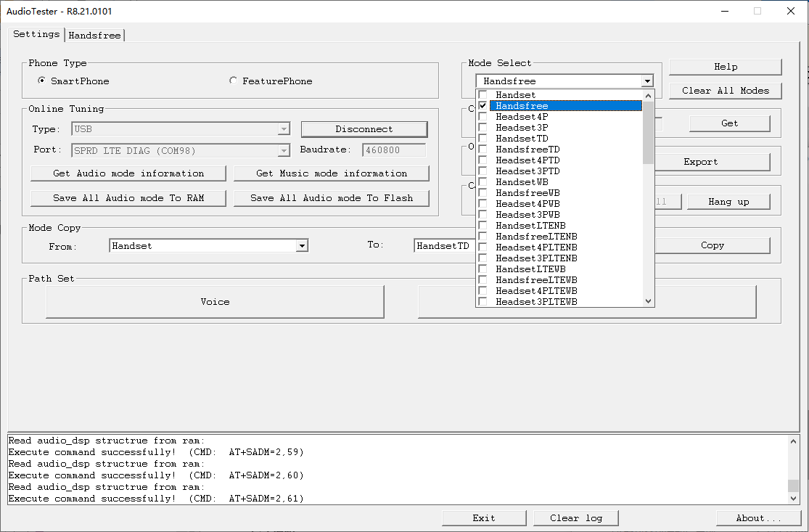
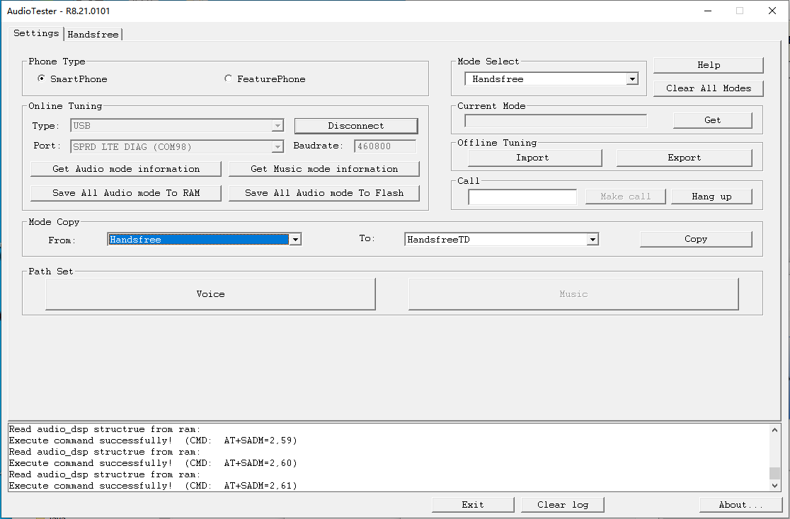

[toc]

### 1. 展讯平台

#### 1.1 打开 `Modem To PC` 功能

进入 `YLog` 应用，点击 `Settings -> Debug Setting & Tools` ，在 `Debug Setting & Tools` 界面打开 `Modem To PC` 开关。

#### 1.2 使用 `AudioTester` 工具调试通话音量

> 提示：`AudioTester` 工具可以在展讯网站下载。

> 注意：下面操作必须使用 `userdebug` 软件。

##### 1.2.1 打开 `AudioTester` 应用


##### 1.2.2 连接设备

开机并将设备连接到电脑，在 `Phone Type` 中选择 `SmartPhone`；在 `Online Tuning` 中的 `Type` 选择 `USB`，`Port` 选择 `SPRD LTE DIAG (COMxxx)`，`Baudrate` 选择 `460800`，然后点击 `Connect` 按钮。


##### 1.2.3 获取音频信息

在 `Online Tuning` 中点击 `Get Audio mode information` 按钮，读取设备音频信息。这个过程只需十几秒钟即可读取完成，在下边的日志中不能有错误输出。


##### 1.2.4 选择 Handsfree 模式

因为我们要修改的是扬声器，因此需要修改 `Handsfree` 和 `HandsfreeWB` 模式的值，这两个模式修改操作一样，下面以 `Handsfree` 模式进行介绍。

在 `Mode Select` 中选择 `Handsfree` 。



##### 1.2.5 切换到 `Handsfree` 选项卡


##### 1.2.6 设置 Vol Config

点击 `Handsfree` 中的 `Vol Config` 按钮，在弹出的对话框中修改 `dl dgain(db)` 栏中的值，通过逐级减小它的值来达到减小音量。设置完成后点击 `OK` 按钮。


##### 1.2.7 写入参数

依次点击 `Handsfree` 界面中的如下按钮，将修改的参数写入到设备中。


##### 1.2.8 切换到 `Settings` 选项卡

##### 1.2.9 拷贝参数

在 `Mode Copy` 中的 `From` 选择 `Handsfree`，`To` 保持不变，然后点击 `Copy` 按钮。



##### 1.2.10 保存音频信息到 RAM 中验证效果

在 `Online Tuning` 中点击 `Save All Audio mode To RAM` 按钮，将音频参数保存到内存中，然后就可以验证效果了。


##### 1.2.11 保存音频参数到存储中

当验证效果 OK 后，就可以将调好的音频参数导出到设备内部存储中。可以通过在 `Online Tuning` 中点击 `Save All Audio mode To Flash` 按钮来保存。


##### 1.2.12 导出音频参数到电脑中

通过如下命令将修改的音频参数导出到电脑中：

```shell
adb pull data/vendor/local/media/
```

#### 1.3 将修改的音频参数合入到代码中

用adb命令导出下列文件，adb pull data/vendor/local/media/

通话参数

```
audioarm
audio_arm.xml
audiodsp
audio_dsp_ex_smat.xml
audio_dsp_ex.xml
audio_dsp.xml
cvs
cvs_params.xml
dspcodec
dsp_codec_config.xml
```

通话部分总共就是上面10个文件。但是要注意，有可能你从media文件夹里导出来的文件少于上面的文件，或多于上面的文件。

只需要把和上面文件名称一模一样的文件给软件替换原始代码里的同名文件即可。如果导出来找不到的，或和上面这些文件名字不一样的，都不需要给软件替换。一个字母都不能差。

